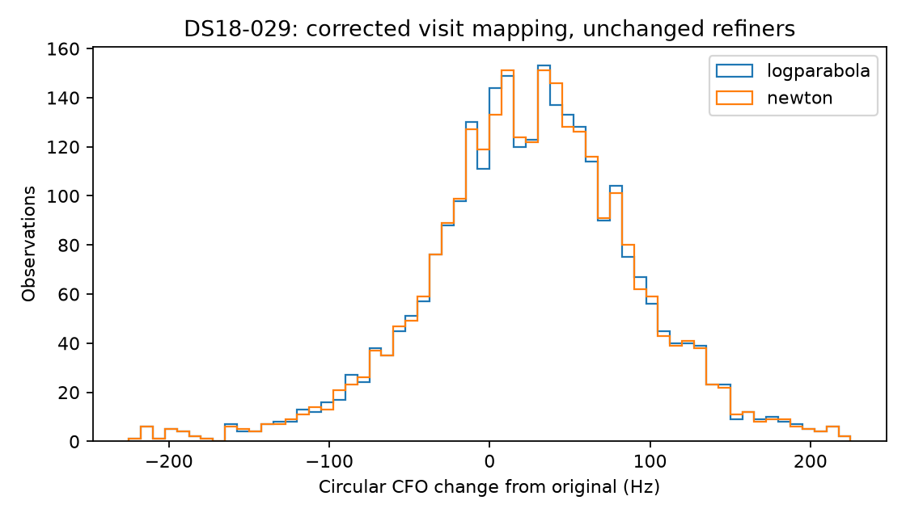

# Explicit sparse-visit replay result

All 2771 original DS18-029 observations were retained; 2771 passed parity and 0 failed. The 989 previously successful observations reproduced every numerical output exactly (excluding elapsed time).

The only change is event-ID→reader-ordinal translation. Original128 failures remain published. This successor took 92.293s; the failed128 attempt cost 74.881s, retained separately. All 728 frozen source/input hashes verify.

| Refiner | RMS change Hz | Median absolute Hz | p95 absolute Hz |
|---|---:|---:|---:|
| logparabola | 70.131 | 44.974 | 139.992 |
| newton | 69.945 | 44.588 | 139.643 |

These are circular measurement changes, not frequency errors or demonstrated localization gains. No observation admission, acquisition, model prior or position fit changed. A later matched positioning experiment must explicitly bind128's other eleven members plus this successor, retaining the original failure/cost lineage.
