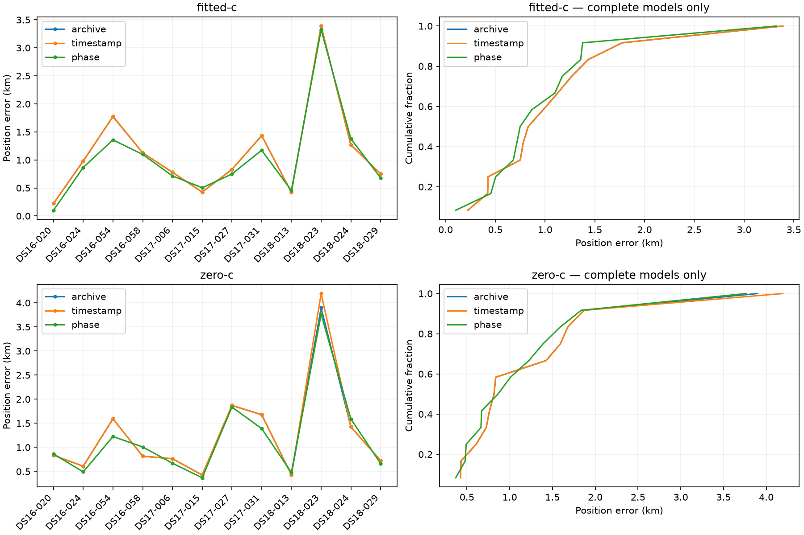

# Clean phase-timing replication

All twelve consumed-development members are reported. Original measurements and support are unchanged; all four fits share the fitted-derived seed, with c=0 RF locks. This removes 130’s legacy reference-field admission but also changes its c=0 initialization: use the fresh timestamp control as comparator. These are neither unseen validation nor full-cohort gains. No operational model winner is selected.

Archived B7 is a separate historical comparator. Its qualification provenance is the published 130 evaluator; clean 132 establishes reconstruction parity, not new endpoint qualification. Raw failures withhold complete position metrics. Archive fallback is a labelled sensitivity only.

| Dataset | Arm | Model | Qualified | Mean km | Median km | p95 km | Worst km |
|---|---|---|---:|---:|---:|---:|---:|
| full | fitted-c | archive | 12/12 | 1.117359 | 0.905836 | 2.501273 | 3.389263 |
| full | fitted-c | timestamp | 12/12 | 1.117359 | 0.905836 | 2.501273 | 3.389263 |
| full | fitted-c | phase | 12/12 | 1.033639 | 0.807675 | 2.254102 | 3.326299 |
| full | zero-c | archive | 12/12 | 1.255968 | 0.826722 | 2.782485 | 3.897895 |
| full | zero-c | timestamp | 12/12 | 1.280581 | 0.826722 | 2.915394 | 4.193248 |
| full | zero-c | phase | 12/12 | 1.195908 | 0.935994 | 2.703730 | 3.763887 |
| DS16 | fitted-c | archive | 4/4 | 1.026534 | 1.054130 | 1.677589 | 1.774735 |
| DS16 | fitted-c | timestamp | 4/4 | 1.026534 | 1.054130 | 1.677589 | 1.774735 |
| DS16 | fitted-c | phase | 4/4 | 0.856103 | 0.982262 | 1.318985 | 1.357928 |
| DS16 | zero-c | archive | 4/4 | 0.963645 | 0.826722 | 1.479465 | 1.592919 |
| DS16 | zero-c | timestamp | 4/4 | 0.963645 | 0.826722 | 1.479465 | 1.592919 |
| DS16 | zero-c | phase | 4/4 | 0.896804 | 0.935994 | 1.192037 | 1.224386 |
| DS17 | fitted-c | archive | 4/4 | 0.867977 | 0.804945 | 1.343881 | 1.434476 |
| DS17 | fitted-c | timestamp | 4/4 | 0.867977 | 0.804945 | 1.343881 | 1.434476 |
| DS17 | fitted-c | phase | 4/4 | 0.785180 | 0.732287 | 1.109194 | 1.172735 |
| DS17 | zero-c | archive | 4/4 | 1.184515 | 1.221124 | 1.841141 | 1.869877 |
| DS17 | zero-c | timestamp | 4/4 | 1.184515 | 1.221124 | 1.841141 | 1.869877 |
| DS17 | zero-c | phase | 4/4 | 1.066633 | 1.030699 | 1.769434 | 1.836329 |
| DS18 | fitted-c | archive | 4/4 | 1.457567 | 1.009240 | 3.071035 | 3.389263 |
| DS18 | fitted-c | timestamp | 4/4 | 1.457567 | 1.009240 | 3.071035 | 3.389263 |
| DS18 | fitted-c | phase | 4/4 | 1.459634 | 1.028749 | 3.033882 | 3.326299 |
| DS18 | zero-c | archive | 4/4 | 1.619744 | 1.075528 | 3.527085 | 3.897895 |
| DS18 | zero-c | timestamp | 4/4 | 1.693582 | 1.075528 | 3.778135 | 4.193248 |
| DS18 | zero-c | phase | 4/4 | 1.624287 | 1.127041 | 3.437776 | 3.763887 |

| Dataset | Arm | Qualified pairs | Improved | Regressed | >1 km regressions | Max regression km |
|---|---|---:|---:|---:|---:|---:|
| full | fitted-c | 12/12 | 9 | 3 | 0 | 0.109111 |
| full | zero-c | 12/12 | 8 | 4 | 0 | 0.191835 |
| DS16 | fitted-c | 4/4 | 4 | 0 | 0 | 0.000000 |
| DS16 | zero-c | 4/4 | 2 | 2 | 0 | 0.191835 |
| DS17 | fitted-c | 4/4 | 3 | 1 | 0 | 0.075866 |
| DS17 | zero-c | 4/4 | 4 | 0 | 0 | 0.000000 |
| DS18 | fitted-c | 4/4 | 2 | 2 | 0 | 0.109111 |
| DS18 | zero-c | 4/4 | 2 | 2 | 0 | 0.163986 |

Regressing labels (qualified matched pairs only; not selection criteria):

full, fitted-c: DS17-015, DS18-013, DS18-024.

full, zero-c: DS16-020, DS16-058, DS18-013, DS18-024.

DS16, fitted-c: none.

DS16, zero-c: DS16-020, DS16-058.

DS17, fitted-c: DS17-015.

DS17, zero-c: none.

DS18, fitted-c: DS18-013, DS18-024.

DS18, zero-c: DS18-013, DS18-024.

Frequency fit and support remain separate from geographic accuracy. Values below are descriptive saved outputs; unqualified fits are explicitly marked. A lower phase-model objective cannot establish the physical convention or choose a model.

| Member | Arm | Model | Qualified | RMS Hz | Objective | Fit seconds |
|---|---|---|---|---:|---:|---:|
| DS16-020 | fitted-c | timestamp | True | 74.202453 | 40484.108988 | 0.071787 |
| DS16-020 | fitted-c | phase | True | 74.189548 | 40483.829470 | 8.112730 |
| DS16-020 | zero-c | timestamp | True | 139.386363 | 41963.755300 | 1.584618 |
| DS16-020 | zero-c | phase | True | 139.432212 | 41963.987021 | 8.138021 |
| DS16-024 | fitted-c | timestamp | True | 59.335434 | 37430.593143 | 0.069011 |
| DS16-024 | fitted-c | phase | True | 59.431829 | 37431.401859 | 9.293722 |
| DS16-024 | zero-c | timestamp | True | 114.009953 | 38676.834694 | 1.797550 |
| DS16-024 | zero-c | phase | True | 114.097738 | 38679.714992 | 9.597328 |
| DS16-054 | fitted-c | timestamp | True | 55.160014 | 32884.370354 | 0.053369 |
| DS16-054 | fitted-c | phase | True | 54.221572 | 32871.612678 | 5.445618 |
| DS16-054 | zero-c | timestamp | True | 56.600239 | 32897.906096 | 0.985118 |
| DS16-054 | zero-c | phase | True | 55.642922 | 32885.183041 | 5.512083 |
| DS16-058 | fitted-c | timestamp | True | 55.303625 | 30923.603586 | 0.022180 |
| DS16-058 | fitted-c | phase | True | 55.307009 | 30923.110783 | 4.180278 |
| DS16-058 | zero-c | timestamp | True | 113.253542 | 31893.015451 | 0.812193 |
| DS16-058 | zero-c | phase | True | 113.277994 | 31897.073395 | 4.125852 |
| DS17-006 | fitted-c | timestamp | True | 61.831264 | 25156.995847 | 0.035955 |
| DS17-006 | fitted-c | phase | True | 61.843224 | 25156.379813 | 2.435409 |
| DS17-006 | zero-c | timestamp | True | 134.027139 | 26269.548227 | 0.525012 |
| DS17-006 | zero-c | phase | True | 134.122378 | 26272.543996 | 2.513378 |
| DS17-015 | fitted-c | timestamp | True | 50.908550 | 36944.372779 | 0.042426 |
| DS17-015 | fitted-c | phase | True | 50.880923 | 36944.670867 | 10.246710 |
| DS17-015 | zero-c | timestamp | True | 102.028795 | 38116.247885 | 1.836952 |
| DS17-015 | zero-c | phase | True | 101.870090 | 38116.838923 | 9.805247 |
| DS17-027 | fitted-c | timestamp | True | 75.899855 | 28045.709873 | 0.039732 |
| DS17-027 | fitted-c | phase | True | 75.606193 | 28040.620790 | 4.082047 |
| DS17-027 | zero-c | timestamp | True | 116.068171 | 28767.763737 | 0.722135 |
| DS17-027 | zero-c | phase | True | 115.918119 | 28766.453831 | 3.514203 |
| DS17-031 | fitted-c | timestamp | True | 60.544485 | 31981.022598 | 0.051359 |
| DS17-031 | fitted-c | phase | True | 60.143055 | 31973.209316 | 5.080810 |
| DS17-031 | zero-c | timestamp | True | 117.234445 | 33151.280757 | 1.011173 |
| DS17-031 | zero-c | phase | True | 117.247275 | 33145.435927 | 5.220101 |
| DS18-013 | fitted-c | timestamp | True | 91.152455 | 29787.584532 | 0.049719 |
| DS18-013 | fitted-c | phase | True | 91.537620 | 29791.601235 | 5.196602 |
| DS18-013 | zero-c | timestamp | True | 93.681827 | 29819.146710 | 0.901658 |
| DS18-013 | zero-c | phase | True | 93.977852 | 29820.585295 | 5.075084 |
| DS18-023 | fitted-c | timestamp | True | 88.404339 | 27910.657037 | 0.051584 |
| DS18-023 | fitted-c | phase | True | 88.345160 | 27910.366405 | 5.286335 |
| DS18-023 | zero-c | timestamp | True | 99.910981 | 28117.394154 | 0.949224 |
| DS18-023 | zero-c | phase | True | 99.430993 | 28115.769395 | 5.149885 |
| DS18-024 | fitted-c | timestamp | True | 56.225199 | 31522.415057 | 0.053069 |
| DS18-024 | fitted-c | phase | True | 56.210239 | 31520.891172 | 5.984304 |
| DS18-024 | zero-c | timestamp | True | 88.028021 | 31986.147622 | 1.051025 |
| DS18-024 | zero-c | phase | True | 87.993103 | 31983.965251 | 5.777333 |
| DS18-029 | fitted-c | timestamp | True | 58.628400 | 29701.254495 | 0.067681 |
| DS18-029 | fitted-c | phase | True | 58.633993 | 29701.284092 | 4.934379 |
| DS18-029 | zero-c | timestamp | True | 60.091032 | 29716.841874 | 0.867429 |
| DS18-029 | zero-c | phase | True | 59.975327 | 29716.299735 | 4.980571 |

| Member | Arm | Changed assignments | Nonclutter mass change |
|---|---|---:|---:|
| DS16-020 | fitted-c | 5 | -0.033505 |
| DS16-020 | zero-c | 9 | 0.208194 |
| DS16-024 | fitted-c | 9 | 0.041498 |
| DS16-024 | zero-c | 7 | -0.173652 |
| DS16-054 | fitted-c | 14 | -0.035103 |
| DS16-054 | zero-c | 10 | -0.867536 |
| DS16-058 | fitted-c | 2 | 0.002149 |
| DS16-058 | zero-c | 2 | -0.694836 |
| DS17-006 | fitted-c | 6 | 0.035782 |
| DS17-006 | zero-c | 5 | -0.335698 |
| DS17-015 | fitted-c | 15 | -0.061263 |
| DS17-015 | zero-c | 12 | -0.827234 |
| DS17-027 | fitted-c | 6 | -0.117690 |
| DS17-027 | zero-c | 10 | -0.315384 |
| DS17-031 | fitted-c | 17 | 0.089232 |
| DS17-031 | zero-c | 13 | 1.032833 |
| DS18-013 | fitted-c | 8 | -0.348847 |
| DS18-013 | zero-c | 8 | 0.215000 |
| DS18-023 | fitted-c | 7 | 0.079648 |
| DS18-023 | zero-c | 22 | -1.510656 |
| DS18-024 | fitted-c | 7 | 0.178633 |
| DS18-024 | zero-c | 7 | 0.154389 |
| DS18-029 | fitted-c | 7 | 0.217766 |
| DS18-029 | zero-c | 10 | 0.170488 |

Summed member time: 309.645s, including reconstruction; not parallel wall time. Peak RSS unavailable. The 90-second fit cap is soft. Score components, every failure, fallback sensitivity and per-member paired outcomes are in [evaluation.json](evaluation.json).

Complete membership: DS16-020 (complete), DS16-024 (complete), DS16-054 (complete), DS16-058 (complete), DS17-006 (complete), DS17-015 (complete), DS17-027 (complete), DS17-031 (complete), DS18-013 (complete), DS18-023 (complete), DS18-024 (complete), DS18-029 (complete).
