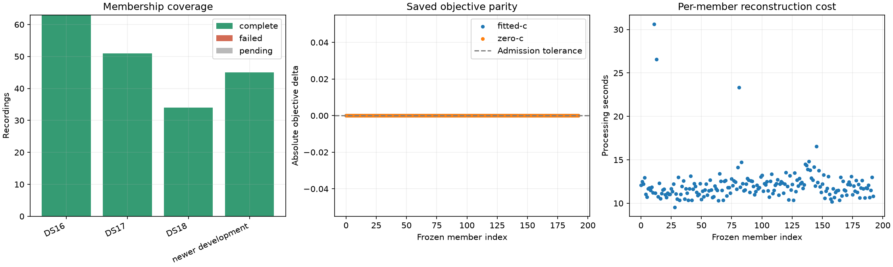

# Full reconstruction parity passed

All 193 members completed: DS16 63, DS17 51, DS18 34, and newer development 45.
Both independently archived c arms reconstruct with exactly zero objective
difference, for 386 endpoint evaluations and zero optimizer calls. Both worker
handles exited successfully. There are no missing, failed or extra receipts.
All 1,592 frozen source hashes and 386 input hashes were verified again by the
final reporter. Summed member processing time is 2,337.485 seconds, not wall time.

This establishes reconstruction of the selected ordinary models, not a position
improvement or validation of the phase alternative. The full193 position mean
remains 1.254810 km fitted-c. All cohort exposure labels are preserved; no reserve
was opened and no reference coordinate was accessed by the parity experiment.
Latest107 candidate selections retain the ac11 search-region recovery.

The prerequisite for iteration140 is now satisfied. Freeze its prepared
four-attempt comparison only after this completed report is published: timestamp
and phase each receive matched fitted-c/zero-c starts, observations, selected
fitted bank, priors and budgets. Historical zero-c retains its independently
checked model and is not forced onto the fitted model. No production change is
authorized by parity alone.

## Receipt archive

[PARITY_RESULT_ARCHIVE.json](PARITY_RESULT_ARCHIVE.json) binds all 386 raw result
and claim files. [parity-results.tar.gz](parity-results.tar.gz) is 16,383 bytes,
SHA256 `ec21a0184eafe890d134d13ccb504b0c7ec266edcbc671cb5915977754c41d72`.
The deterministic archive was restored to a fresh temporary directory and every
file hash verified. Originals remain intact. For safe restoration use
`archive_inputs.restore(archive_path, manifest_dict, destination)` from this
directory; it refuses unsafe paths or differing existing files. The earlier
input bundle is separately documented in PARITY_INPUT_ARCHIVE.md.

Full membership and both-arm receipts are in
[parity-summary.json](parity-summary.json); the readable coverage table is in
[PARITY_RESULTS.md](PARITY_RESULTS.md). Four reporting/archive tests passed in
parent review, including full-terminal gating and no-overwrite behavior.
