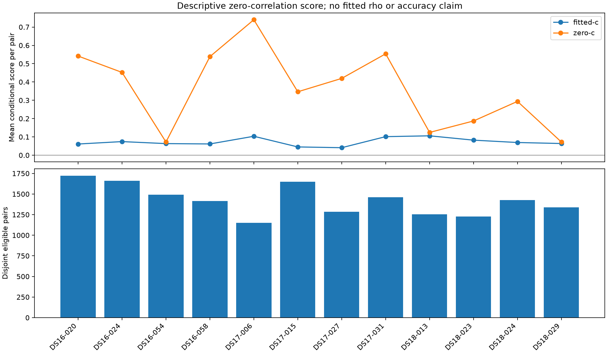

# Conditional frequency-correlation audit

All twelve terminal members are included. Failed members remain explicit; full-cohort totals are withheld if any member failed.

These are descriptive derivatives at zero correlation after full-data nuisance fitting. They are not estimates of rho, calibrated significance tests or position accuracy. No parameter is selected.

| Member | Status | Rows | Support available | Pairs | Unpaired | Fitted-c mean score | c=0 mean score | Seconds |
|---|---|---:|---:|---:|---:|---:|---:|---:|
| DS16-020 | complete | 3515 | 3515 | 1722 | 71 | 0.0610547 | 0.541679 | 17.5373 |
| DS16-024 | complete | 3406 | 3406 | 1659 | 88 | 0.0743042 | 0.452241 | 34.562 |
| DS16-054 | complete | 3073 | 3073 | 1491 | 91 | 0.0633278 | 0.0720343 | 16.8432 |
| DS16-058 | complete | 2921 | 2921 | 1414 | 93 | 0.0614411 | 0.538495 | 16.5037 |
| DS17-006 | complete | 2389 | 2389 | 1152 | 85 | 0.103394 | 0.74 | 14.9459 |
| DS17-015 | complete | 3378 | 3378 | 1648 | 82 | 0.0451567 | 0.346407 | 18.1207 |
| DS17-027 | complete | 2648 | 2648 | 1285 | 78 | 0.0409766 | 0.419532 | 14.5764 |
| DS17-031 | complete | 3011 | 3011 | 1463 | 85 | 0.101349 | 0.553808 | 15.5688 |
| DS18-013 | complete | 2609 | 2609 | 1256 | 97 | 0.10584 | 0.124373 | 14.5209 |
| DS18-023 | complete | 2549 | 2549 | 1229 | 91 | 0.0821911 | 0.186941 | 14.8896 |
| DS18-024 | complete | 2936 | 2936 | 1427 | 82 | 0.069301 | 0.293914 | 15.6745 |
| DS18-029 | complete | 2771 | 2771 | 1337 | 97 | 0.0637756 | 0.0718547 | 15.5214 |

Total recorded member elapsed time: 209.264 seconds.

## Coverage and conditional summaries

```json
{
  "observations": 35206,
  "support_available": 35206,
  "pairs": 17083,
  "unpaired": 1040,
  "unpaired_reasons": {
    "no-close-neighbour": 1040
  },
  "support_unavailable_reasons": {},
  "arms": {
    "fitted-c": {
      "score_sum": 1222.271328507499,
      "score_mean": 0.07154898603919095,
      "shared_label_mass_sum": 13754.271554686498,
      "shared_label_mass_mean": 0.8051438011289878
    },
    "zero-c": {
      "score_sum": 6226.001339944096,
      "score_mean": 0.3644559702595619,
      "shared_label_mass_sum": 13426.408148856775,
      "shared_label_mass_mean": 0.785951422399858
    }
  }
}
```

## Group and alternating-block consistency

Groups use fixed RX/channel/RF/edge identity. Alternating blocks contain disjoint pairs, but fitted nuisance parameters are shared; sign agreement is descriptive.

| Member | Arm | Score sum | Shared-label mass sum | Positive groups | Comparable block groups | Both positive | Both negative | Opposite signs |
|---|---|---:|---:|---:|---:|---:|---:|---:|
| DS16-020 | fitted-c | 105.136 | 1137.4 | 8 | 8 | 8 | 0 | 0 |
| DS16-020 | zero-c | 932.772 | 1072.77 | 8 | 8 | 8 | 0 | 0 |
| DS16-024 | fitted-c | 123.271 | 1291.47 | 8 | 8 | 8 | 0 | 0 |
| DS16-024 | zero-c | 750.268 | 1229.81 | 8 | 8 | 8 | 0 | 0 |
| DS16-054 | fitted-c | 94.4218 | 1250.51 | 8 | 8 | 8 | 0 | 0 |
| DS16-054 | zero-c | 107.403 | 1250.73 | 8 | 8 | 8 | 0 | 0 |
| DS16-058 | fitted-c | 86.8777 | 1220.35 | 8 | 8 | 8 | 0 | 0 |
| DS16-058 | zero-c | 761.432 | 1197.82 | 8 | 8 | 8 | 0 | 0 |
| DS17-006 | fitted-c | 119.11 | 952.086 | 8 | 8 | 6 | 0 | 2 |
| DS17-006 | zero-c | 852.48 | 921.436 | 8 | 8 | 8 | 0 | 0 |
| DS17-015 | fitted-c | 74.4182 | 1338.7 | 8 | 8 | 8 | 0 | 0 |
| DS17-015 | zero-c | 570.878 | 1281.98 | 8 | 8 | 8 | 0 | 0 |
| DS17-027 | fitted-c | 52.6549 | 1108.26 | 6 | 8 | 5 | 0 | 3 |
| DS17-027 | zero-c | 539.099 | 1093.63 | 8 | 8 | 8 | 0 | 0 |
| DS17-031 | fitted-c | 148.273 | 1256.52 | 8 | 8 | 8 | 0 | 0 |
| DS17-031 | zero-c | 810.221 | 1199.7 | 8 | 8 | 8 | 0 | 0 |
| DS18-013 | fitted-c | 132.935 | 882.282 | 8 | 8 | 7 | 0 | 1 |
| DS18-013 | zero-c | 156.213 | 881.386 | 8 | 8 | 7 | 0 | 1 |
| DS18-023 | fitted-c | 101.013 | 986.161 | 7 | 8 | 7 | 0 | 1 |
| DS18-023 | zero-c | 229.75 | 978.925 | 8 | 8 | 7 | 0 | 1 |
| DS18-024 | fitted-c | 98.8926 | 1189.4 | 8 | 8 | 8 | 0 | 0 |
| DS18-024 | zero-c | 419.416 | 1176.43 | 8 | 8 | 8 | 0 | 0 |
| DS18-029 | fitted-c | 85.268 | 1141.12 | 8 | 8 | 8 | 0 | 0 |
| DS18-029 | zero-c | 96.0697 | 1141.79 | 8 | 8 | 8 | 0 | 0 |

Per-group scores, alternating-block summaries, failure reasons and raw receipt hashes are retained in `summary.json`; raw receipts retain every support row and pair.



## Explicit successor lineage

Iteration 136 failed for all twelve members before model reconstruction because of an import-name collision. Those failures were not overwritten. Iteration 138 changes only import isolation and result paths; the audit mathematics and membership are unchanged.

Original failed-run elapsed time: 0.014355 seconds. Combined predecessor and successor elapsed time: 209.278822 seconds. Source-bound predecessor receipt paths and costs are in `summary.json`.
