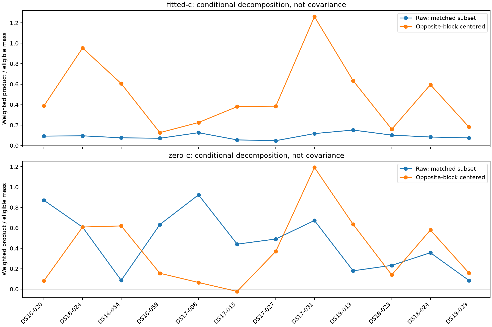

# Conditional residual means versus products

All twelve terminal members remain in coverage. Cohort summaries are withheld if any member failed.

Raw and opposite-block-centered products below use exactly the same eligible fractional mass. Zero training/target mass is unavailable, not zero evidence. Nuisance parameters and soft responsibilities were fitted on the full recording: these are not independent validation predictions, covariance estimates, significance tests or accuracy results.

| Member | Arm | Status | Eligible mass | Excluded mass | Matched raw / mass | Centered / mass |
|---|---|---|---:|---:|---:|---:|
| DS16-020 | fitted-c | complete | 1135.43 | 1.97919 | 0.092127 | 0.38783 |
| DS16-020 | zero-c | complete | 1070.74 | 2.03473 | 0.870666 | 0.0816621 |
| DS16-024 | fitted-c | complete | 1288.57 | 2.90239 | 0.0949342 | 0.954213 |
| DS16-024 | zero-c | complete | 1226.08 | 3.73429 | 0.607385 | 0.608254 |
| DS16-054 | fitted-c | complete | 1246.12 | 4.39356 | 0.0755295 | 0.60592 |
| DS16-054 | zero-c | complete | 1246.31 | 4.42132 | 0.0858869 | 0.619271 |
| DS16-058 | fitted-c | complete | 1219.37 | 0.978919 | 0.0709202 | 0.125999 |
| DS16-058 | zero-c | complete | 1197.01 | 0.803694 | 0.632689 | 0.155188 |
| DS17-006 | fitted-c | complete | 948.346 | 3.74014 | 0.125572 | 0.224988 |
| DS17-006 | zero-c | complete | 918.761 | 2.6752 | 0.924026 | 0.0648839 |
| DS17-015 | fitted-c | complete | 1331.81 | 6.89033 | 0.0550088 | 0.380184 |
| DS17-015 | zero-c | complete | 1277.01 | 4.96693 | 0.440435 | -0.0228159 |
| DS17-027 | fitted-c | complete | 1106.29 | 1.96309 | 0.0474833 | 0.38461 |
| DS17-027 | zero-c | complete | 1093.35 | 0.277309 | 0.490816 | 0.369656 |
| DS17-031 | fitted-c | complete | 1255.57 | 0.951285 | 0.116763 | 1.2603 |
| DS17-031 | zero-c | complete | 1199.2 | 0.502285 | 0.672688 | 1.19261 |
| DS18-013 | fitted-c | complete | 879.717 | 2.56517 | 0.151389 | 0.635013 |
| DS18-013 | zero-c | complete | 878.615 | 2.77075 | 0.179228 | 0.635347 |
| DS18-023 | fitted-c | complete | 981.459 | 4.70181 | 0.101792 | 0.159272 |
| DS18-023 | zero-c | complete | 974.17 | 4.75496 | 0.232456 | 0.138973 |
| DS18-024 | fitted-c | complete | 1189.4 | 2.91483e-14 | 0.0831446 | 0.594941 |
| DS18-024 | zero-c | complete | 1176.43 | 3.15476e-14 | 0.356516 | 0.579059 |
| DS18-029 | fitted-c | complete | 1141.12 | 8.98464e-06 | 0.0747231 | 0.180622 |
| DS18-029 | zero-c | complete | 1141.79 | 2.2649e-06 | 0.0841392 | 0.157022 |

## Dataset and pooled summaries

```json
{
  "pooled": {
    "fitted-c": {
      "pairs": 17083,
      "shared_label_mass": 13754.271554686498,
      "weighted_product_sum": 1222.271328507499,
      "crossprediction_mass": 13723.205655231062,
      "crossprediction_raw_product_sum": 1216.255346468296,
      "crossprediction_centered_product_sum": 6934.87625689721,
      "excluded_crossprediction_mass": 31.065899455435446,
      "raw_matched_per_mass": 0.08862764116667445,
      "centered_matched_per_mass": 0.505339381418783,
      "mass_coverage": 0.9977413635224578
    },
    "zero-c": {
      "pairs": 17083,
      "shared_label_mass": 13426.408148856775,
      "weighted_product_sum": 6226.001339944096,
      "crossprediction_mass": 13399.466687705977,
      "crossprediction_raw_product_sum": 6195.464268454006,
      "crossprediction_centered_product_sum": 5209.706744004825,
      "excluded_crossprediction_mass": 26.941461150798496,
      "raw_matched_per_mass": 0.462366481655449,
      "centered_matched_per_mass": 0.3887995593723693,
      "mass_coverage": 0.9979933977239406
    }
  },
  "DS16": {
    "fitted-c": {
      "pairs": 6286,
      "shared_label_mass": 4899.740318089127,
      "weighted_product_sum": 409.7065037472591,
      "crossprediction_mass": 4889.486263658967,
      "crossprediction_raw_product_sum": 407.5295602189892,
      "crossprediction_centered_product_sum": 2578.6076483369434,
      "excluded_crossprediction_mass": 10.254054430159723,
      "raw_matched_per_mass": 0.08334813480261649,
      "centered_matched_per_mass": 0.5273780330466221,
      "mass_coverage": 0.9979072249212262
    },
    "zero-c": {
      "pairs": 6286,
      "shared_label_mass": 4751.132878311788,
      "weighted_product_sum": 2551.874834738898,
      "crossprediction_mass": 4740.138844776505,
      "crossprediction_raw_product_sum": 2541.335245428989,
      "crossprediction_centered_product_sum": 1790.7715762959613,
      "excluded_crossprediction_mass": 10.994033535283242,
      "raw_matched_per_mass": 0.5361309718236348,
      "centered_matched_per_mass": 0.3777888443646201,
      "mass_coverage": 0.9976860185103495
    }
  },
  "DS17": {
    "fitted-c": {
      "pairs": 5548,
      "shared_label_mass": 4655.5653596232005,
      "weighted_product_sum": 394.4560729527023,
      "crossprediction_mass": 4642.020502429237,
      "crossprediction_raw_product_sum": 391.48157000904445,
      "crossprediction_centered_product_sum": 2727.5816291076726,
      "excluded_crossprediction_mass": 13.544857193963033,
      "raw_matched_per_mass": 0.08433430438408801,
      "centered_matched_per_mass": 0.5875850026255354,
      "mass_coverage": 0.997090609593534
    },
    "zero-c": {
      "pairs": 5548,
      "shared_label_mass": 4496.741322284637,
      "weighted_product_sum": 2772.678604932936,
      "crossprediction_mass": 4488.319604642228,
      "crossprediction_raw_product_sum": 2754.7198971707276,
      "crossprediction_centered_product_sum": 1864.817914321942,
      "excluded_crossprediction_mass": 8.421717642408483,
      "raw_matched_per_mass": 0.6137530612395663,
      "centered_matched_per_mass": 0.4154824251805014,
      "mass_coverage": 0.9981271509658176
    }
  },
  "DS18": {
    "fitted-c": {
      "pairs": 5249,
      "shared_label_mass": 4198.965876974172,
      "weighted_product_sum": 418.10875180753766,
      "crossprediction_mass": 4191.698889142859,
      "crossprediction_raw_product_sum": 417.2442162402622,
      "crossprediction_centered_product_sum": 1628.6869794525935,
      "excluded_crossprediction_mass": 7.26698783131269,
      "raw_matched_per_mass": 0.09954059851984799,
      "centered_matched_per_mass": 0.38855056685277223,
      "mass_coverage": 0.9982693386790393
    },
    "zero-c": {
      "pairs": 5249,
      "shared_label_mass": 4178.53394826035,
      "weighted_product_sum": 901.447900272262,
      "crossprediction_mass": 4171.008238287243,
      "crossprediction_raw_product_sum": 899.4091258542893,
      "crossprediction_centered_product_sum": 1554.1172533869212,
      "excluded_crossprediction_mass": 7.525709973106771,
      "raw_matched_per_mass": 0.21563350501163647,
      "centered_matched_per_mass": 0.37259990021623507,
      "mass_coverage": 0.9981989592363513
    }
  }
}
```

Per-group/satellite/block means and products, full raw scores, shared-label mass, support reasons, failures, runtimes and receipt hashes are retained in `summary.json`.

This run: 149.615 seconds. Including preserved iteration 136 failures and iteration 138 audit: 358.894 seconds.


