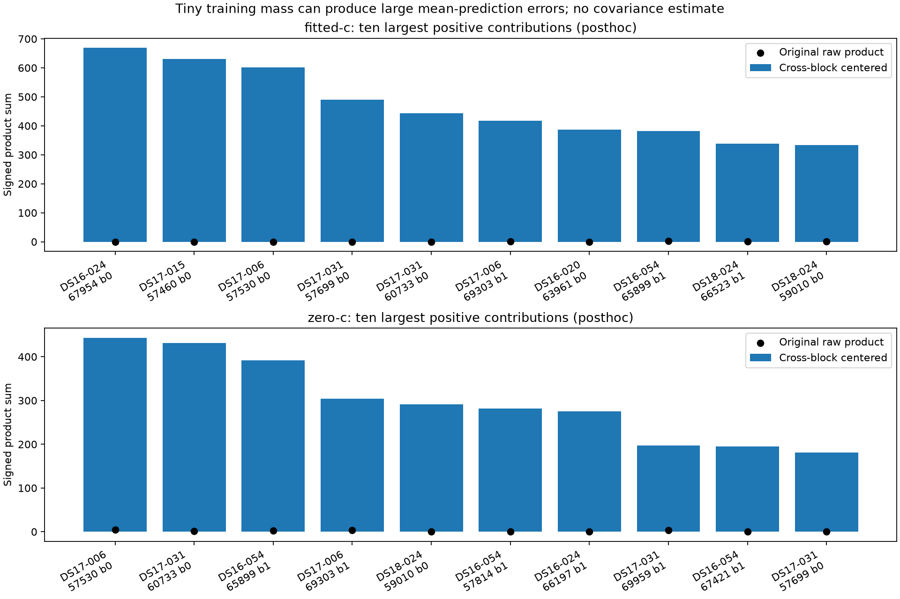

# Why opposite-block centering inflated the fitted-c product

The inflation is predominantly a failure of the opposite-block mean prediction,
not evidence of large physical covariance. Positive training mass can be an
almost-zero soft assignment tail. Normalizing that tail yields a large residual
mean for a satellite that has meaningful support only in the target block.
The original complete results and all members remain unchanged.

For target block t and opposite block o, the following identity uses only saved
weighted moments, with target mass M:

```
cross_centered_t = within_centered_t
                + M * (mean_x_t - mean_x_o) * (mean_y_t - mean_y_o)
within_centered_t = sum(w*x*y) - M*mean_x_t*mean_y_t
```

The script checks this identity for every eligible block; no endpoint evaluation,
IQ read, optimizer or position reference is used.

| Arm | Eligible mass | Raw product sum | Within-block centered | Mean disagreement | Cross-block centered |
|---|---:|---:|---:|---:|---:|
| Fitted-c | 13,723.206 | 1,216.255 | 577.059 | 6,357.817 | 6,934.876 |
| c=0 | 13,399.467 | 6,195.464 | 1,072.547 | 4,137.160 | 5,209.707 |

Mean disagreement accounts for 91.68% of the fitted-c centered total and 79.41%
of the c=0 total. Per eligible mass, fitted-c decomposes as
`0.505339 = 0.042050 + 0.463289`; c=0 as
`0.388800 = 0.080044 + 0.308756`. Within-block centering is descriptive and fits
means on the same residuals; its smaller result is not an unbiased covariance.

## Concentration and the training-support problem

Each arm contains 2,672 group/satellite records over 96 acquisition groups.
Fitted-c has 2,049 records with positive mass in both blocks, 340 with mass in
only one, and 283 with neither. c=0 has 2,049, 341 and 282 respectively.
Thus 4,098 directed block predictions pass the original strictly-positive-mass
rule in each arm. High target-mass coverage does not establish useful training
support.

As a **posthoc concentration diagnostic only**, 1,923 fitted-c predictions have
opposite-block mass below 1e-12. Their target mass is only 62.538 (0.456% of the
eligible mass), yet their centered sum is 6,097.056 (87.92% of the net centered
total). For c=0 the corresponding 1,931 predictions have target mass 57.671 and
centered sum 3,894.766. This threshold does not filter or replace the primary
result; no alternative threshold has been selected for inference.

The largest fitted-c contribution is DS16-024, RX0/channel2/upper, satellite
67954, target block0. Target mass is 0.972211; opposite-block mass is
4.4299346853e-314, a subnormal positive float. Target standardized means are
(0.226862, -0.119501), versus opposite-block (30.564246, 22.551279). Its original
product sum -0.026357 becomes 668.659951 after cross-centering. The target/training
mass ratio spans about 313.34 decimal orders. Other large examples have training
mass around 1e-282 and 1e-258, so this is not merely one subnormal arithmetic case.
Tiny conditional-label tails create unsupported extrapolation of means.

The ten largest positive fitted-c centered contributions sum to 4,693.758
(67.68% of the net total); the largest twenty sum to 7,115.507, exceeding the
net total because other contributions are negative. These signed concentration
percentages are not probability shares.



## Decision

Do not infer covariance, select rho or deploy a covariance correction from this
result. It demonstrates inadequate cross-block conditional-label overlap and
mean prediction. The existing moments identify the problem without another
recording pass. If this branch continues, predeclare an overlap-aware diagnostic
that reports training support and unavailable extrapolations; do not retrofit a
threshold into the primary analysis or present it as independent validation.
Prioritize the full phase-versus-timestamp position test, whose outcome directly
addresses positioning rather than further residual-model speculation.

`RCA.json` contains the source-summary hash, both-arm decomposition, availability
counts and top contributions. `saved_moment_rca.py` reproduces the arithmetic and
plot from the saved summary alone. The frozen scientific sources are unchanged.
