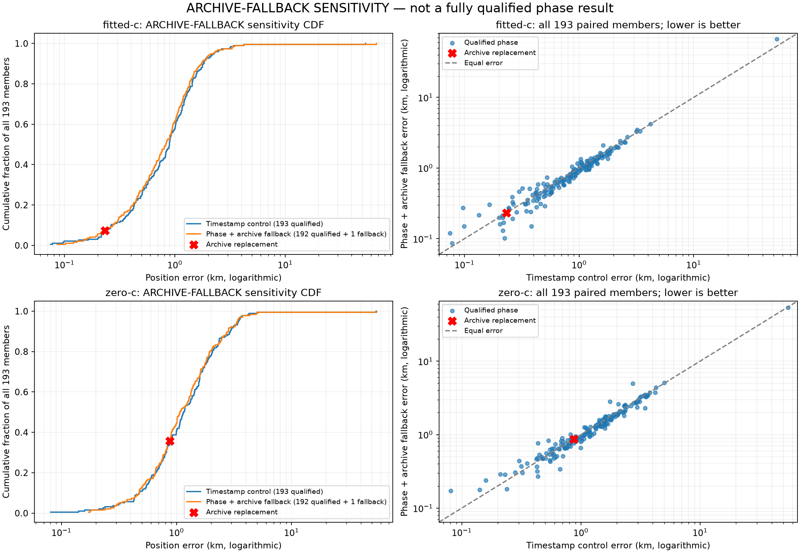

# Improved typical errors do not offset the large fitted-c regression

The supplementary plot uses logarithmic axes to show typical errors and the largest failure together. Its phase curves are explicitly archive-fallback sensitivities, with one replacement in each arm; they are not completely qualified raw phase cohorts. The plotting source and evaluation hashes are recorded in `sensitivity-integrity.json`.

All193 members completed, returning772 fits. Independent qualification passed770 fits; the two unqualified phase endpoints remain failures without retries. The report keeps strict complete-cohort metrics separate from qualification subsets and explicit archived-fallback sensitivities.

The phase model improves typical fitted-c position errors: median0.892565→0.828960km and p952.235773→2.155976km in the fallback comparison. It nevertheless worsens mean1.254810→1.283931km and worst53.400741→67.124341km. Both fresh timestamp and phase use the same fitted-derived starting points and candidate bank. This is a controlled local-model comparison, not an end-to-end new-search evaluation or independent validation.

Dataset fitted-c mean comparisons are DS160.973596→0.903642km, DS170.819111→0.794122km, DS182.691656→3.085888km, and newer development1.056687→1.009976km with one phase fallback. The last comparison must not be presented as a completely qualified raw phase cohort. Of192 qualified fitted-c pairs,135 improve and57 regress. The DS18-022 regression of13.723600km is retained, not removed as an inconvenient outlier.

The zero-c comparison is separate: fresh timestamp mean1.690866km versus phase archive-fallback mean1.647983km, with one phase fallback. Fresh zero-c refitting from the common fitted-derived start also changes the historical zero-c archive, whose mean is1.684085km; those two effects must not be conflated. Better frequency likelihood is not proof of better position accuracy.

**Decision:** keep timestamp physics as the global control for the prepared iteration145 paired-emission experiment. Do not deploy phase from this evidence. Preserve the phase results as a promising typical-error effect that still needs a reliable search solution and qualification handling. Any later combination requires its own matched test; combining the single-case iteration123 rescue with these numbers retrospectively would not be valid.

The official full193 research candidate mean remains1.254810km. The standalone0.4km goal is unmet. Production is unchanged, existing reserves remain closed, and all22 newer-cohort outcomes remain closed pending a globally frozen validation candidate.
