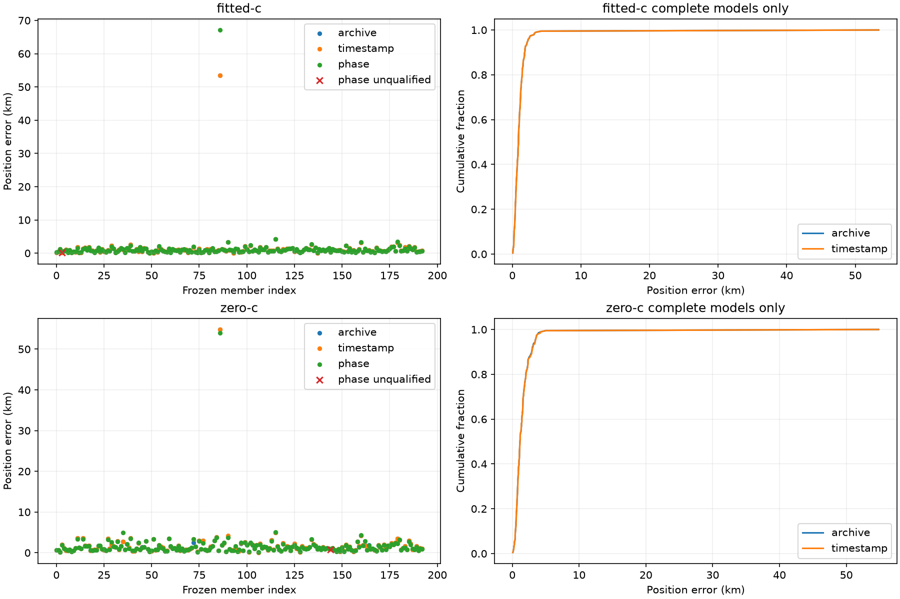

# Full-cohort phase comparison

All 193 consumed development members are retained. Archive is latest 107 candidate; fresh timestamp control and phase share fitted-derived starts. No operational winner is selected. Saved archive qualification is historical; fresh qualification uses unchanged independent KKT. Frequency fit is separate from accuracy.

| Dataset | Arm | Model | Qualified | Mean km | Median km | p95 km | Worst km |
|---|---|---|---:|---:|---:|---:|---:|
| full | fitted-c | archive | 193 | 1.254810208661937 | 0.8925649893361597 | 2.2357729804994544 | 53.4007411668201 |
| full | fitted-c | timestamp | 193 | 1.254810208639215 | 0.8925649893361597 | 2.235772981005515 | 53.40074116681601 |
| full | fitted-c | phase | 192 | withheld | withheld | withheld | withheld |
| full | zero-c | archive | 193 | 1.6840853292956026 | 1.1501435588178712 | 3.426454918282022 | 54.832123158914946 |
| full | zero-c | timestamp | 193 | 1.690865836395902 | 1.1501434982414782 | 3.454505512673735 | 54.78120411301172 |
| full | zero-c | phase | 192 | withheld | withheld | withheld | withheld |
| DS16 | fitted-c | archive | 63 | 0.9735956866741381 | 0.834879456563917 | 2.0342663211720438 | 3.2047981428197856 |
| DS16 | fitted-c | timestamp | 63 | 0.9735956866315837 | 0.834879456563917 | 2.0342663211690275 | 3.2047981428197856 |
| DS16 | fitted-c | phase | 63 | 0.9036417419944982 | 0.7504996782241962 | 1.9235350483111715 | 3.467368493714584 |
| DS16 | zero-c | archive | 63 | 1.3137592790906114 | 1.0750304888388371 | 2.9373025078166037 | 4.263626134724564 |
| DS16 | zero-c | timestamp | 63 | 1.3282794655204078 | 1.0750304919387494 | 3.3372363542262686 | 4.263626312643261 |
| DS16 | zero-c | phase | 63 | 1.243023165913205 | 0.9948379966760873 | 2.730478822518806 | 4.373476324581248 |
| DS17 | fitted-c | archive | 51 | 0.8191105531820497 | 0.6962757307780432 | 2.0589779896152556 | 2.483592781392106 |
| DS17 | fitted-c | timestamp | 51 | 0.8191105531817433 | 0.6962757307780432 | 2.0589779896152556 | 2.483592781391506 |
| DS17 | fitted-c | phase | 51 | 0.794122482858809 | 0.65158811559798 | 1.8534629566346066 | 2.3417905036078595 |
| DS17 | zero-c | archive | 51 | 1.3269221501257726 | 1.3599108447591617 | 2.874086008657886 | 3.124957809924034 |
| DS17 | zero-c | timestamp | 51 | 1.3285473747207734 | 1.3119506773310663 | 2.874086089245969 | 3.124957898077595 |
| DS17 | zero-c | phase | 51 | 1.3021810617784355 | 1.286472127817958 | 2.6516481784911514 | 3.2323471653806224 |
| DS18 | fitted-c | archive | 34 | 2.6916559925887857 | 1.1224608110355907 | 2.9035250889963375 | 53.4007411668201 |
| DS18 | fitted-c | timestamp | 34 | 2.6916559925843546 | 1.1224608111014995 | 2.903525088996528 | 53.40074116681601 |
| DS18 | fitted-c | phase | 34 | 3.085887568779559 | 1.0925539628382248 | 2.9497051802510263 | 67.12434131133426 |
| DS18 | zero-c | archive | 34 | 2.815838277035093 | 1.1301507804693458 | 3.7015307881542374 | 54.832123158914946 |
| DS18 | zero-c | timestamp | 34 | 2.835941035758365 | 1.1301507383888398 | 3.804904023265316 | 54.78120411301172 |
| DS18 | zero-c | phase | 34 | 2.7926127172418775 | 1.078021761660428 | 3.530584418862066 | 54.01300891406033 |
| newer development | fitted-c | archive | 45 | 1.056686667799553 | 0.9159676182592921 | 2.0845912671840003 | 4.2044892309726585 |
| newer development | fitted-c | timestamp | 45 | 1.0566866677653723 | 0.915967618294354 | 2.084591267157581 | 4.2044892309726585 |
| newer development | fitted-c | phase | 44 | withheld | withheld | withheld | withheld |
| newer development | zero-c | archive | 45 | 1.7522245087941164 | 1.472279732443075 | 3.5474340362882755 | 5.001511217318251 |
| newer development | zero-c | timestamp | 45 | 1.7439464171128776 | 1.4722795603385253 | 3.5474340441436487 | 5.001511627980441 |
| newer development | zero-c | phase | 44 | withheld | withheld | withheld | withheld |

Fallback applies only to unavailable/unqualified/integrity-failed fresh endpoints, never by true error. Runtime is summed processing cost, not wall time. Archive frequency RMS/support/stationarity/evaluation counts are unavailable in the lean projection; no model calls fill these gaps.

| Dataset | Arm | Fallback model | Fallbacks | Mean km | Median km | p95 km | Worst km |
|---|---|---|---:|---:|---:|---:|---:|
| full | fitted-c | timestamp | 0 | 1.254810208639215 | 0.8925649893361597 | 2.235772981005515 | 53.40074116681601 |
| full | fitted-c | phase | 1 | 1.283931465464241 | 0.828960097367757 | 2.155976013113633 | 67.12434131133426 |
| full | zero-c | timestamp | 0 | 1.690865836395902 | 1.1501434982414782 | 3.454505512673735 | 54.78120411301172 |
| full | zero-c | phase | 1 | 1.6479827143724717 | 1.0684176711649567 | 3.3796122926635204 | 54.01300891406033 |
| DS16 | fitted-c | timestamp | 0 | 0.9735956866315837 | 0.834879456563917 | 2.0342663211690275 | 3.2047981428197856 |
| DS16 | fitted-c | phase | 0 | 0.9036417419944982 | 0.7504996782241962 | 1.9235350483111715 | 3.467368493714584 |
| DS16 | zero-c | timestamp | 0 | 1.3282794655204078 | 1.0750304919387494 | 3.3372363542262686 | 4.263626312643261 |
| DS16 | zero-c | phase | 0 | 1.243023165913205 | 0.9948379966760873 | 2.730478822518806 | 4.373476324581248 |
| DS17 | fitted-c | timestamp | 0 | 0.8191105531817433 | 0.6962757307780432 | 2.0589779896152556 | 2.483592781391506 |
| DS17 | fitted-c | phase | 0 | 0.794122482858809 | 0.65158811559798 | 1.8534629566346066 | 2.3417905036078595 |
| DS17 | zero-c | timestamp | 0 | 1.3285473747207734 | 1.3119506773310663 | 2.874086089245969 | 3.124957898077595 |
| DS17 | zero-c | phase | 0 | 1.3021810617784355 | 1.286472127817958 | 2.6516481784911514 | 3.2323471653806224 |
| DS18 | fitted-c | timestamp | 0 | 2.6916559925843546 | 1.1224608111014995 | 2.903525088996528 | 53.40074116681601 |
| DS18 | fitted-c | phase | 0 | 3.085887568779559 | 1.0925539628382248 | 2.9497051802510263 | 67.12434131133426 |
| DS18 | zero-c | timestamp | 0 | 2.835941035758365 | 1.1301507383888398 | 3.804904023265316 | 54.78120411301172 |
| DS18 | zero-c | phase | 0 | 2.7926127172418775 | 1.078021761660428 | 3.530584418862066 | 54.01300891406033 |
| newer development | fitted-c | timestamp | 0 | 1.0566866677653723 | 0.915967618294354 | 2.084591267157581 | 4.2044892309726585 |
| newer development | fitted-c | phase | 1 | 1.0099759805475748 | 0.9441953545017385 | 1.8994671549737203 | 4.222374508620575 |
| newer development | zero-c | timestamp | 0 | 1.7439464171128776 | 1.4722795603385253 | 3.5474340441436487 | 5.001511627980441 |
| newer development | zero-c | phase | 1 | 1.742003064098469 | 1.3323788795445513 | 3.499846800714781 | 5.080886532128593 |

| Dataset | Arm | Comparison | Pairs | Improved | Regressed | Max regression km |
|---|---|---|---:|---:|---:|---:|
| full | fitted-c | paired_phase_minus_timestamp | 192 | 135 | 57 | 13.723600144518251 |
| full | fitted-c | timestamp_minus_archive | 193 | 4 | 3 | 2.1379712444868915e-09 |
| full | fitted-c | phase_minus_archive | 192 | 135 | 57 | 13.723600144514165 |
| full | fitted-c | fallback_phase_minus_timestamp | 193 | 135 | 57 | 13.723600144518251 |
| full | zero-c | paired_phase_minus_timestamp | 192 | 127 | 65 | 2.2286847120712148 |
| full | zero-c | timestamp_minus_archive | 193 | 91 | 102 | 0.8934833507395767 |
| full | zero-c | phase_minus_archive | 192 | 127 | 65 | 2.2286847731203387 |
| full | zero-c | fallback_phase_minus_timestamp | 193 | 127 | 66 | 2.2286847120712148 |
| DS16 | fitted-c | paired_phase_minus_timestamp | 63 | 55 | 8 | 0.2625703508947983 |
| DS16 | fitted-c | timestamp_minus_archive | 63 | 3 | 2 | 2.1379712444868915e-09 |
| DS16 | fitted-c | phase_minus_archive | 63 | 55 | 8 | 0.2625703508947983 |
| DS16 | fitted-c | fallback_phase_minus_timestamp | 63 | 55 | 8 | 0.2625703508947983 |
| DS16 | zero-c | paired_phase_minus_timestamp | 63 | 48 | 15 | 0.33094773971277863 |
| DS16 | zero-c | timestamp_minus_archive | 63 | 30 | 33 | 0.8934833507395767 |
| DS16 | zero-c | phase_minus_archive | 63 | 48 | 15 | 0.883844081151878 |
| DS16 | zero-c | fallback_phase_minus_timestamp | 63 | 48 | 15 | 0.33094773971277863 |
| DS17 | fitted-c | paired_phase_minus_timestamp | 51 | 30 | 21 | 0.17743202940310027 |
| DS17 | fitted-c | timestamp_minus_archive | 51 | 0 | 0 | 6.051690815134236e-10 |
| DS17 | fitted-c | phase_minus_archive | 51 | 30 | 21 | 0.1774320293830134 |
| DS17 | fitted-c | fallback_phase_minus_timestamp | 51 | 30 | 21 | 0.17743202940310027 |
| DS17 | zero-c | paired_phase_minus_timestamp | 51 | 29 | 22 | 0.5341053897417107 |
| DS17 | zero-c | timestamp_minus_archive | 51 | 24 | 27 | 0.24089836063983272 |
| DS17 | zero-c | phase_minus_archive | 51 | 29 | 22 | 0.5940040600949956 |
| DS17 | zero-c | fallback_phase_minus_timestamp | 51 | 29 | 22 | 0.5341053897417107 |
| DS18 | fitted-c | paired_phase_minus_timestamp | 34 | 22 | 12 | 13.723600144518251 |
| DS18 | fitted-c | timestamp_minus_archive | 34 | 1 | 1 | 1.2651515390871282e-09 |
| DS18 | fitted-c | phase_minus_archive | 34 | 22 | 12 | 13.723600144514165 |
| DS18 | fitted-c | fallback_phase_minus_timestamp | 34 | 22 | 12 | 13.723600144518251 |
| DS18 | zero-c | paired_phase_minus_timestamp | 34 | 21 | 13 | 0.19357205597787752 |
| DS18 | zero-c | timestamp_minus_archive | 34 | 15 | 19 | 0.4032032100178411 |
| DS18 | zero-c | phase_minus_archive | 34 | 20 | 14 | 0.34740728549142674 |
| DS18 | zero-c | fallback_phase_minus_timestamp | 34 | 21 | 13 | 0.19357205597787752 |
| newer development | fitted-c | paired_phase_minus_timestamp | 44 | 28 | 16 | 0.30601244718758824 |
| newer development | fitted-c | timestamp_minus_archive | 45 | 0 | 0 | 8.484404845354732e-11 |
| newer development | fitted-c | phase_minus_archive | 44 | 28 | 16 | 0.30601244718758824 |
| newer development | fitted-c | fallback_phase_minus_timestamp | 45 | 28 | 16 | 0.30601244718758824 |
| newer development | zero-c | paired_phase_minus_timestamp | 44 | 29 | 15 | 2.2286847120712148 |
| newer development | zero-c | timestamp_minus_archive | 45 | 22 | 23 | 4.1066218958718537e-07 |
| newer development | zero-c | phase_minus_archive | 44 | 30 | 14 | 2.2286847731203387 |
| newer development | zero-c | fallback_phase_minus_timestamp | 45 | 29 | 16 | 2.2286847120712148 |

All member status, exposure labels, regressing labels and separate frequency/prior/responsibility effects are retained in evaluation.json.
