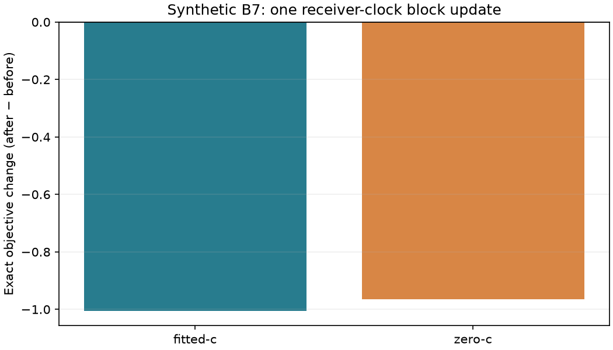

# A bounded receiver-clock block adapter for B7

This preparation connects the existing iteration 91 bounded quadratic solver
to actual production B7 likelihood terms. It is a synthetic integration test,
not a recording experiment, position improvement or measured speedup. The full
phase comparison remains the next recording experiment; this adapter is not
inserted into its frozen physics or fitting policy. Production is unchanged.

At fixed position, timing and satellite slopes, receiver clock corrections enter
predicted frequency linearly. The adapter freezes the current soft assignments
and alias windings, solves the bounded weighted least-squares receiver block
with its original coefficient prior, then evaluates the original wrapped mixture
again. It accepts only a qualified quadratic step with nonincreasing **exact**
objective. There is no line search or additional nuisance parameter. The step
uses at most two exact evaluations and one bounded linear solve.

All geometry/timing/static-c coefficients remain unchanged. Satellite slope
basis coefficients are locked at their original values. Both RF-time terms are
locked to zero in c=0; an invalid c=0 start is rejected rather than silently
changed. The current coefficient enters the prior gradient, so the solve does
not accidentally replace a prior on the coefficient with a prior on its update.
Failed or nonfinite exact refreshes retain the original state and explicit
failure reason. The implementation only admits the narrow-Gaussian regime used
by B7, for which the saved nearest-wrap residual represents its score.

Six initial tests exercise a synthetic production SlopePrior model with both c
arms, nonzero satellite coefficients and perturbed receiver clocks. They verify
exact objective descent, unchanged caller inputs, geometry and satellite locks,
c=0 admission, and restoration after increasing, nonfinite or throwing refreshes.
The first test run exposed a fixture shape error: satellite slopes use a
K−1-dimensional basis, not K independent coefficients. The fixture was corrected;
no golden fixture or production source was changed. Detailed synthetic outcomes
are in [synthetic.json](synthetic.json).

Independent review added two tests, for eight passing tests in total: the
quadratic gradient in every optimized receiver/RF direction agrees with the
production objective gradient to 1e-12, and fitted-c with RF drift explicitly
disabled preserves its locks. The full satellite gradient is deliberately not
represented by receiver-only clock_design; those columns stay locked. This
adapter assumes a feasible geometry/timing start from its caller and does not
replace the pipeline's independent full-model qualification.

This is not full nonlinear convergence: geometry/timing gradients and refreshed
assignments can still require movement. Repeated block updates at an already
qualified endpoint are not expected to materially improve accuracy under the
same model. The potential benefit is a cheaper inner step during search or
alternating joint fitting. Before using it, a separately frozen matched-start
experiment must measure end-to-end cost and objective/qualification against the
existing fitter, preserving both c arms and all failures. Position error must
remain a separate evaluation, not an acceptance rule. No receiver reference,
location constant, recording access or additional RF collection is involved.
