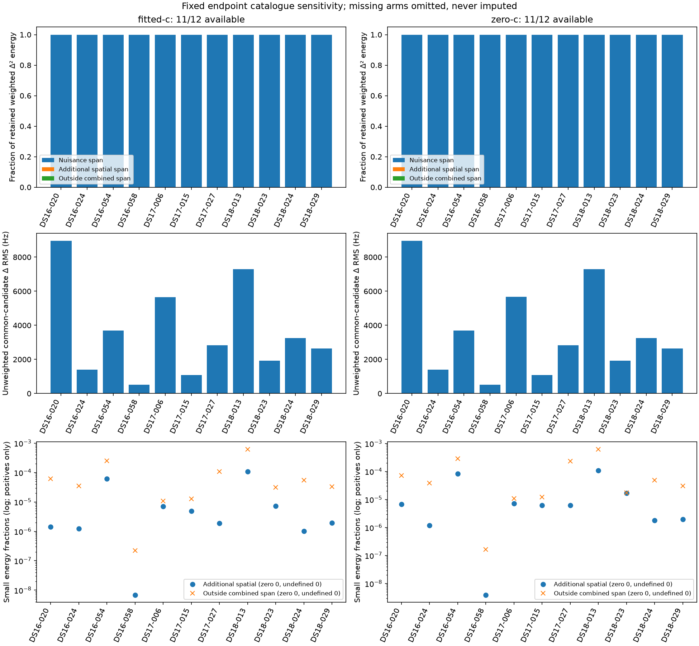

# Iteration 144 catalogue sensitivity

The frozen reference-free policy inspects at most 10 distinct earlier catalogue payloads within 24 hours and selects the first changed payload for the original satellite bank. The original endpoints, responsibilities, derivative spans and candidate policy remain fixed.

Recorded outcomes: catalogue-sensitivity: 11, no-earlier-changed-snapshot: 1.
fitted-c: nuisance-span fraction 99.927242%–99.999977% across 11 nonzero-energy comparisons zero-c: nuisance-span fraction 99.927232%–99.999983% across 11 nonzero-energy comparisons. This is local prediction-space absorption, not a fitted catalogue comparison or evidence of improved localization.

All 12 members are terminal: 12 complete, 0 failed. Failed members and partial arms remain in coverage. No optimizer was run.

This consumed development diagnostic changes catalogue predictions at fixed endpoints. It establishes neither position improvement nor independent validation. Local free derivative spans exclude priors and bounds; their energy fractions are not covariance or calibrated uncertainty.

Fractions use retained common-candidate weighted Δ² energy. Zero-energy fractions are undefined. Frequency RMS uses unweighted retained observation×candidate rows. Missing arms are omitted from the figure, never assigned zero; the tables disclose their denominators and omitted original responsibility-weight mass. Visibility counts and event-normalizer changes are separate from the frozen-visibility derivative projection.
The third figure row expands small additional spatial/outside fractions on a logarithmic axis. Exact zeros and undefined fractions are counted in its legend and omitted from that axis; no plotting floor is substituted.

| Member | Status | Admissions | Available arms | Error |
|---|---|---|---|---|
| DS16-020 | complete | fitted-c: complete, zero-c: complete | fitted-c, zero-c |  |
| DS16-024 | complete | fitted-c: complete, zero-c: complete | fitted-c, zero-c |  |
| DS16-054 | complete | fitted-c: complete, zero-c: complete | fitted-c, zero-c |  |
| DS16-058 | complete | fitted-c: complete, zero-c: complete | fitted-c, zero-c |  |
| DS17-006 | complete | fitted-c: complete, zero-c: complete | fitted-c, zero-c |  |
| DS17-015 | complete | fitted-c: complete, zero-c: complete | fitted-c, zero-c |  |
| DS17-027 | complete | fitted-c: complete, zero-c: complete | fitted-c, zero-c |  |
| DS17-031 | complete | fitted-c: complete, zero-c: complete | none |  |
| DS18-013 | complete | fitted-c: complete, zero-c: complete | fitted-c, zero-c |  |
| DS18-023 | complete | fitted-c: complete, zero-c: complete | fitted-c, zero-c |  |
| DS18-024 | complete | fitted-c: complete, zero-c: complete | fitted-c, zero-c |  |
| DS18-029 | complete | fitted-c: complete, zero-c: complete | fitted-c, zero-c |  |

## fitted-c

Available 11/12; unavailable 1/12.

| Member | Rows retained/original (positive W) | Candidates common/original | Δ RMS Hz | Original W | Omitted W (%) | Visibility changes | Event NLL Δ |
|---|---|---|---|---|---|---|---|
| DS16-020 (complete) | 112480/112480 (7202) | 32/32 | 8950.93 | 0.18499 | 0 (0.000%) | 0 | -0 |
| DS16-024 (complete) | 115804/115804 (7645) | 34/34 | 1406.21 | 0.206533 | 0 (0.000%) | 0 | -0 |
| DS16-054 (complete) | 82971/82971 (5833) | 27/27 | 3699.31 | 0.190872 | 2.77556e-17 (0.000%) | 0 | -0 |
| DS16-058 (complete) | 70104/70104 (4566) | 24/24 | 511.227 | 0.181135 | 0 (0.000%) | 0 | -0 |
| DS17-006 (complete) | 47780/47780 (4022) | 20/20 | 5661.39 | 0.144904 | 0 (0.000%) | 0 | -0 |
| DS17-015 (complete) | 121608/121608 (7493) | 36/36 | 1083.18 | 0.208734 | 0 (0.000%) | 0 | -0 |
| DS17-027 (complete) | 58256/58256 (4466) | 22/22 | 2827.15 | 0.163719 | 0 (0.000%) | 6 | -0.514625 |
| DS18-013 (complete) | 75661/75661 (5449) | 29/29 | 7292.75 | 0.141782 | 0 (0.000%) | 11 | -0.709699 |
| DS18-023 (complete) | 76470/76470 (4538) | 30/30 | 1928.78 | 0.157375 | 0 (0.000%) | 0 | -0 |
| DS18-024 (complete) | 82208/82208 (6248) | 28/28 | 3244.34 | 0.182153 | 0 (0.000%) | 0 | -0 |
| DS18-029 (complete) | 74817/74817 (5496) | 27/27 | 2648.88 | 0.17065 | -5.55112e-17 (-0.000%) | 0 | -0 |

| Member | Retained weighted Δ² energy | Nuisance % | Additional spatial % | Outside % |
|---|---|---|---|---|
| DS16-020 | 20918577 | 99.9937 | 0.0001 | 0.0062 |
| DS16-024 | 978673.7 | 99.9963 | 0.0001 | 0.0035 |
| DS16-054 | 4291822.7 | 99.9684 | 0.0062 | 0.0254 |
| DS16-058 | 47460.356 | 100.0000 | 0.0000 | 0.0000 |
| DS17-006 | 14246093 | 99.9982 | 0.0007 | 0.0011 |
| DS17-015 | 899322.44 | 99.9982 | 0.0005 | 0.0013 |
| DS17-027 | 7603849.6 | 99.9890 | 0.0002 | 0.0108 |
| DS18-013 | 7189416.1 | 99.9272 | 0.0108 | 0.0620 |
| DS18-023 | 1087964.5 | 99.9962 | 0.0007 | 0.0031 |
| DS18-024 | 3851637.4 | 99.9944 | 0.0001 | 0.0055 |
| DS18-029 | 3245921.2 | 99.9965 | 0.0002 | 0.0033 |

## zero-c

Available 11/12; unavailable 1/12.

| Member | Rows retained/original (positive W) | Candidates common/original | Δ RMS Hz | Original W | Omitted W (%) | Visibility changes | Event NLL Δ |
|---|---|---|---|---|---|---|---|
| DS16-020 (complete) | 112480/112480 (7195) | 32/32 | 8952.08 | 0.17958 | 2.77556e-17 (0.000%) | 0 | -0 |
| DS16-024 (complete) | 115804/115804 (7625) | 34/34 | 1406.24 | 0.200812 | 0 (0.000%) | 0 | -0 |
| DS16-054 (complete) | 82971/82971 (5838) | 27/27 | 3699.64 | 0.190917 | 0 (0.000%) | 0 | -0 |
| DS16-058 (complete) | 70104/70104 (4554) | 24/24 | 511.519 | 0.178938 | 2.77556e-17 (0.000%) | 0 | -0 |
| DS17-006 (complete) | 47780/47780 (4032) | 20/20 | 5663.09 | 0.142479 | 2.77556e-17 (0.000%) | 0 | -0 |
| DS17-015 (complete) | 121608/121608 (7481) | 36/36 | 1083.41 | 0.201957 | 0 (0.000%) | 0 | -0 |
| DS17-027 (complete) | 58256/58256 (4473) | 22/22 | 2828.35 | 0.161825 | 0 (0.000%) | 7 | -0.600396 |
| DS18-013 (complete) | 75661/75661 (5449) | 29/29 | 7293.85 | 0.141758 | 2.77556e-17 (0.000%) | 11 | -0.709699 |
| DS18-023 (complete) | 76470/76470 (4530) | 30/30 | 1928.77 | 0.156671 | 0 (0.000%) | 0 | -0 |
| DS18-024 (complete) | 82208/82208 (6272) | 28/28 | 3243.98 | 0.181604 | 0 (0.000%) | 0 | -0 |
| DS18-029 (complete) | 74817/74817 (5497) | 27/27 | 2648.84 | 0.17065 | 2.77556e-17 (0.000%) | 0 | -0 |

| Member | Retained weighted Δ² energy | Nuisance % | Additional spatial % | Outside % |
|---|---|---|---|---|
| DS16-020 | 20373560 | 99.9921 | 0.0007 | 0.0073 |
| DS16-024 | 967333.31 | 99.9961 | 0.0001 | 0.0038 |
| DS16-054 | 4287425.3 | 99.9627 | 0.0083 | 0.0290 |
| DS16-058 | 49660.187 | 100.0000 | 0.0000 | 0.0000 |
| DS17-006 | 13945310 | 99.9982 | 0.0007 | 0.0011 |
| DS17-015 | 878487.88 | 99.9982 | 0.0006 | 0.0012 |
| DS17-027 | 7532137.3 | 99.9763 | 0.0006 | 0.0231 |
| DS18-013 | 7208623.2 | 99.9272 | 0.0107 | 0.0621 |
| DS18-023 | 1085020.6 | 99.9966 | 0.0017 | 0.0017 |
| DS18-024 | 3818093.1 | 99.9949 | 0.0002 | 0.0049 |
| DS18-029 | 3244571.6 | 99.9967 | 0.0002 | 0.0031 |

Full-cohort aggregate conclusions are withheld when any member fails. No changed earlier catalogue is a recorded complete outcome without a sensitivity arm, not a zero effect. Snapshot inspection/admission errors and propagation filtering are preserved in [summary.json](summary.json). [REPORT_INTEGRITY.json](REPORT_INTEGRITY.json) binds protocol, terminal claims, receipts and generated artifacts.
