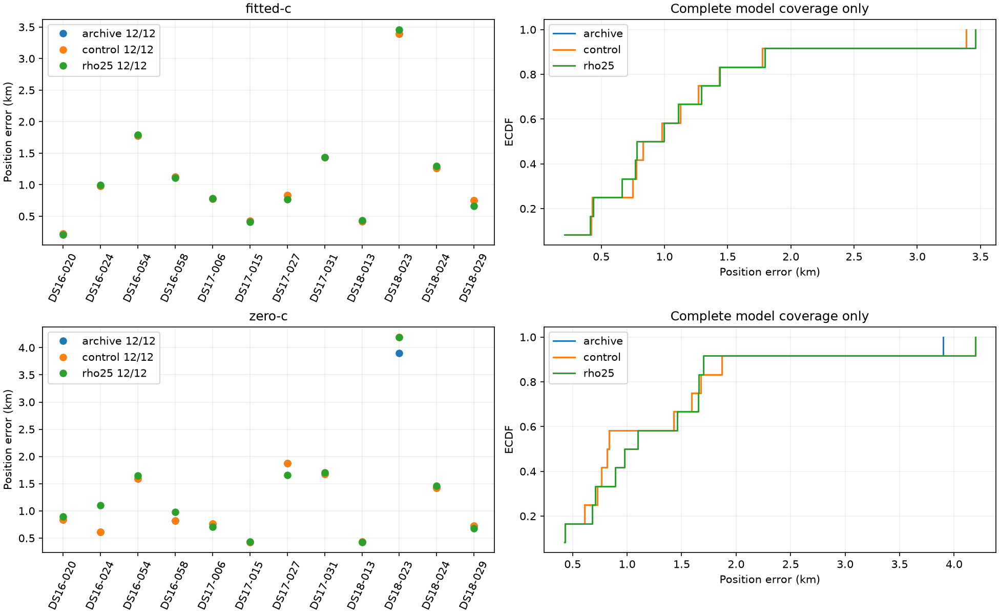

# Fixed paired-emission correlation does not justify broader rollout

All twelve consumed members completed, and all48 fits qualified. There were no missing inputs, failed attempts, retries or fallback substitutions. Timestamp physics, pairs, observations, banks, starts and priors were matched between the rho=0 control and fixed rho=0.25 candidate.

| Final arm | Control mean km | Candidate mean km | Control median km | Candidate median km | Better / worse |
|---|---:|---:|---:|---:|---:|
| Fitted c | 1.117359 | 1.114049 | 0.905836 | 0.890257 | 5 / 7 |
| c=0 | 1.280581 | 1.322881 | 0.826722 | 1.038222 | 4 / 8 |

The fitted-c mean improvement is only3.31m, about0.30%, while p95 worsens2.501273→2.543971km and worst error worsens3.389263→3.459085km. DS16 and DS18 fitted-c means regress slightly; DS17 improves. The matched c=0 mean worsens42.30m, with a maximum paired regression0.490651km. These effects do not justify a more expensive likelihood or a full193 expansion of this fixed-correlation variant.

The report's paired counts use its existing1e-9km numerical threshold. Historical-archive versus fresh-control counts can therefore include tiny floating-point differences that round to0.000000km in the table. Those counts are not evidence of meaningful localization changes; the unrounded deltas remain in the evaluation receipt.

Frequency evidence is separate: median posterior-weighted RMS change is+0.086Hz for fitted-c and+2.004Hz for c=0. Responsibilities change between models, so these RMS values are descriptive. Lower objectives under a different emission model do not establish improved localization or calibrate the exploratory rho value.

Summed member processing cost is258.247s, including reconstruction and four attempts per member. Summed fit times are0.624s control versus19.818s candidate for fitted-c, and13.433s versus20.557s for c=0. The fitted-c control starts at an already optimized endpoint; this is not a cold-fit speed comparison and those ratios must not be advertised as end-to-end or embedded slowdown factors. The earlier synthetic kernel benchmark remains a separate measurement.

**Decision:** do not deploy or expand this fixed rho=0.25 variant. Retain ordinary independent emissions. Prioritize the reference-free discovery ambiguity behind the remaining catastrophic error, with a separately frozen zero-led discovery test. This is a negative consumed-data pilot, not independent validation. No reserve or newer22 outcomes were opened, and the official full193 mean remains1.254810km.

The [complete report](RESULTS.md) includes dataset-specific metrics, paired regressions and frequency/runtime evidence. `REPORT_INTEGRITY.json` binds all24 result/claim receipts and generated report artifacts. Raw receipts are published directly; no additional archive format is needed for these24 files.
