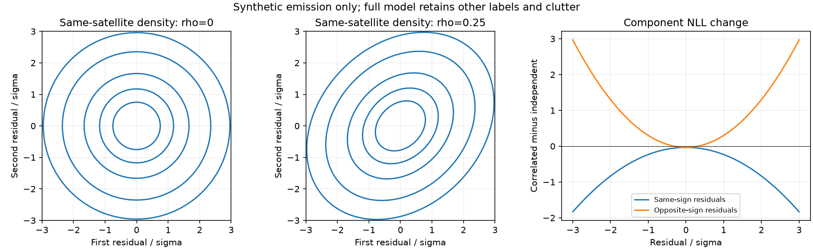

# Fixed correlated-emission prototype

This preparation tests a specific hypothesis: nearby, independently acquired
observations of the same satellite may share frequency error. Treating that
error as independent could overstate the repeated evidence for one position.
There is no measured position improvement yet and production is unchanged.

The prototype replaces only the same-satellite emission product with a bivariate
Gaussian at fixed correlation 0.25. It preserves independent satellite-label
priors, all different-label combinations, clutter, unpaired rows, and B7's
singleton-event probability. It adds no fitted nuisance parameter. The figure
illustrates that component alone; the actual likelihood retains the full mixture.

The O(K) positive-sum kernel avoids constructing a K-by-K label table. It retains
the Gaussian determinant and returns the correct marginal responsibilities and
prediction gradients. Zero correlation delegates directly to the unchanged
control. The research objective adapter supports either timestamp or phase
geometry through an explicit prediction function, preserving existing clock,
timing and satellite priors without changing module globals.

All 23 kernel/adapter synthetic tests pass, and Ruff is clean. Verification covers exact zero-correlation parity, independently
enumerated label combinations, density mass, finite-difference emission and
full parameter gradients, both geometry conventions and c arms, alias seams,
pair exchange, disjoint row accounting, and invisible/clutter extremes. Review
found that evaluating a large exponential before multiplying by zero visibility
could yield NaN for extremely small clutter. The kernel now evaluates only
visible diagonal components; strict floating-point regression tests cover it.

The first implementation looped over each pair in Python. Batching at most 256
pairs preserves O(K) work per pair and bounds additional workspace while reducing
that overhead. A fixed synthetic benchmark (3,500 rows, 30 satellites, 1,750
pairs, five timed calls) measured median kernel times of 35.57 ms for the
published scalar prototype and 4.02 ms for batching, versus 1.35 ms for ordinary
independent emissions. The objective difference was 7.28e-12 and responsibilities
and gradients passed the numerical equivalence check. A chunk-boundary test
verifies full pair and unpaired-row accounting. These host timings exclude orbit
prediction and optimization; they are not embedded or end-to-end speed claims.
The [benchmark receipt](synthetic_timing.json) records source hashes and all calls.

The narrow wrapped approximation is qualified only for the stated 125 Hz scale
and correlation range. It is not a general-purpose bivariate wrapped density.
The global 0.25 value is exploratory, not a covariance estimate from the earlier
residual analysis: iteration 139's centering artifact and uncertainty about
conditional means remain unresolved.

See [the fixed experiment plan](PLAN.md) and [independent derivation](MATH_REVIEW.md).
No recording fit or numerical protocol has been launched or frozen. Iteration
140's full-cohort assessment precedes choosing the single physics convention
for the proposed matched twelve-member test. Its position results will be
evaluated only after all attempts finish, separately from frequency fit.
