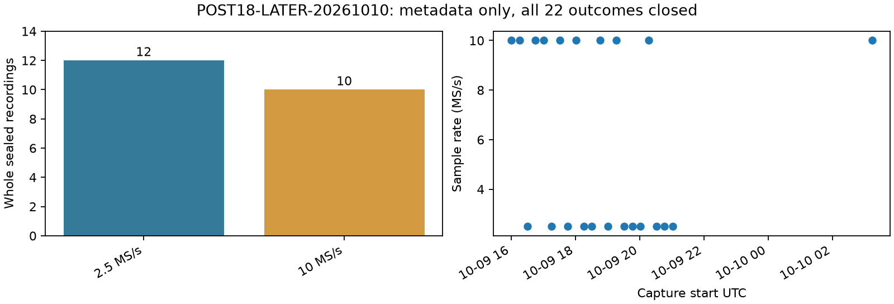

# A sealed, outcome-closed successor cohort

POST18-LATER-20261010 contains **22 whole sealed recordings**, 48,454 visits and 5,814.48 valid seconds per receiver. All 22 were published; the unchanged inventory also checked unpublished archives. Twelve recordings use 2.5 MS/s and ten use 10 MS/s. No partials or exclusions were reported. This is a metadata result, not an accuracy evaluation.

The fixed capture-start window is `[2026-10-09T15:46:15Z,2026-10-10T03:33:34Z)`. The clock cutoff preceded inventory. Protocol preparation was published at commit `922cc02bb` before the mint ran. All 788 frozen source hashes matched; fourteen unchanged offline mint tests passed. Mint and separate verification both exited successfully, with their exact commands and timestamps retained in the receipts.

Additional metadata comparisons found zero session or IQ-digest overlap against full DS16 (63), DS17 (51), DS18 (34), POST18-RESERVE (11) and parent89 (53). No quality or analysis-readiness filter was applied. Both receivers remain together.

All new outcomes remain closed; no development/reserve split is assigned. Existing eleven POST18-RESERVE members and parent89 newer009–016 remain closed. An identity-registry match does not necessarily show outcome consumption, and a missing match does not prove unseen validation. Exposure audit limitations remain explicit in the separate metadata receipt. No RF, retention hold, QNAP write or localization analysis occurred.

The exposure scan emits only filenames and matching session identities, never localization values. It covers text metadata in both report worktrees; files larger than 64 MiB are explicitly listed as unscanned, and nontext/binary archives and external UI/other-thread exposure are not certified. This bounded audit must not be used to claim the cohort is unseen.

The completed fixed-string scan covered **818,805 eligible text files** in 75.678 seconds, searching exact session, recording-manifest/input and IQ-digest tokens. It found zero identity matches, recorded 720 oversized files as unscanned, and reported zero access errors. Every new member therefore has no match within this limited scope; independence remains unproven. Existing consumed identities retain their consumed status; this inventory does not relabel them. The first inefficient metadata scan was explicitly terminated with exit 143; its last observed elapsed time was 295 seconds, while exact total duration was not captured. Both attempts remain documented. The mint and verification were not retried.

Full membership is recorded in the sealed local manifest; all 22 remain included, including any future input or fitting failures. The next candidate must be globally frozen before opening new outcomes.

Future numerical admission must reconstruct ordinary reference-free B7 observations, priors, regional bank and starts through the documented public input loader. Historical 193-member selected projections do not exist for these recordings and must not be transplanted as seeds. Missing input or publication readiness must remain explicit failures, not exclusions. No readiness or numerical input query is part of this mint.
