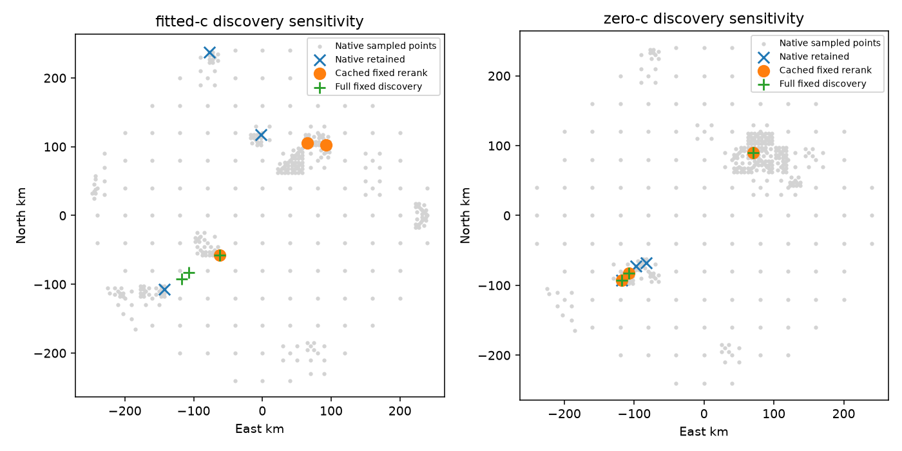

# Cached coarse-point reranking does not reproduce fitted-led rescue discovery

This is a receipt-only audit of the consumed DS18-022 mechanism. No predictor,
objective, fitter, recording loader or reference/evaluation port was called.
No position improvement is measured. Historical116/123/129 files are unchanged.

The proposed gate activates, but the fitted-native400-point domain omits the
first two full fixed-discovery retained centers. Reranking existing points cannot
recover those absent centers. This falsifies the narrow claim that cached-point
reranking reproduces iteration116's fitted-led discovery rescue; it does not
prove downstream continuation of the different centers would fail.

| Discovery sensitivity | Cached fixed rerank centers (east,north km) | Nearest native-retained distance of best | Gate |
|---|---|---:|---|
| fitted-c | (-62.5,-57.5); (65,105); (92.5,102.5) | 94.340 km | active |
| zero-c | (70,90); (-117.5,-92.5); (-107.5,-82.5) | 219.232 km | active |

Selection exactly implements the existing greedy score/east/north ordering and
global three-region separation of at least12.5km. Gate requires the best point
to be strictly farther than12.5km from every native retained center. Qualification
does not silently filter points:27 fitted and19 zero native coarse points remain
unqualified, as in the ordinary discovery policy. Both400-point domains seal;
terminal point failures are0 and missing cache points are0.

Full fitted fixed-discovery centers are(-107.5,-82.5),(-117.5,-92.5),(-62.5,-57.5).
Only the third is present in fitted-nativeP. Its ordinary local radius is
25km. Both missing centers have nearest native sample(-120,-80), spacing40km,
at12.747549km distance. They are absent, not present-but-outranked. Although that
coarse sample would have a28.284271km local radius if retained, this policy does
not retain it; geometry does not establish that its nuisance state could reach
either branch. The best cached retained center has local radius
25km; the absent first center is51.478km away, so its original local domain is
not reached simply by continuing that coarse center. Cached fitted spacing is
5/10/5km, yielding25km ordinary local radii throughout. Full fitted fixed discovery uses
5/5/5km spacing and the same25km local radii. Iteration123's direct continuation
explicitly uses25km for every retained region, independently of spacing.

Zero sensitivity retains the exact three full zero-fixed centers, with spacing
20/5/5km and local radii25/25/25km. This is a separate discovery-arm
sensitivity, not a matched final c ablation and not authorization to substitute
a zero-led or union discovery policy for the fitted-led pipeline.



## Provenance boundary

The historically published SEARCH_INTEGRITY binds traces/result/snapshot, but
contains **no point-cache hashes**. Iteration123's published protocol, however,
pins eight point-cache files. Four belong to fitted-nativeP; two of those add
fixed-score authority beyond the trace overlap. All eight hashes were verified.
All400 native scores per arm reproduce historically hash-pinned native trace
scores. Fixed scores on283 fitted /306 zero overlapping sampled points reproduce
historically hash-pinned fixed traces. Current point-cache bytes are retrospectively
bound in147 results.json; the remaining115/94 fixed scores lack historical hash
authority. Consequently the full400 rerank is provisional and cache-dependent.
No claim of fully historically frozen fixed-score verification is made.

Strict historically verified sensitivity, clearly not the400-point
policy: fitted285 retains(-62.5,-57.5),(92.5,102.5),(-142.5,-107.5); zero306 retains
the same three centers as its400-point rerank. Both gates activate. Even this
strict fitted sensitivity exposes disagreement but omits the two full-fixed
centers. Inventory disagreement alone therefore does not certify a useful rescue.

Sources and all read receipt hashes are recorded in results.json. Four tests
pass: score ties/global separation, exact strict gate boundary, and rejection
of incomplete/duplicate/nonfinite domains, and the distinction between25km
minimum local radius and12.5km basin separation. Pure report-owned selector imports
no application or model module. Historical trace binding and cross-score checks
are runtime assertions. Execution took seconds; this is receipt-processing cost,
not the cost of operational full-bank rescoring, which remains unknown.

Reproduce from repository root:

```sh
sudo -n /opt/leo-tracker/current-api/.venv/bin/python reports/2026_10_10_position_error_iter147/audit.py
sudo -n /opt/leo-tracker/current-api/.venv/bin/python -m unittest discover -s reports/2026_10_10_position_error_iter147 -p 'test_*.py'
```

No official mean update, independent-validation claim, deployment recommendation,
new numerical experiment, reserve exposure or git mutation follows this audit.

Correction after parent source review: the first publication confused12.5km
basin separation with25km minimum fit radius and overlooked the eight cache
hashes in the123 protocol. Both are corrected here and in the reproduced receipt.
The retained centers and the limited negative search conclusion are unchanged.
