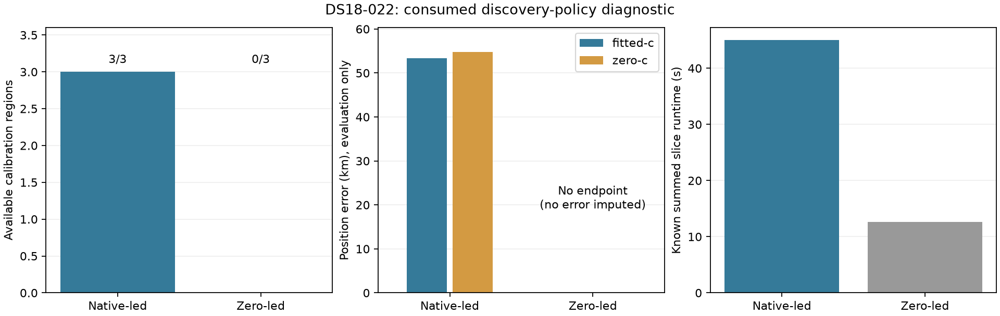

# Zero-led discovery did not produce an endpoint

Both branches completed one bounded slice. The fresh native control reproduced its historical endpoint and full-state parity checks passed. All three zero-led retained regions failed calibration with `AssertionError`; association and final fits were not reached. No position error or fallback is imputed for that branch.

| Discovery | Region | Calibration | Failure | Fitted-c finals qualified/attempted | c=0 finals qualified/attempted |
|---|---|---|---|---|---|
| native | retained-0 | qualified | — | 3/3 | 1/3 |
| native | retained-1 | qualified | — | 3/3 | 2/3 |
| native | retained-2 | qualified | — | 3/3 | 1/3 |
| zero | retained-0 | unavailable | AssertionError:  | 0/0 | 0/0 |
| zero | retained-1 | unavailable | AssertionError:  | 0/0 | 0/0 |
| zero | retained-2 | unavailable | AssertionError:  | 0/0 | 0/0 |

| Discovery | Arm | Endpoint | Error km | Frequency RMS Hz | Qualified |
|---|---|---|---|---|---|
| native | zero-c | selected | 54.832123165799764 | 108.48811829103796 | True |
| native | fitted-c | selected | 53.40074111497591 | 108.564524446494 | True |
| zero | zero-c | no-selected-endpoint | unavailable | unavailable | not reached |
| zero | fitted-c | no-selected-endpoint | unavailable | unavailable | not reached |

| Discovery | Completed/claimed slices | Known runtime seconds | Unfinished claims |
|---|---|---|---|
| native | 1/1 | 44.980728 | 0 |
| zero | 1/1 | 12.585609 | 0 |

This is one consumed scan, not an independent validation or population mean. Zero-led failure receipts do not identify the assertion's root cause. Different banks and policies are not selected by raw likelihood. Native matched c arms and frequency effects remain separate from position accuracy; the absent zero-led endpoint is not an accuracy result. This result does not measure whether zero-led discovery improves localization and supports no production change.

Source-only follow-up identifies a probable unsupported c=0-to-fitted-c handoff. The inherited [105 recovery](../2026_10_09_position_error_iter105/run.py) skips its prefit qualification when the saved coarse fit reports convergence. [103 validated_postfit](../2026_10_09_position_error_iter103/run.py) then tests stationarity with `rf_arm='fitted-c'`. A constrained c=0 optimum need not be stationary when c is freed. The blank assertion receipts do not retain which conjunct failed, so this source finding is a probable integration/admission failure, not evidence that zero-led discovery is poor. A separately frozen transition diagnostic is required; the failed branch is not rerun or admitted by relaxing its gate.

Full raw region/stage coverage, qualification, fresh-control parity and evaluation binding are retained in the [verified results archive](RESULT_ARCHIVE.md), including SUMMARY.json.
