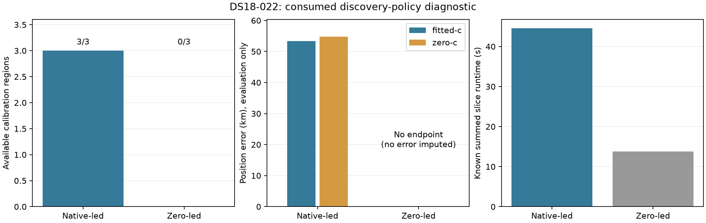
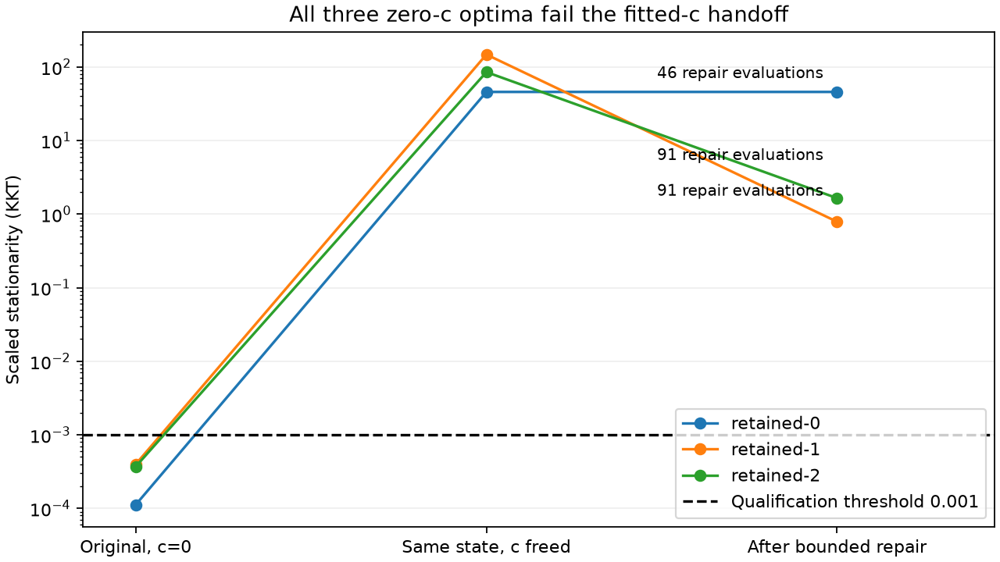

# Zero-led discovery did not produce an endpoint

Both branches completed one bounded slice. The fresh native control reproduced its historical endpoint and full-state parity checks passed. All three zero-led retained regions remained promotion-unqualified; association and final fits were not reached. No position error or fallback is imputed for that branch.

| Discovery | Region | Calibration | Failure | Fitted-c finals qualified/attempted | c=0 finals qualified/attempted |
|---|---|---|---|---|---|
| native | retained-0 | qualified | — | 3/3 | 1/3 |
| native | retained-1 | qualified | — | 3/3 | 2/3 |
| native | retained-2 | qualified | — | 3/3 | 1/3 |
| zero | retained-0 | promotion-unqualified | — | 0/0 | 0/0 |
| zero | retained-1 | promotion-unqualified | — | 0/0 | 0/0 |
| zero | retained-2 | promotion-unqualified | — | 0/0 | 0/0 |

| Discovery | Arm | Endpoint | Error km | Frequency RMS Hz | Qualified |
|---|---|---|---|---|---|
| native | zero-c | selected | 54.832123165799764 | 108.48811829103796 | True |
| native | fitted-c | selected | 53.40074111497591 | 108.564524446494 | True |
| zero | zero-c | no-selected-endpoint | unavailable | unavailable | not reached |
| zero | fitted-c | no-selected-endpoint | unavailable | unavailable | not reached |

| Discovery | Completed/claimed slices | Known runtime seconds | Unfinished claims |
|---|---|---|---|
| native | 1/1 | 44.523006 | 0 |
| zero | 1/1 | 13.816113 | 0 |

This is one consumed scan, not an independent validation or population mean. Different banks and policies are not selected by raw likelihood. Native matched c arms and frequency effects remain separate from position accuracy; the absent zero-led endpoint is not an accuracy result. This result does not measure whether zero-led discovery improves localization and supports no production change.

The explicit handoff diagnostic confirms that all three saved zero-c coarse states are feasible and qualified under zero-c, but fail fitted-c stationarity when c is freed. This identifies the unsupported admission transition behind iteration 148's blank assertions. The unchanged bounded repair also remains unqualified in all three regions; no calibration, association or zero-led final endpoint is admitted. This is not a test of zero-led localization accuracy, and no qualification gate was relaxed.

| Region | Original zero-c KKT | Same-state fitted-c KKT | Repair evaluations | Repair result |
|---|---:|---:|---:|---|
| retained-0 | 0.000112309027 | 45.7323095 | 46 | unqualified |
| retained-1 | 0.000399039541 | 147.432892 | 91 | unqualified |
| retained-2 | 0.000370821447 | 85.0806647 | 91 | unqualified |

After repair, stationarity is 45.73230947, 0.7875023813 and 1.647595086. The first region stops with `no-kkt-improving-admissible-step`; the other two stop with `round-budget`. All remain above 0.001. Reproduce this receipt-only figure with `python3 reports/2026_10_10_position_error_iter149/plot_handoff.py` after restoring the archive.

Full raw region/stage coverage, qualification, fresh-control parity and evaluation binding are retained in the [verified results archive](RESULT_ARCHIVE.md), including SUMMARY.json.
