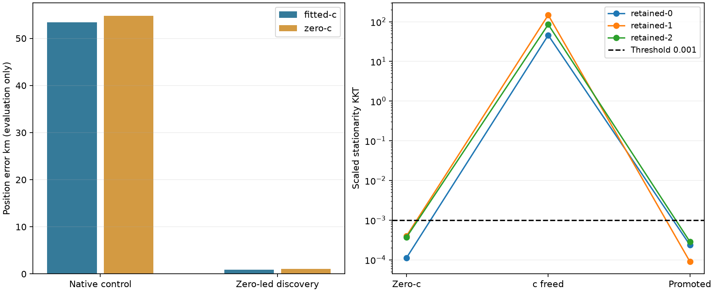

# Qualified handoff recovers a different discovery region

Native full-state parity passes for both final arms, with zero objective and vector deltas. All three zero-led promotions now qualify; no Newton fallback was needed. This is one consumed DS18-022 diagnostic, not independent validation or a cohort mean.

| Discovery | Arm | Error km | Frequency RMS Hz | Region | Final KKT |
|---|---|---:|---:|---|---:|
| native | fitted-c | 53.400741 | 108.564524 | retained-1 | 9.7933035e-06 |
| native | zero-c | 54.832123 | 108.488118 | retained-1 | 2.66242146e-05 |
| zero | fitted-c | 0.934270 | 84.798198 | retained-0 | 3.88708547e-05 |
| zero | zero-c | 1.099333 | 92.615058 | retained-0 | 0.000199415816 |

| Region | Zero-c KKT | Freed-c KKT | Promoted KKT | Feasible evaluations | Seconds |
|---|---:|---:|---:|---:|---:|
| retained-0 | 0.000112309027 | 45.7323095 | 0.000235877178 | 103 | 0.205529 |
| retained-1 | 0.000399039541 | 147.432892 | 9.00423761e-05 | 100 | 0.195848 |
| retained-2 | 0.000370821447 | 85.0806647 | 0.000285556798 | 113 | 0.219317 |

| Branch | Known slice seconds | Calibration regions |
|---|---:|---:|
| native | 44.586436 | 3/3 |
| zero | 52.105545 | 3/3 |

Both zero-led final arms select retained-0, `point:-82.5:-67.5`, via B7. Native selects retained-1, `point:-142.5:-107.5`. Selection used the frozen model rule; reference errors were calculated only after both branches completed. The discovery methods can have different banks, so frequency RMS, support and scores are operational model-specific summaries, not an identical-bank likelihood comparison. The improved frequency fit alone does not establish position accuracy.

Iteration 149 established that zero-c optima were not stationary with c freed. The separately frozen nonlinear promotion solves that admission transition and retains the 0.001 qualification gate. This single-case recovery supports a broader matched evaluation, not deployment or a general accuracy claim.

Full qualification, support, selected states and receipts are in the [verified archive](RESULT_ARCHIVE.md).

This consumed motivating case was selected for catastrophic-failure diagnosis. The ordinary discovery bootstrap remains fitted-derived, so this is not a pure zero-c pipeline. Final c arms are matched within each branch; no cross-bank score winner is selected and these results are not spliced into full-cohort metrics. Promotion evaluation counts are retained feasible evaluation records, not all objective calls or optimizer iterations.

| Branch | Region | Fitted-c qualified/attempted | c=0 qualified/attempted |
|---|---|---:|---:|
| native | retained-0 | 3/3 | 1/3 |
| native | retained-1 | 3/3 | 2/3 |
| native | retained-2 | 3/3 | 1/3 |
| zero | retained-0 | 3/3 | 2/3 |
| zero | retained-1 | 3/3 | 3/3 |
| zero | retained-2 | 3/3 | 3/3 |

Native has 9/9 qualified regional recovery fitted-c finals and 4/9 qualified regional recovery c=0 finals; zero-led has 9/9 and 8/9 respectively. These counts cover regional recovery finals; B7 joint alternatives are separate. Six unqualified c=0 alternatives remain in the archive. All six regional calibrations and associations were available.
