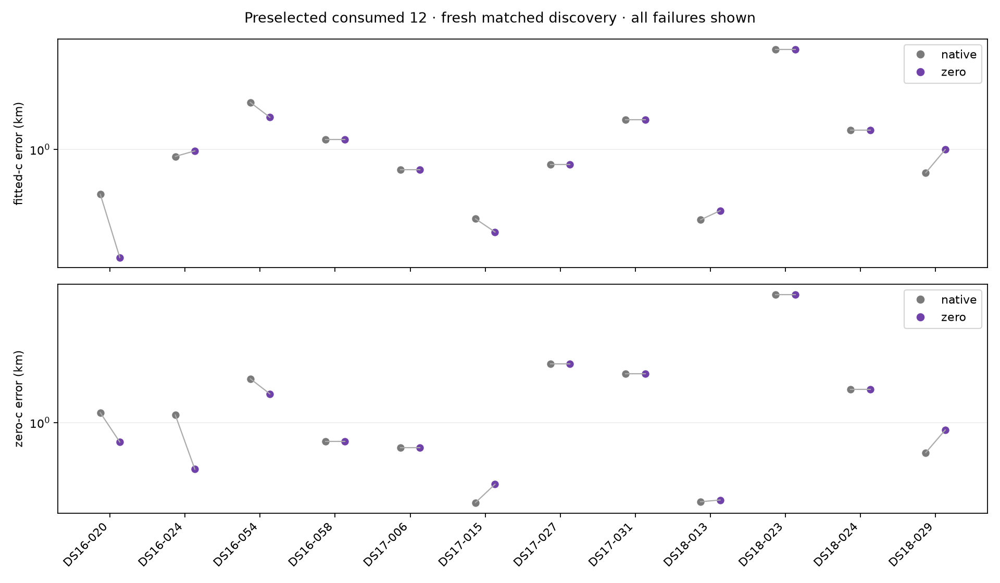

# Zero-led discovery: small mean gain, mixed individual results

The completed twelve-recording pilot reduced fitted-c mean position error from
**1.141562 to 1.115799 km** (25.8 m, 2.26%). It passed the predeclared screen:
complete matched coverage, lower fitted-c mean, and no fitted-c regression above
1 km. This is a consumed development panel, not independent validation, a full
DS16/DS17/DS18 result, or justification for deployment. The standalone 0.4 km
goal remains unmet. Production B7 and the official 193-member research mean of
1.2548102087 km remain unchanged.

Both strategies freshly searched 400 points with the same 40/20/10/5 km hierarchy,
retained three regions, and ran matched final c=0/fitted-c fits. One discovery
strategy fitted c; the other locked c=0 while searching. This single-pass pilot
is not parity with deployed B7's multiple retention radii. Banks can differ
between discovery strategies; final c arms are matched within each strategy.

| Dataset / four consumed members each | Fitted-c mean: native → zero-led km | Final c=0 mean: native → zero-led km |
|---|---:|---:|
| DS16 | 1.099141 → 0.963690 | 1.150814 → 0.898456 |
| DS17 | 0.867977 → 0.852056 | 1.184515 → 1.207502 |
| DS18 | 1.457567 → 1.531650 | 1.619744 → 1.671334 |
| All twelve | 1.141562 → 1.115799 | 1.318358 → 1.259097 |

The fitted-c median **worsened from 0.873723 to 0.989247 km**. The p95 improved
from 2.501273 to 2.339081 km, while the 3.389264 km worst case stayed essentially
unchanged. Final c=0 mean improved by 59.3 m overall, with a median improvement
from 1.096725 to 0.870231 km and essentially unchanged 3.897895 km worst case.
See [full results](RESULTS.md) for per-dataset median/p95/worst, every paired
delta, frequency RMS, stage failures and timing. Frequency fit is reported
separately and does not establish localization improvement.

Six fitted-c pairs change materially: DS16-020 improves 311.1 m, DS16-054 improves
294.9 m, and DS17-015 improves 63.7 m; DS16-024 regresses 64.2 m, DS18-013 regresses
49.7 m, and DS18-029 regresses 246.6 m. The other six differ by less than 0.3 mm.
Literal 7-improved/5-regressed sign counts include these numerical ties. The
DS18 subset gets worse on average, so the pilot's passing gate should not be
described as a broad typical-error improvement.

All 36 member/phase receipts and both batch receipts completed; both processes
exited 0 with no controller failure. All 48 selected endpoints qualified, and
all 288 recorded intermediate joint fits qualified. Earlier failures were still
preserved: native calibrated 34/36 retained regions, versus 33/36 for zero-led;
qualified regional final attempts were 197/204 and 191/198 respectively.

The five rejected retained regions were native DS16-020/retained-1 and
DS16-024/retained-0, and zero-led DS17-006/retained-0,
DS17-015/retained-0 and DS17-027/retained-1. These returned coarse states failed
their own-arm stationarity gate before continuation. This is evidence about
the returned state, not proof that the optimizer's terminal state was
nonstationary. The fitter can return its best objective evaluation separately
from that terminal state. [Handoff analysis](HANDOFF_OBSERVATIONS.md) explains
the distinction and conditional repair opportunities.

The next lean comparison is [iteration 154](../2026_10_10_position_error_iter154/README.md):
reuse the sealed discovery queues and exact retained regions, apply one uniform
bounded own-arm repair rule before unchanged continuation, and run fresh matched
downstream controls. This targets the measured five-region admission gap without
repeating grids or choosing repairs by reference error. It needs its own frozen
protocol and review before recording execution. The marginalization prototype's
seven synthetic checks also passed, but actual RF-likelihood parity and bounded
integration remain untested, so it is not the next recording-level comparison.

Recorded invocation time totals are 10,080.223 s for shared search, 900.151 s for
native continuation and 862.148 s for zero-led continuation: 11,842.522 worker
seconds. These include [shared-host I/O contention](HOST_IO_OBSERVATION.md),
exclude some controller/startup overhead, and are not an embedded-speed benchmark.
The [runtime audit](ENVIRONMENT_AUDIT.md) records shard 0's interpreter alias
deviation and the limited observed numerical-library equivalence. No worker was
restarted or budget changed to compensate.

Frozen source, input and evaluation checks passed before reference access. The
[supplemental integrity manifest](PUBLICATION_INTEGRITY.json) reports 36 terminal
phases, two complete batches and no missing/foreign artifacts. The position plot
was visually inspected. [SUMMARY.json](SUMMARY.json) retains compact result and
qualification evidence plus raw receipt hashes. Raw receipts remain local, as
documented in [publication scope](PUBLICATION_POLICY.md); this is not a remote
standalone reproduction bundle. Reserve/newer closed outcomes were not opened.
