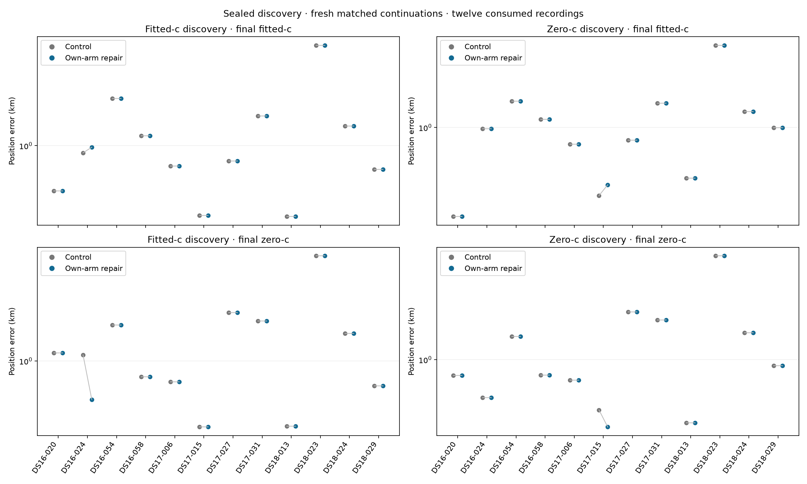

# Own-arm qualification before the existing calibration transition

## Completed result: no fitted-c accuracy improvement

All 48 fresh continuation cells completed, all 96 selected final endpoints
qualified, and both batches exited successfully. Source/input/evaluation bindings
passed before reference evaluation. All 24 fresh controls matched their historical
selected states under the frozen parity rule. **Both progression checks failed.**

| Discovery policy | Final arm | Control mean km | Repair mean km | Change m |
|---|---|---:|---:|---:|
| Fitted-c | fitted-c | 1.141562 | 1.146914 | +5.352 |
| Zero-c | fitted-c | 1.115799 | 1.121093 | +5.294 |
| Fitted-c | zero-c | 1.318358 | 1.278776 | −39.582 |
| Zero-c | zero-c | 1.259097 | 1.250438 | −8.660 |

These are the twelve previously consumed pilot members, four per dataset—not
the full DS16 (63), DS17 (51), or DS18 (34) cohorts. Dataset-specific distributions,
every paired regression, frequency-fit effects, failures and timings are in
[RESULTS.md](RESULTS.md) and [SUMMARY.json](SUMMARY.json).

Four of five originally rejected regional starts became qualified after
21–120 ms of bounded repair; DS17-027 remained unqualified. Recovering these
regions did not improve fitted-c localization. The two material fitted-c changes
were regressions: DS16-024 under fitted-c discovery (+64.227 m) and DS17-015 under
zero-c discovery (+63.524 m). Their frequency RMS nevertheless improved,
70.262→59.335 Hz and 53.510→50.928 Hz respectively. A better frequency fit alone
therefore remains insufficient evidence of better position accuracy. Worst-case
position error did not improve under either discovery policy.

New continuation costs were 811.315/837.768 worker-seconds (control/repair,
fitted-c discovery) and 767.414/815.910 seconds (zero-c discovery), 3232.407 total.
Inherited iteration151 discovery cost was 10080.223 seconds and was reused, not
rerun or counted once per continuation. These host timings are not embedded
performance benchmarks; the tiny bounded-repair calls exclude downstream
calibration and final fitting. Full timing receipts remain in the summary.

[FAILURE_NOTES.md](FAILURE_NOTES.md) documents the remaining convergence mismatch
and an untested possible successor. This result does not support expanding or
deploying this repair as an accuracy improvement. The official 193-recording
mean remains 1.254810 km and production B7 is unchanged. The 0.4 km goal is unmet.

The rendered PNG was visually inspected. Raw receipts are preserved locally;
[PUBLICATION_INTEGRITY.json](PUBLICATION_INTEGRITY.json) binds batch/results and
published outputs but does not provide standalone remote replay.

## Earlier preparation record

The following records preparation status before execution; the completed result
above supersedes its future-tense and not-yet-run statements.

Preparation and independent review are complete. Iteration 151 is fully evaluated
and published; this successor will test the uniform repair against fresh controls
using its sealed discovery. The implementation's 29 source/synthetic tests passed
in 1.43 seconds with the pinned 47e interpreter. Metadata-only preparation checked
the twelve members, source/input bindings and numerical runtime. No recording
fit, new grid, or deployment change has occurred in this iteration.

[PLAN.md](PLAN.md) defines the matched experiment and progression rule;
[REVIEW.md](REVIEW.md) records the independent source review. A separate metadata
freeze and publication precede the two-worker recording replay. The design notes
below preserve the original preparation rationale; the recording adapter and
all-48-terminal reporter are now implemented, rather than future proposals.

The initial retained-state diagnostic established that two original **returned best
feasible states** failed their independent KKT check. The coarse fitter did not
persist the optional terminal diagnostics in this path. The optimizer's actual
terminal state is therefore unknown; this is not proof that it stopped at a
nonstationary point or that increasing its iteration budget would help.

`own_arm.py` adds one narrow, injected-port wrapper. It first audits the original
state under its own discovery arm. Qualified states pass through without repair,
regardless of the saved optimizer/convergence flag. An unqualified retained state
gets exactly one existing bounded-fit attempt from its original vector, at the
same fixed position and under the **same** discovery arm, with hard60 slopes,
5 seconds and 200 maximum iterations. The zero-c coarse lock remains exact.
The supplied independent auditor must use the actual `_Problem`, original prior
disk, orbit-coverage/coupled timing constraints, static-c bounds, and fixed-position
constraints, with finite objective/gradient and full scaled KKT ≤0.001. Local
checks additionally reject moved points, changed vector size/arm, slope violations
and nonfinite states. A qualified replacement may not worsen the independently
repriced original objective by more than the existing 1e-6 comparison tolerance.

Only then does an explicit caller-supplied function invoke the unchanged
[150 transition](../2026_10_10_position_error_iter150/transition.py). This wrapper
does not import or construct that runtime adapter. It does not call iteration
102: that qualifier assumes fitted-c and cannot silently repair a zero-c state
under its original constraints. The ordinary 150 promotion/polish, if needed
after own-arm admission, remains a separate downstream action and cost.

The bounded port returns serialized PositionFit and diagnostics dictionaries;
a future adapter must use production `json_value` without losing terminal/best
state evidence. Originals, audit records, returned candidate, solver diagnostics,
rejection reasons and downstream transition results are kept separately. Invalid
nonfinite evidence is represented as a string for JSON-safe failure receipts,
never admitted as a fitted value. `own-arm-admitted` certifies only this gate,
not successful downstream calibration, final qualification or position accuracy.

No completed discovery score is overwritten or reranked, no retained region is
added, and no reference coordinate/error selects a repair or winner. The same
conditional rule applies globally to both discovery arms. The bounded fit already
prefers independently qualified feasible candidates when available, unlike merely
returning the lowest-score unqualified state; this is not just a longer legacy
coarse fit. Its five-second deadline is checked during optimizer evaluations and
callbacks, so independent audits and summarization can add wall time. Additional
attempts/cost must be explicit in any future frozen controller budget.

Fake-port tests cover both arms, exact budgets, unchanged
originals, bypass of already-qualified states, rejected movement/locks/nonfinite
values/worse scores, and preservation of failure diagnostics. These tests have
run as lightweight unit checks alongside the three publisher tests:
`14 passed in 0.09s` with the pinned 47e interpreter and pytest plugin autoload
disabled. Eleven cases belong to this wrapper. They exercise injected fake
ports, not an optimizer, numerical model, quadrature or recording. No additional
numerical research worker was started. Production-adapter parity and localization
benefit remain untested. No generic controller, storage mechanism or recording
adapter is added.

## Possible successor execution after full 151 review

Reuse sealed 151 discovery rather than another grid search. Preserve all twelve
members and both discovery policies, including failed or incomplete rows. For
each completed queue, use exactly its three retained regions, original bootstrap,
satellite subset and original coarse fit. Do not rerank discovery using repaired
scores, substitute another region or use a later promoted fit as the original.

A separate protocol must bind the published 151 protocol; terminal searches,
original point/bootstrap bytes and retained-region trace authority; clean public
input identities and observation content/order; causal TLE snapshot and exact
bank ordering/orbit states; numerical sources/native library/runtime; and all
prior, constraint and fitting policies. Subset indices must identify the same
physical satellites. Reconstruct and independently reprice each original before
repair, checking its discovery-arm lock, fixed coordinates and physical bounds.
Keep reference-error evaluation authorities outside inference admission. Freeze
the additional repair budget and separate control/candidate stage identities.

The clearest primary comparison is **fresh downstream control versus fresh
downstream candidate from the same sealed discovery**. Control uses unchanged
150; candidate adds this own-arm repair before unchanged 150. Both retain three
regions and identical downstream settings, including both final c arms. Earlier
151 endpoints are historical parity comparators, not automatically fresh controls.
Expose control replay differences; time-limited fitting is not necessarily
bitwise deterministic, and tolerances must not change after outcomes are seen.

Reusing an unchanged regional continuation is defensible only if its effective
admitted prefit, correction, association, bank, vector/clock starts, constraints,
sources and complete input/policy bindings are identical and the relevant stage
receipts are complete and independently qualified. A changed prefit invalidates
all dependent stages. Unchanged coordinates alone do not establish equivalence.
Nor can an unchanged region justify reusing the branch-level B7 selection when
another region changes: that selection depends on the complete region inventory.
Any such reuse is explicitly cached computation with historical-cost accounting,
not fresh matched downstream timing. Fresh continuations are simpler to audit
for the initial small handoff comparison.

Report inherited discovery cost separately from new own-arm repair evaluations
and elapsed time, and separate those from existing free-c promotion, calibration
and final-fit costs. Apply the same repair rule to every retained own-arm failure
in both branches; labels, reference errors and earlier favorable outcomes never
decide which failures receive it. Preserve missing inputs, unqualified repairs
and budget exhaustion in full-member coverage. Evaluate position only after all
declared continuations seal, keeping both final c arms and frequency effects
separate. This design authorizes no replay, implementation, freeze or launch.
