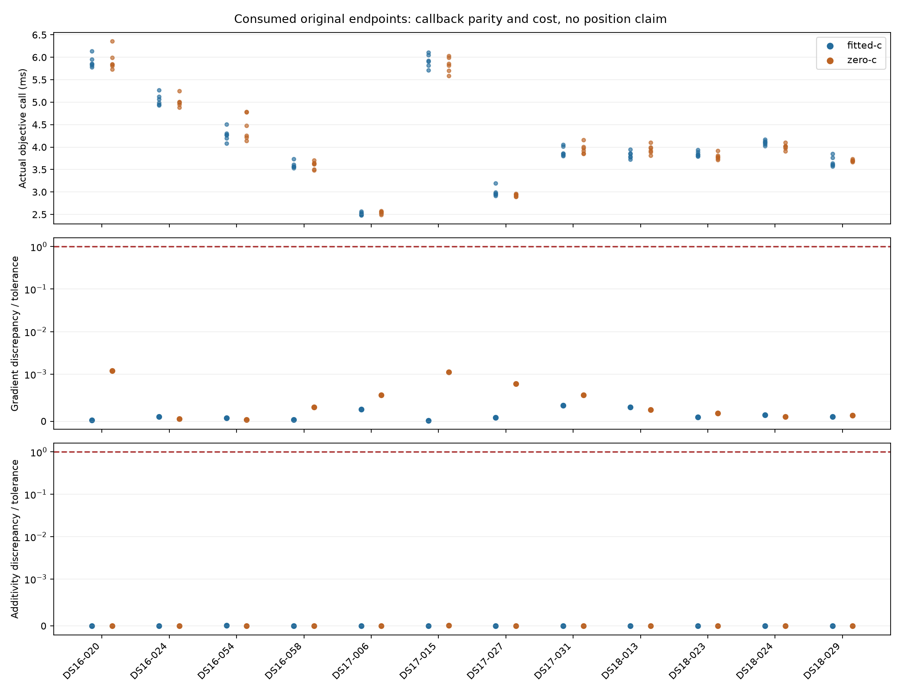

# Actual-model clock-uncertainty preflight

## Completed result

Both workers exited successfully. All twelve members and 24 c-arm endpoints
passed, with **144 actual likelihood calls**, no failed or missing endpoints and
no retries. All twelve pairs had identical reconstructed model, input and local
constraint identities. Frozen source/input/runtime and matching claim/result
identities were verified before aggregation.

| Check | Observed result |
|---|---:|
| Maximum saved-objective discrepancy | 0 NLL |
| Maximum central-derivative discrepancy | 1.208e-8 NLL/amplitude-unit |
| Largest derivative discrepancy / declared tolerance | 0.001208 |
| Maximum receiver additivity discrepancy | 1.455e-11 NLL |
| Maximum independent anchor KKT | 0.00078194 (limit 0.001) |
| Actual objective call, median / mean | 3.914 / 4.137 ms |
| Actual objective call, minimum / maximum | 2.477 / 6.356 ms |

All objective calls together took 0.596 seconds; complete diagnostic work took
1.979 seconds. Public input reconstruction dominated at 144.893 worker-seconds,
within 147.086 total member seconds. These costs are nested, not additive, and
are host measurements rather than embedded performance estimates. Endpoint model
reconstruction accounted for 0.106 seconds of the total.

The existing callback is cheap enough for a bounded exploratory integral without
first implementing a cache. Numerical parity does not establish integration
accuracy, global mode coverage or localization benefit. The next unresolved issue
is reliable finite-interval integration within a small fixed budget; an overly
conservative bound must fail honestly rather than silently miss another mode.
No spatial search or fit was run. The official 193-recording mean remains
1.254810 km, and the 0.4 km goal remains unmet. Production B7 is unchanged.

[RESULTS.md](RESULTS.md) contains all per-dataset coverage and per-endpoint checks;
[SUMMARY.json](SUMMARY.json) contains compact machine-readable evidence.
[Raw receipts and claims](raw-receipts.tar.gz) preserve the complete callback
diagnostics; [REPORT_INTEGRITY.json](REPORT_INTEGRITY.json) binds their hashes and
published artifacts. The archive does not include the external recording store.
The three-panel PNG was rendered and visually inspected. Seven reporter tests
passed in 0.07 seconds, in addition to the 36 pre-execution component tests.

## Preparation record

The following describes preparation before the completed run above.

This experiment checks the existing likelihood at the original selected endpoints
of the twelve consumed development recordings used in iteration154, in both final
c arms. It does not fit positions, integrate a likelihood, or evaluate position
errors. The goal is to establish derivative/factorization parity and measure the
cost of exact likelihood calls before deciding whether nuisance integration is
worth implementing.

[PLAN.md](PLAN.md) defines six maximum joint calls per endpoint, with a 30-second
soft callback budget. Reconstruction costs are separate. All twelve members and
both arms remain in coverage, including failures. Source, input and runtime
identities must be frozen and published before the two serial shards launch.

The source review verified the B7 seed authority: one joint-stage chain is run
after selecting the regional winner. Each of the 24 saved endpoints matches its
corresponding B7 attempt, and each member's two arms share the same region and
ordered satellite bank. The runtime check will additionally compare the complete
reconstructed model and local constraint identities. Shared labels alone are not
a controlled c ablation, and this preflight makes no c-effect or accuracy claim.

Initial component tests passed (35 tests, 0.19 seconds, pinned47e interpreter and
single-thread numerical libraries). A subsequent metadata-only preparation check
correctly detected that iteration154's README had been updated after completion
to report its results. The successor records only that exact published narrative
change as preparation provenance; it is not an inference input. Every inherited
scientific source and other input remains strictly bound. The final test receipt,
protocol and execution results will supersede this preparation status.

No production change or new RF collection is part of this work. Iteration154's
negative result and the official 193-recording position metric remain unchanged.
