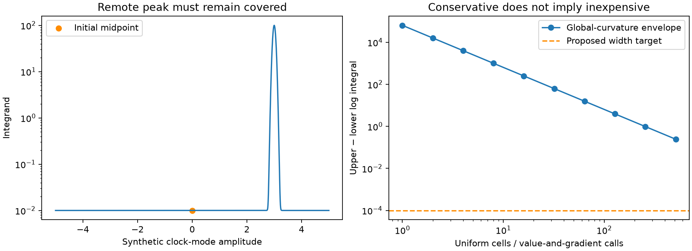

# Scalar curvature and cell-envelope preparation

Implements the first, deliberately simple affine-integral envelope from
[152 FOLLOWUP_MATH](../2026_10_10_position_error_iter152/FOLLOWUP_MATH.md).
No recordings, objective callbacks, quadrature engine or experiment freeze.
All 19 synthetic tests passed in 0.15 seconds under the pinned 47e2705e release
Python environment, with numerical libraries restricted to one thread.

`report.py` measures uniform-partition bounds on a deliberately remote narrow
peak with an analytically known integral. Every partition brackets that integral.
See [SUMMARY.json](SUMMARY.json) for the complete measurements. This is a
synthetic feasibility diagnostic, not an adaptive integrator or a localization
experiment; its function evaluations do not call the production objective.

At 512 uniform cells the log-integral width is **0.245295**, versus the proposed
**0.0001** target: about 2,453 times too wide. This establishes a limitation of
uniform subdivision with global curvature bounds on this synthetic example.
It does not establish failure of adaptive refinement on recordings. No new
position-error estimate is available and B7 remains unchanged.

Independent mathematical/code review found no substantive bound defect and
requested a multiple-component, multiple-winding seam test; that fixture now
covers both direction signs. Before a recording adapter is frozen it must
explicitly enforce the production nearest-image likelihood branch (sigma at
most 1000 Hz). These jump bounds are not a theorem for a different wrapped
density implementation.

`curvature_bounds` uses positive clutter and the nonnegative Lambert W bound,
evaluated through Wright omega to avoid forming a large exponential.
`log_affine_integral` treats zero, small and large slopes stably.
`cell_envelope` applies uniform quadratic remainders around the exact affine
integral. Its seam-jump argument is mandatory. `seam_log_bound` supplies a global
conservative crossing count when exact seams are unavailable; mathematically
nonzero tiny jumps remain finite logarithms and are explicitly flagged if their
linear remainder underflows. No tiny jump is silently treated as proof of a
seam-free cell.

Numerical bounds include outward rounding slack, but this is not formal interval
arithmetic or a proven bound on all floating-point/libm error. Curvature claims
apply to the fixed-geometry, positive-clutter mathematical likelihood and proper
scalar Gaussian prior. They do not establish whole-support integration accuracy,
production parity, embedded cost or positioning benefit. A large upper envelope
is an honest unresolved bound, not evidence that a remote mode exists.

Synthetic test sources cover finite-mixture observed curvature, analytic affine
and Gaussian integrals, coordinate scaling, a remote narrow peak missed by a
midpoint estimate, explicit tiny seam contributions and invalid domains. No
adaptive integration or endpoint trial is included.

Reproduction (from the research checkout, with `PYTHONPATH` including this
directory): run `python -m pytest -q -p no:cacheprovider
reports/2026_10_10_position_error_iter156/test_envelopes.py`, then
`python reports/2026_10_10_position_error_iter156/report.py`. Both were executed
using `/opt/leo-tracker/releases/47e2705e437722daa5e6d6bb1c252d54b7a21dbc/.venv/bin/python`,
with `OPENBLAS_NUM_THREADS=1 OMP_NUM_THREADS=1 MKL_NUM_THREADS=1` and bytecode
writes disabled; pytest plugin autoload was disabled. The figure was rendered
and visually checked. No reference coordinates, RF data, or production settings
were used or changed. The next step is bounded adaptive synthetic refinement;
recording execution remains contingent on an explicit frozen protocol.
