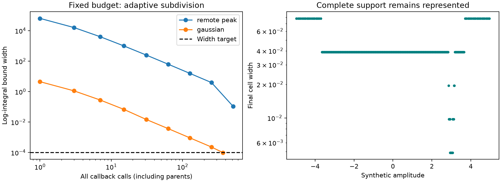

# Adaptive full-support scalar envelope: synthetic results

Reuses immutable [156 envelopes](../2026_10_10_position_error_iter156/envelopes.py)
and the mathematics in [152 FOLLOWUP_MATH](../2026_10_10_position_error_iter152/FOLLOWUP_MATH.md).
No recording port or optimizer is included. The synthetic tests and the fixed
synthetic diagnostic have now run; no RF recordings or reference positions were
read. B7 remains unchanged and the standalone position metric is unchanged.

| Synthetic integrand | Actual calls | Active cells | Log-integral width | Outcome |
|---|---:|---:|---:|---|
| Gaussian on [-3,3] | 369 | 185 | 0.0000993160 | Target met |
| Remote narrow peak plus clutter on [-5,5] | 511 | 256 | 0.1095103 | Budget exhausted |

The fixed target is 0.0001 and the maximum is 512 actual value/gradient calls.
The remote-peak uncertainty is still about 1,095 times the target. Every reported
partition brackets an independent analytic integral. Success on the Gaussian
does not establish tractability for recordings; failure on the deliberately
difficult peak does not prove the recording integrals fail. No tolerances or
budgets were expanded after these results.

[SUMMARY.json](SUMMARY.json) contains all budget comparisons and host elapsed
times; [TERMINAL_RECEIPTS.json](TERMINAL_RECEIPTS.json) preserves both terminal
partitions, all parent/child evaluations, failures and call accounting. These
receipts serialize intentional negative infinity for zero seam bounds as a
string, so the JSON is standards-compliant. The report took about 0.027 seconds
for the 511-call synthetic case and 0.018 seconds for the 369-call case; these
are cheap analytic callbacks, not production-objective or embedded benchmarks.

The root midpoint costs one value/gradient call. Every accepted bisection costs
two more; discarded parent evaluations remain in the ledger. A 512-call ceiling
therefore normally stops at 511 calls if another complete split cannot fit.
The next cell has the largest absolute integral gap, evaluated in log space;
ties use increasing lower coordinate. Full original finite support is retained,
not a neighborhood of a found mode. Callers must supply valid fixed curvature
bounds and an explicit per-cell seam-jump bound.

`target_met`, `budget_exhausted`, callback failures and partition-resolution
failures are distinct. Failed child evaluations consume budget and remain in
the ledger while the parent's previously established bound stays active. The
complete active partition and every parent/child relationship are returned.
Reaching the numerical envelope target is **not** rigorous floating-point
certification, a guarantee of production-likelihood parity or a positioning gain.

This simple implementation recomputes log sums over at most 256 active cells;
the bounded O(cells²) bookkeeping avoids a priority-tree framework. Callback cost
is expected to dominate but has not been measured for this helper. Loose global
curvature/seam bounds can still exhaust the call budget. No automatic tolerance,
support or budget expansion is permitted after observing a result.

## Decision

Proceed only to preparation of one bounded recording diagnostic using the same
24 consumed endpoints (12 members, both c arms) from iteration155. Freeze its
source/input closure before execution; retain complete coefficient support,
the fixed call/time caps, explicit unsupported/failure coverage, and the actual
nearest-image likelihood branch guard. Do not introduce a likelihood cache or
relax the accuracy target. Unresolved real endpoints stop this lean integration
route rather than authorizing silent approximate scores.

Only tractable integrals justify a separately declared five-point position
stencil (anchor and +/-0.5 km east/north). Correction variation must exceed the
existing 0.01 NLL relevance threshold and overcome ordinary score gaps with
nonoverlapping score bounds before localization work is justified. This would
test local sensitivity, not prove basin recovery or position improvement.
Anchor-relative corrections must not be called integration-minus-profile unless
the conditional profile minima are independently established. A cheap Laplace
substitute still needs the existing 0.001 relative-score agreement criterion.

## Reproduction

The pinned interpreter is
`/opt/leo-tracker/releases/47e2705e437722daa5e6d6bb1c252d54b7a21dbc/.venv/bin/python`.
Use `PYTHONPATH=src:.:reports/2026_10_10_position_error_iter157`, single-thread
OpenBLAS/OMP/MKL, disabled bytecode writes and disabled pytest plugin autoload.
Run `-m pytest -q -p no:cacheprovider` on `test_adaptive.py`; run `report.py`
to reproduce the synthetic receipts and figure. The figure was rendered and
visually checked. Independent source review is recorded separately below.

All **14 tests passed in 0.15 seconds**, including nonfinite-root rejection,
failed-child support retention, deterministic ties and counting discarded
parents. Independent read-only review found no coverage or budget bug. For the
future recording diagnostic it emphasized splitting the combined 0.0001 target
into at most 0.00005 per receiver, separate construction/parity-call accounting,
and checking the 30-second soft deadline before every actual objective call.
None of those recording-wrapper guarantees is claimed by this scalar helper.
