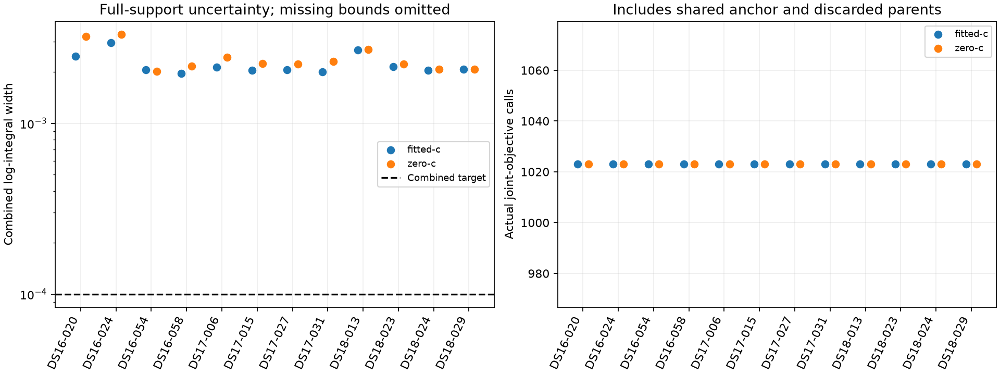

# Bounded conditional integration: recording results

This is a consumed-data tractability diagnostic on twelve fixed scans, both final c arms. It performs no position fitting, changes no frequency-fit parameters, and supplies no new position-error estimate. B7 is unchanged. All members and failures are retained.

| Dataset | Arm | Endpoints | Target met | Both bounds available |
|---|---|---:|---:|---:|
| DS16 | fitted-c | 4 | 0 | 4 |
| DS16 | zero-c | 4 | 0 | 4 |
| DS17 | fitted-c | 4 | 0 | 4 |
| DS17 | zero-c | 4 | 0 | 4 |
| DS18 | fitted-c | 4 | 0 | 4 |
| DS18 | zero-c | 4 | 0 | 4 |

| Member | Arm | Status | RX0 / RX1 | Combined width | Calls |
|---|---|---|---|---:|---:|
| DS16-020 | fitted-c | unresolved | budget_exhausted / budget_exhausted | 0.00246937 | 1023 |
| DS16-020 | zero-c | unresolved | budget_exhausted / budget_exhausted | 0.00321636 | 1023 |
| DS16-024 | fitted-c | unresolved | budget_exhausted / budget_exhausted | 0.00295881 | 1023 |
| DS16-024 | zero-c | unresolved | budget_exhausted / budget_exhausted | 0.00331029 | 1023 |
| DS16-054 | fitted-c | unresolved | budget_exhausted / budget_exhausted | 0.00204798 | 1023 |
| DS16-054 | zero-c | unresolved | budget_exhausted / budget_exhausted | 0.00201619 | 1023 |
| DS16-058 | fitted-c | unresolved | budget_exhausted / budget_exhausted | 0.0019583 | 1023 |
| DS16-058 | zero-c | unresolved | budget_exhausted / budget_exhausted | 0.00214953 | 1023 |
| DS17-006 | fitted-c | unresolved | budget_exhausted / budget_exhausted | 0.00212582 | 1023 |
| DS17-006 | zero-c | unresolved | budget_exhausted / budget_exhausted | 0.00242971 | 1023 |
| DS17-015 | fitted-c | unresolved | budget_exhausted / budget_exhausted | 0.00203185 | 1023 |
| DS17-015 | zero-c | unresolved | budget_exhausted / budget_exhausted | 0.00223338 | 1023 |
| DS17-027 | fitted-c | unresolved | budget_exhausted / budget_exhausted | 0.00204983 | 1023 |
| DS17-027 | zero-c | unresolved | budget_exhausted / budget_exhausted | 0.00222553 | 1023 |
| DS17-031 | fitted-c | unresolved | budget_exhausted / budget_exhausted | 0.00200192 | 1023 |
| DS17-031 | zero-c | unresolved | budget_exhausted / budget_exhausted | 0.00230132 | 1023 |
| DS18-013 | fitted-c | unresolved | budget_exhausted / budget_exhausted | 0.0026766 | 1023 |
| DS18-013 | zero-c | unresolved | budget_exhausted / budget_exhausted | 0.00269868 | 1023 |
| DS18-023 | fitted-c | unresolved | budget_exhausted / budget_exhausted | 0.00213915 | 1023 |
| DS18-023 | zero-c | unresolved | budget_exhausted / budget_exhausted | 0.0022125 | 1023 |
| DS18-024 | fitted-c | unresolved | budget_exhausted / budget_exhausted | 0.0020347 | 1023 |
| DS18-024 | zero-c | unresolved | budget_exhausted / budget_exhausted | 0.00207101 | 1023 |
| DS18-029 | fitted-c | unresolved | budget_exhausted / budget_exhausted | 0.00206495 | 1023 |
| DS18-029 | zero-c | unresolved | budget_exhausted / budget_exhausted | 0.00206281 | 1023 |

**0/24 endpoints met the target; 12/12 pairs had matching model/input identities.** Total actual objective calls: 24,552; measured objective time: 97.305 s; total member worker time including reconstruction: 350.769 s. These costs are nested, not additive. Host timings are not embedded benchmarks.

The combined width target is 0.0001 NLL, allocated 0.00005 per receiver. Each receiver has at most 512 scalar calls and the endpoint has a 30-second soft deadline including model construction; public input reconstruction is separate. Envelope bounds are conservative numerical checks, not formal floating-point certificates.

**Decision: stop this lean integration route under the declared budget.** Unresolved endpoints do not provide usable marginal scores. No tolerance expansion, retries, spatial stencil or localization comparison is authorized by these results.

## Reproducibility

The [scientific plan](PLAN.md) and [frozen source/input/runtime protocol](protocol.json) were published before execution. Nineteen adapter/orchestration tests passed in 0.40 seconds; four reporter tests passed in 0.21 seconds. The complete closure was rechecked before this report. [SUMMARY.json](SUMMARY.json) retains errors, per-arm coverage, timing and original-anchor checks; [raw-receipts.tar.gz](raw-receipts.tar.gz) contains all terminal receipts and claims. The recording store itself is not bundled. No reference coordinates or position-error evaluation modules are used.
