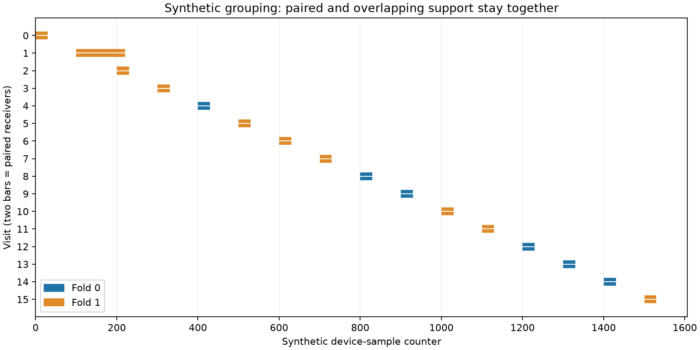

# Predictive-consistency preparation

The source audit found two ways a naive split-data comparison could be
misleading: paired/overlapping observations could cross folds, and reconstructing
a fold-specific model could change its centering or timing-support metadata. This
iteration implements and tests guards against both. **No recording fits or
position-error experiment have run.** B7 and the official research metric remain
unchanged.

This illustration uses invented sample intervals, not DS16/17/18 measurements.
Two receiver rows remain together within each visit. Visits 1 and 2 also remain
together because their sample intervals overlap. Hash assignment uses only fixed
support identities and a declared synthetic seed; frequency residuals and known
position errors do not enter it. Physical separation does not prove statistical
independence of clocks or satellite errors.

The row adapter reuses the existing `SlopePrior.evaluate_joint` implementation.
It keeps full-model metadata for physical constraints, and slices the observation
and precomputed design rows used by the likelihood. It does not rebuild clock
bases or recenter RF/time columns. Only its explicit joint evaluation port is
safe for fitting; other inherited callable methods are refused. Reports must use
`selected_observations` for training counts and rowwise likelihood terms.

Synthetic tests verify the following:

- Whole visits and transitive sample overlap stay in one fold; empty folds and
  missing support fail explicitly. Integer sample counters retain precision.
- With actual production joint-likelihood algebra and a synthetic orbital port,
  `full = fold0 + fold1 − prior` holds for the value and both gradients.
- Perturbing held-out measurements cannot affect the training value or gradients.
- Full timing constraints remain unchanged, asymmetric time/RF folds do not
  recenter the design, and invalid row inventories are rejected.

**All 28 tests passed in 0.39 seconds.** Independent source review confirmed the
row adapter's likelihood and constraint separation and flagged the training-row
reporting caveat above. The synthetic figure was rendered and visually checked;
its complete group membership is in [SYNTHETIC_GROUPS.json](SYNTHETIC_GROUPS.json).

A subsequent source review corrected the initial timing-bound rationale: the
current `_Problem` accepts only models with enough margin for exactly +/-20
second timing limits. Slicing changes coverage margins, but does not enlarge
that accepted feasible range. The adapter preserves the full metadata without
claiming to fix a demonstrated timing-bound defect.

The [plan](PLAN.md) remains **unfrozen**. A fresh matched full-data control and a
common reference-free start must be specified before fits. The original bank,
starting region and responsibility-weighted satellite time centers depend on the
full recording. This will therefore be conditional sensitivity, not independent
validation. A single selected geometry tests calibration consistency; identifying
wrong geometry requires competing ordinary hypotheses and a separately declared
selection test. Improved frequency prediction alone will not establish better
localization.

Reproduce the figure with `report.py`, and the tests with pytest on
`test_grouping.py` and `test_rows.py`, using pinned release47e Python,
`PYTHONPATH=src:.:reports/2026_10_10_position_error_iter159`, one OpenBLAS/OMP/MKL
thread, disabled bytecode writes and disabled pytest plugin autoload. No new RF
collection or production changes are included.
