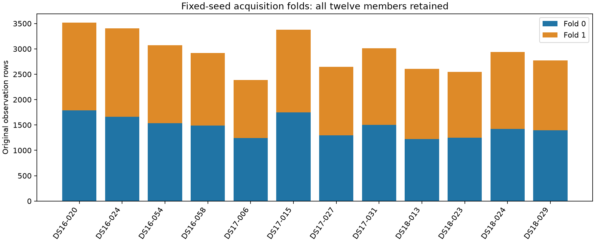

# Real acquisition folds prepared

**12/12 members prepared; 35,206 observation rows retained.** This is metadata preparation only. No IQ was read, no model was fitted, and no new position error was measured. B7 remains unchanged. The seed was frozen and published before metadata loading; no reseeding or member replacement occurred.

| Member | Status | Observations | Visits | Overlap groups | Fold 0 | Fold 1 |
|---|---|---:|---:|---:|---:|---:|
| DS16-020 | complete | 3515 | 2135 | 2135 | 1788 | 1727 |
| DS16-024 | complete | 3406 | 2064 | 2064 | 1664 | 1742 |
| DS16-054 | complete | 3073 | 1903 | 1903 | 1535 | 1538 |
| DS16-058 | complete | 2921 | 1794 | 1794 | 1487 | 1434 |
| DS17-006 | complete | 2389 | 1682 | 1682 | 1242 | 1147 |
| DS17-015 | complete | 3378 | 1931 | 1931 | 1746 | 1632 |
| DS17-027 | complete | 2648 | 1724 | 1724 | 1294 | 1354 |
| DS17-031 | complete | 3011 | 1973 | 1973 | 1499 | 1512 |
| DS18-013 | complete | 2609 | 1846 | 1846 | 1221 | 1388 |
| DS18-023 | complete | 2549 | 1815 | 1815 | 1247 | 1302 |
| DS18-024 | complete | 2936 | 1920 | 1920 | 1420 | 1516 |
| DS18-029 | complete | 2771 | 1811 | 1811 | 1393 | 1378 |

An independent postseal sweep verified that each original row occurs exactly once, whole visits remain together, and no physical sample interval overlaps across folds. Both receivers are represented in both folds for every completed member with nonzero receiver counts reported below. These properties prevent direct sample overlap; they do not establish statistical independence.

| Member | Fold 0 RX0 / RX1 | Fold 1 RX0 / RX1 | Held rows outside training center span (train 0 / train 1) |
|---|---:|---:|---:|
| DS16-020 | 1033 / 755 | 975 / 752 | 3 / 2 |
| DS16-024 | 971 / 693 | 1034 / 708 | 6 / 1 |
| DS16-054 | 919 / 616 | 926 / 612 | 1 / 8 |
| DS16-058 | 830 / 657 | 804 / 630 | 4 / 1 |
| DS17-006 | 792 / 450 | 737 / 410 | 0 / 9 |
| DS17-015 | 970 / 776 | 904 / 728 | 9 / 1 |
| DS17-027 | 820 / 474 | 846 / 508 | 5 / 8 |
| DS17-031 | 889 / 610 | 898 / 614 | 1 / 9 |
| DS18-013 | 789 / 432 | 864 / 524 | 7 / 1 |
| DS18-023 | 862 / 385 | 898 / 404 | 2 / 4 |
| DS18-024 | 861 / 559 | 895 / 621 | 4 / 2 |
| DS18-029 | 863 / 530 | 859 / 519 | 9 / 8 |

The span diagnostic counts held-row centers outside the same receiver’s training-row center range. It is metadata context, not an estimate of extrapolation error and not a reason to alter the folds.

## Evidence and next step

The [plan](PLAN.md) and [frozen protocol](protocol.json) bind all original support/claim hashes, the twelve iteration 155 observation identities, helper sources and pinned runtime. Seventeen preparation tests passed in 0.18 seconds; five independent reporter-audit tests passed in 0.21 seconds. The complete closure was checked again before reporting. [SUMMARY.json](SUMMARY.json) retains coverage, errors, receiver counts and elapsed costs; [raw-receipts.tar.gz](raw-receipts.tar.gz) includes every exact fold membership and claim. The source recording store is not bundled.

The next fit protocol must declare a common reference-free seed, fresh same-budget full-data controls, paired c locks, convergence handling and separate held-likelihood versus position-error reporting. Full-data bank/region/satellite-center conditioning remains explicit; this is consumed-data development, not independent validation.
