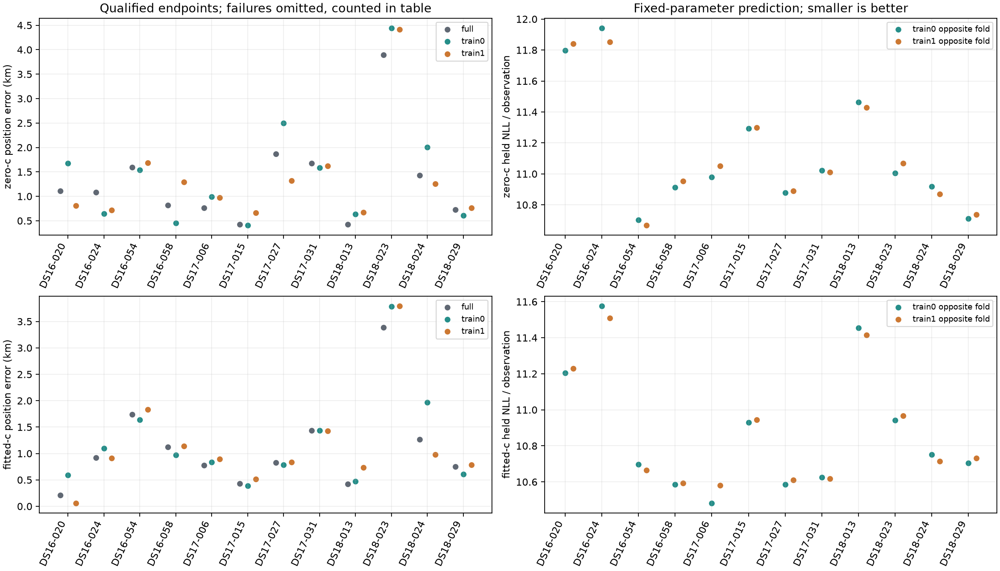

# Matched full-data and grouped-training fits

All 72 fits qualified and all 72 position evaluations succeeded. On these twelve
consumed scans, fresh full-data fitted-c has mean error **1.10797 km**; fitting
fold 0 or fold 1 alone gives **1.21437 km** and **1.15992 km**. Neither split
improves the aggregate position result. The corresponding zero-c means are
1.31836, 1.45725 and 1.34888 km.

Fitted-c improves opposite-fold frequency likelihood in **24/24** comparisons,
but improves position error in **17/24**. The two folds from one recording are
related, so these are not 24 independent validation samples. This supports a
predictive benefit for fitted-c within the existing conditioned model, while
showing that better predictive frequency fit still does not guarantee better
position. No per-scan c selection or split winner was introduced.

**Decision:** keep full-data fitting and the existing deployed pipeline. Do not
deploy fold-only fitting or a predictive-score position selector from this
pilot. A next test must compare distinct ordinary candidate geometries before
claiming that held likelihood can distinguish the correct search region.
The 0.4 km standalone goal remains unmet, and the official 193-member result
is unchanged.

The source/input/runtime protocol was published before fitting; all 168 raw
claim/result files were sealed before the separate evaluation protocol was
published and reference coordinates were read. Thirty-three preparation and
component tests passed; seven evaluation/report tests passed after reporting
changes. Both single-thread workers exited successfully without retries.
The conclusions above were added after evaluation; numerical sources and both
published protocols remain frozen.

This is a consumed-data pilot with four members per dataset, not the full DS16/DS17/DS18 cohorts. Both c arms use the same zero-c starting state. Training-fold solutions predict the opposite fold without updating parameters. Full-data controls are fresh fits; they are not historical B7 results.

| Dataset | Arm | Fit rows | Qualified / attempted | Evaluated | Position mean | Median | p95 | Worst (km) | Paired mean change vs full (km) | Regressions / pairs |
|---|---|---|---:|---:|---:|---:|---:|---:|---:|---:|
| DS16 | zero-c | full | 4 / 4 | 4 | 1.1508 | 1.0967 | 1.5205 | 1.5929 | 0.0000 | 0 / 4 |
| DS16 | zero-c | train0 | 4 / 4 | 4 | 1.0776 | 1.0920 | 1.6562 | 1.6762 | -0.0732 | 1 / 4 |
| DS16 | zero-c | train1 | 4 / 4 | 4 | 1.1257 | 1.0502 | 1.6281 | 1.6870 | -0.0251 | 2 / 4 |
| DS16 | fitted-c | full | 4 / 4 | 4 | 0.9984 | 1.0220 | 1.6495 | 1.7416 | 0.0000 | 0 / 4 |
| DS16 | fitted-c | train0 | 4 / 4 | 4 | 1.0757 | 1.0347 | 1.5584 | 1.6402 | 0.0773 | 2 / 4 |
| DS16 | fitted-c | train1 | 4 / 4 | 4 | 0.9870 | 1.0257 | 1.7302 | 1.8340 | -0.0113 | 2 / 4 |
| DS17 | zero-c | full | 4 / 4 | 4 | 1.1845 | 1.2211 | 1.8411 | 1.8699 | 0.0000 | 0 / 4 |
| DS17 | zero-c | train0 | 4 / 4 | 4 | 1.3715 | 1.2868 | 2.3647 | 2.5021 | 0.1870 | 2 / 4 |
| DS17 | zero-c | train1 | 4 / 4 | 4 | 1.1441 | 1.1463 | 1.5777 | 1.6235 | -0.0405 | 2 / 4 |
| DS17 | fitted-c | full | 4 / 4 | 4 | 0.8680 | 0.8049 | 1.3439 | 1.4345 | 0.0000 | 0 / 4 |
| DS17 | fitted-c | train0 | 4 / 4 | 4 | 0.8610 | 0.8108 | 1.3467 | 1.4361 | -0.0070 | 2 / 4 |
| DS17 | fitted-c | train1 | 4 / 4 | 4 | 0.9183 | 0.8676 | 1.3457 | 1.4250 | 0.0504 | 3 / 4 |
| DS18 | zero-c | full | 4 / 4 | 4 | 1.6197 | 1.0755 | 3.5271 | 3.8979 | 0.0000 | 0 / 4 |
| DS18 | zero-c | train0 | 4 / 4 | 4 | 1.9227 | 1.3196 | 4.0758 | 4.4413 | 0.3029 | 3 / 4 |
| DS18 | zero-c | train1 | 4 / 4 | 4 | 1.7769 | 1.0098 | 3.9389 | 4.4122 | 0.1572 | 3 / 4 |
| DS18 | fitted-c | full | 4 / 4 | 4 | 1.4576 | 1.0092 | 3.0710 | 3.3893 | 0.0000 | 0 / 4 |
| DS18 | fitted-c | train0 | 4 / 4 | 4 | 1.7065 | 1.2880 | 3.5093 | 3.7810 | 0.2489 | 3 / 4 |
| DS18 | fitted-c | train1 | 4 / 4 | 4 | 1.5744 | 0.8852 | 3.3715 | 3.7934 | 0.1168 | 3 / 4 |
| pilot | zero-c | full | 12 / 12 | 12 | 1.3184 | 1.0967 | 2.7825 | 3.8979 | 0.0000 | 0 / 12 |
| pilot | zero-c | train0 | 12 / 12 | 12 | 1.4573 | 1.2651 | 3.3747 | 4.4413 | 0.1389 | 6 / 12 |
| pilot | zero-c | train1 | 12 / 12 | 12 | 1.3489 | 1.1158 | 2.9133 | 4.4122 | 0.0305 | 7 / 12 |
| pilot | fitted-c | full | 12 / 12 | 12 | 1.1080 | 0.8737 | 2.4831 | 3.3893 | 0.0000 | 0 / 12 |
| pilot | fitted-c | train0 | 12 / 12 | 12 | 1.2144 | 0.9072 | 2.7850 | 3.7810 | 0.1064 | 7 / 12 |
| pilot | fitted-c | train1 | 12 / 12 | 12 | 1.1599 | 0.9029 | 2.7157 | 3.7934 | 0.0519 | 8 / 12 |

Means with missing endpoints describe only the explicitly reported qualified subset. Paired changes use the same members on both sides; no failed solution is replaced by a historical endpoint. An absolute 1e-9 km tolerance defines equality for all comparisons. SUMMARY.json includes improved/equal/regressed counts, every regression label and maximum regression.

## Coverage and failures

| Member | Arm | Fit rows | Status | Position km | Failure |
|---|---|---|---|---:|---|
| DS16-020 | zero-c | full | qualified | 1.1102 |  |
| DS16-020 | fitted-c | full | qualified | 0.2078 |  |
| DS16-020 | zero-c | train0 | qualified | 1.6762 |  |
| DS16-020 | fitted-c | train0 | qualified | 0.5929 |  |
| DS16-020 | zero-c | train1 | qualified | 0.8062 |  |
| DS16-020 | fitted-c | train1 | qualified | 0.0627 |  |
| DS16-024 | zero-c | full | qualified | 1.0832 |  |
| DS16-024 | fitted-c | full | qualified | 0.9169 |  |
| DS16-024 | zero-c | train0 | qualified | 0.6411 |  |
| DS16-024 | fitted-c | train0 | qualified | 1.0949 |  |
| DS16-024 | zero-c | train1 | qualified | 0.7153 |  |
| DS16-024 | fitted-c | train1 | qualified | 0.9092 |  |
| DS16-054 | zero-c | full | qualified | 1.5929 |  |
| DS16-054 | fitted-c | full | qualified | 1.7416 |  |
| DS16-054 | zero-c | train0 | qualified | 1.5429 |  |
| DS16-054 | fitted-c | train0 | qualified | 1.6402 |  |
| DS16-054 | zero-c | train1 | qualified | 1.6870 |  |
| DS16-054 | fitted-c | train1 | qualified | 1.8340 |  |
| DS16-058 | zero-c | full | qualified | 0.8169 |  |
| DS16-058 | fitted-c | full | qualified | 1.1271 |  |
| DS16-058 | zero-c | train0 | qualified | 0.4501 |  |
| DS16-058 | fitted-c | train0 | qualified | 0.9746 |  |
| DS16-058 | zero-c | train1 | qualified | 1.2941 |  |
| DS16-058 | fitted-c | train1 | qualified | 1.1422 |  |
| DS17-006 | zero-c | full | qualified | 0.7639 |  |
| DS17-006 | fitted-c | full | qualified | 0.7794 |  |
| DS17-006 | zero-c | train0 | qualified | 0.9874 |  |
| DS17-006 | fitted-c | train0 | qualified | 0.8399 |  |
| DS17-006 | zero-c | train1 | qualified | 0.9742 |  |
| DS17-006 | fitted-c | train1 | qualified | 0.8965 |  |
| DS17-015 | zero-c | full | qualified | 0.4259 |  |
| DS17-015 | fitted-c | full | qualified | 0.4275 |  |
| DS17-015 | zero-c | train0 | qualified | 0.4103 |  |
| DS17-015 | fitted-c | train0 | qualified | 0.3863 |  |
| DS17-015 | zero-c | train1 | qualified | 0.6601 |  |
| DS17-015 | fitted-c | train1 | qualified | 0.5132 |  |
| DS17-027 | zero-c | full | qualified | 1.8699 |  |
| DS17-027 | fitted-c | full | qualified | 0.8305 |  |
| DS17-027 | zero-c | train0 | qualified | 2.5021 |  |
| DS17-027 | fitted-c | train0 | qualified | 0.7817 |  |
| DS17-027 | zero-c | train1 | qualified | 1.3183 |  |
| DS17-027 | fitted-c | train1 | qualified | 0.8387 |  |
| DS17-031 | zero-c | full | qualified | 1.6783 |  |
| DS17-031 | fitted-c | full | qualified | 1.4345 |  |
| DS17-031 | zero-c | train0 | qualified | 1.5863 |  |
| DS17-031 | fitted-c | train0 | qualified | 1.4361 |  |
| DS17-031 | zero-c | train1 | qualified | 1.6235 |  |
| DS17-031 | fitted-c | train1 | qualified | 1.4250 |  |
| DS18-013 | zero-c | full | qualified | 0.4300 |  |
| DS18-013 | fitted-c | full | qualified | 0.4225 |  |
| DS18-013 | zero-c | train0 | qualified | 0.6344 |  |
| DS18-013 | fitted-c | train0 | qualified | 0.4688 |  |
| DS18-013 | zero-c | train1 | qualified | 0.6760 |  |
| DS18-013 | fitted-c | train1 | qualified | 0.7336 |  |
| DS18-023 | zero-c | full | qualified | 3.8979 |  |
| DS18-023 | fitted-c | full | qualified | 3.3893 |  |
| DS18-023 | zero-c | train0 | qualified | 4.4413 |  |
| DS18-023 | fitted-c | train0 | qualified | 3.7810 |  |
| DS18-023 | zero-c | train1 | qualified | 4.4122 |  |
| DS18-023 | fitted-c | train1 | qualified | 3.7934 |  |
| DS18-024 | zero-c | full | qualified | 1.4258 |  |
| DS18-024 | fitted-c | full | qualified | 1.2677 |  |
| DS18-024 | zero-c | train0 | qualified | 2.0049 |  |
| DS18-024 | fitted-c | train0 | qualified | 1.9702 |  |
| DS18-024 | zero-c | train1 | qualified | 1.2573 |  |
| DS18-024 | fitted-c | train1 | qualified | 0.9812 |  |
| DS18-029 | zero-c | full | qualified | 0.7252 |  |
| DS18-029 | fitted-c | full | qualified | 0.7507 |  |
| DS18-029 | zero-c | train0 | qualified | 0.6100 |  |
| DS18-029 | fitted-c | train0 | qualified | 0.6059 |  |
| DS18-029 | zero-c | train1 | qualified | 0.7623 |  |
| DS18-029 | fitted-c | train1 | qualified | 0.7893 |  |

## Predictive frequency comparison

Changes below are fitted-c minus c=0 on the same opposite-fold observations. Negative NLL change means better predictive frequency likelihood; negative position change means lower geographic error. These are separate measurements.

| Member | Training fold | Held NLL change / observation | Position change (km) |
|---|---|---:|---:|
| DS16-020 | train0 | -0.5930 | -1.0833 |
| DS16-020 | train1 | -0.6121 | -0.7435 |
| DS16-024 | train0 | -0.3652 | 0.4538 |
| DS16-024 | train1 | -0.3425 | 0.1939 |
| DS16-054 | train0 | -0.0062 | 0.0974 |
| DS16-054 | train1 | -0.0045 | 0.1470 |
| DS16-058 | train0 | -0.3255 | 0.5245 |
| DS16-058 | train1 | -0.3618 | -0.1519 |
| DS17-006 | train0 | -0.4974 | -0.1475 |
| DS17-006 | train1 | -0.4705 | -0.0778 |
| DS17-015 | train0 | -0.3641 | -0.0239 |
| DS17-015 | train1 | -0.3529 | -0.1469 |
| DS17-027 | train0 | -0.2908 | -1.7204 |
| DS17-027 | train1 | -0.2777 | -0.4796 |
| DS17-031 | train0 | -0.3973 | -0.1502 |
| DS17-031 | train1 | -0.3927 | -0.1986 |
| DS18-013 | train0 | -0.0097 | -0.1656 |
| DS18-013 | train1 | -0.0129 | 0.0577 |
| DS18-023 | train0 | -0.0622 | -0.6604 |
| DS18-023 | train1 | -0.1011 | -0.6188 |
| DS18-024 | train0 | -0.1673 | -0.0347 |
| DS18-024 | train1 | -0.1529 | -0.2761 |
| DS18-029 | train0 | -0.0065 | -0.0041 |
| DS18-029 | train1 | -0.0056 | 0.0270 |

Member worker time including input reconstruction, fitting, audits and scoring: 181.710 seconds. Unqualified/failed fits: 0/72. Qualified fits with missing fold scores: 0. The 90-second fit budget is soft; raw receipts preserve measured times. This is host timing, not an embedded benchmark.

Training likelihood, unchanged prior penalty, held likelihood and posterior frequency RMS are retained separately in SUMMARY.json. Optimizer success flags do not replace the independent feasibility and stationarity audit. No fallback endpoints were counted.

## Interpretation

The satellite bank, retained region, starting state and satellite time centers are conditioned on full-data inference. The split keeps whole visits and overlapping sample support together but does not remove shared clock/orbit errors. Consequently this is conditional sensitivity on consumed data, not independent validation. Predictive frequency fit and localization are separate outcomes; neither selects a per-scan winner here.

The official 193-member mean and production B7 remain unchanged. No new RF collection, retries, fallback successes or reference-guided fitting were used. See [fit plan](PLAN.md), [evaluation plan](EVALUATION_PLAN.md), [numerical protocol](protocol.json), [evaluation protocol](evaluation_protocol.json), [all results](SUMMARY.json) and [raw receipts](raw-receipts.tar.gz).
