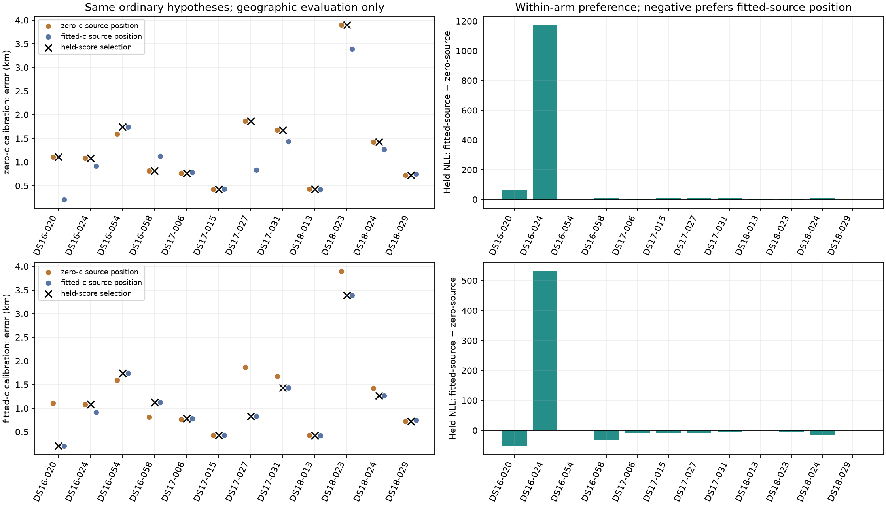

# Conditional geometry preference results

All **96/96** fits qualified and all geographic evaluations succeeded. The
fitted-c selector worsened mean error from **1.10797 to 1.11970 km** (+11.73 m);
the zero-c selector worsened its own zero-c baseline from **1.31836 to
1.33075 km** (+12.39 m). Both had complete twelve-member coverage, with no
ties, failures or fallback endpoints. The table below deliberately uses the
fitted-source position as the common comparison baseline for both arms; its
zero-arm delta therefore differs from the own-zero-baseline change above.

The fitted-c selector changed only two positions: DS16-024 worsened by
166.27 m, while DS18-029 improved by 25.51 m. The zero-c selector changed only
DS16-054, worsening it by 148.72 m. This pilot does not justify deploying the
selector or expanding it to the full datasets.

## A concrete calibration local-minimum failure

A posthoc comparison of cached, authenticated scores found a useful root-cause
lead without additional fits or reference-coordinate reads. For each of the
48 same-arm geometry/fold comparisons, the already-qualified full-data state
from iteration 161 is available at the exact fixed hypothesis position. Its
training-fold objective is its previously measured fold NLL plus its unchanged
prior penalty. Both DS16-024 fitted-c training fits returned worse objectives
than this available state: **+311.55** and **+334.22**, despite independent KKT
residuals of 0.000752 and 0.0000745.

This demonstrates that convergence to a constrained stationary point did not
find the best already-available calibration at that geometry. It does not
prove that a better calibration will reverse the held-score preference or
improve localization; that requires a successor experiment. The finding limits
what this negative selector result says about predictive scoring itself.
See [all 48 cached comparisons](CACHED_OBJECTIVE_AUDIT.json) and the
[reference-free audit script](cached_objective_audit.py).

**Decision:** preserve the deployed pipeline and investigate a symmetric,
bounded pool of ordinary calibration starts at both hypotheses. Do not repair
only DS16-024 or choose a start using its geographic error. All 96 original
receipts and the pre-evaluation preferences remain unchanged.

Forty-five preparation/component tests passed before execution; ten evaluation
and reporting tests passed before geographic reporting. Independent review
verified all 216 archived claim/result files. The conclusions and cached audit
above were added after the frozen experiment and geographic evaluation.

This consumed-data pilot keeps two ordinary full-data positions per scan fixed, fits nuisance parameters on each training fold and scores the opposite fold. Both c arms compare both positions. Scores are summed within each arm; no c-arm winner is chosen. Each scan contributes one geographic error per hypothesis, not one independent position observation per fit.

| Dataset | Calibration arm | Resolved / members | Ties / incomplete | Evaluated | Selected mean | Median | p95 | Worst km | Paired fitted-source mean | Mean change km | Correct preference / evaluable non-ties | Geographic ties |
|---|---|---:|---:|---:|---:|---:|---:|---:|---:|---:|---:|---:|
| DS16 | zero-c | 4 / 4 | 0 / 0 | 4 | 1.1880 | 1.0967 | 1.6469 | 1.7416 | 0.9984 | 0.1896 | 1 / 4 | 0 |
| DS16 | fitted-c | 4 / 4 | 0 / 0 | 4 | 1.0399 | 1.1051 | 1.6495 | 1.7416 | 0.9984 | 0.0416 | 1 / 4 | 0 |
| DS17 | zero-c | 4 / 4 | 0 / 0 | 4 | 1.1845 | 1.2211 | 1.8411 | 1.8699 | 0.8680 | 0.3165 | 2 / 4 | 0 |
| DS17 | fitted-c | 4 / 4 | 0 / 0 | 4 | 0.8680 | 0.8049 | 1.3439 | 1.4345 | 0.8680 | 0.0000 | 2 / 4 | 0 |
| DS18 | zero-c | 4 / 4 | 0 / 0 | 4 | 1.6197 | 1.0755 | 3.5271 | 3.8979 | 1.4576 | 0.1622 | 1 / 4 | 0 |
| DS18 | fitted-c | 4 / 4 | 0 / 0 | 4 | 1.4512 | 0.9965 | 3.0710 | 3.3893 | 1.4576 | -0.0064 | 4 / 4 | 0 |
| pilot | zero-c | 12 / 12 | 0 / 0 | 12 | 1.3308 | 1.0967 | 2.7825 | 3.8979 | 1.1080 | 0.2228 | 4 / 12 | 0 |
| pilot | fitted-c | 12 / 12 | 0 / 0 | 12 | 1.1197 | 0.9569 | 2.4831 | 3.3893 | 1.1080 | 0.0117 | 7 / 12 | 0 |

| Member | Calibration arm | Status / selected source | Zero-source km | Fitted-source km | Held NLL difference | Change vs fitted-source km |
|---|---|---|---:|---:|---:|---:|
| DS16-020 | zero-c | selected / zero-c | 1.1102 | 0.2078 | 65.4242 | 0.9024 |
| DS16-020 | fitted-c | selected / fitted-c | 1.1102 | 0.2078 | -51.2129 | 0.0000 |
| DS16-024 | zero-c | selected / zero-c | 1.0832 | 0.9169 | 1173.9601 | 0.1663 |
| DS16-024 | fitted-c | selected / zero-c | 1.0832 | 0.9169 | 531.3618 | 0.1663 |
| DS16-054 | zero-c | selected / fitted-c | 1.5929 | 1.7416 | -0.2090 | 0.0000 |
| DS16-054 | fitted-c | selected / fitted-c | 1.5929 | 1.7416 | -0.5653 | 0.0000 |
| DS16-058 | zero-c | selected / zero-c | 0.8169 | 1.1271 | 10.9881 | -0.3102 |
| DS16-058 | fitted-c | selected / fitted-c | 0.8169 | 1.1271 | -31.0891 | 0.0000 |
| DS17-006 | zero-c | selected / zero-c | 0.7639 | 0.7794 | 3.7458 | -0.0154 |
| DS17-006 | fitted-c | selected / fitted-c | 0.7639 | 0.7794 | -8.6873 | 0.0000 |
| DS17-015 | zero-c | selected / zero-c | 0.4259 | 0.4275 | 9.3202 | -0.0016 |
| DS17-015 | fitted-c | selected / fitted-c | 0.4259 | 0.4275 | -9.6328 | 0.0000 |
| DS17-027 | zero-c | selected / zero-c | 1.8699 | 0.8305 | 6.3801 | 1.0394 |
| DS17-027 | fitted-c | selected / fitted-c | 1.8699 | 0.8305 | -7.9136 | 0.0000 |
| DS17-031 | zero-c | selected / zero-c | 1.6783 | 1.4345 | 9.8912 | 0.2438 |
| DS17-031 | fitted-c | selected / fitted-c | 1.6783 | 1.4345 | -5.4759 | 0.0000 |
| DS18-013 | zero-c | selected / zero-c | 0.4300 | 0.4225 | 2.0928 | 0.0075 |
| DS18-013 | fitted-c | selected / fitted-c | 0.4300 | 0.4225 | -0.7568 | 0.0000 |
| DS18-023 | zero-c | selected / zero-c | 3.8979 | 3.3893 | 4.9217 | 0.5086 |
| DS18-023 | fitted-c | selected / fitted-c | 3.8979 | 3.3893 | -4.0896 | 0.0000 |
| DS18-024 | zero-c | selected / zero-c | 1.4258 | 1.2677 | 5.9301 | 0.1581 |
| DS18-024 | fitted-c | selected / fitted-c | 1.4258 | 1.2677 | -14.6235 | 0.0000 |
| DS18-029 | zero-c | selected / zero-c | 0.7252 | 0.7507 | 0.1042 | -0.0255 |
| DS18-029 | fitted-c | selected / zero-c | 0.7252 | 0.7507 | 0.1291 | -0.0255 |

## Coverage and limits

Qualified fits: 96/96; geographic evaluations: 96/96. Total member worker time including reconstruction: 202.572 seconds. Qualification, held scoring and reference-evaluation failures remain separate in SUMMARY.json and raw receipts. Ties and incomplete selections have no fallback. The table reports paired baseline means on the same evaluable selection subset; full hypothesis metrics, regression labels and maximum regression are in SUMMARY.json.

The geographic equality tolerance is 1e-9 km; equal geographic hypotheses are neutral, excluded from binary preference accuracy and retained in coverage. The reference-free summed-NLL tie tolerance is 1e-6. The two positions and shared model definitions were obtained using full-data inference, including the held folds. This is conditional development sensitivity, not unbiased cross-validation or independent validation. The hypotheses may occupy one local region; no conclusion about distant-region discrimination follows.

The official 193-member score, deployed B7 and closed reserved recordings are unchanged. No RF collection, reference-guided fitting, per-scan tuning, retry or fallback success was used. The 0.4 km standalone goal remains unmet. [Plan](PLAN.md), [frozen numerical protocol](protocol.json), [sealed preferences](PREFERENCES.json), [evaluation plan](EVALUATION_PLAN.md), [evaluation protocol](evaluation_protocol.json), [all results](SUMMARY.json), [raw receipts](raw-receipts.tar.gz).
