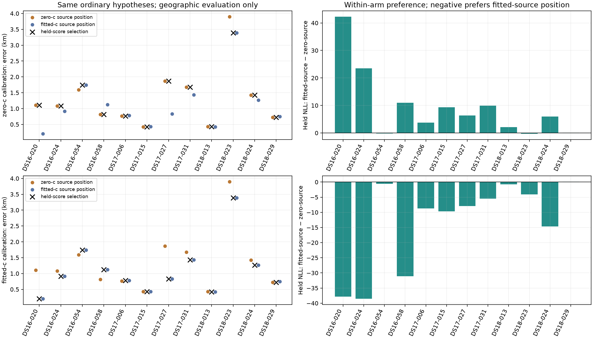

# Symmetric calibration starts: results

All **192 new fits qualified**, as did all 96 selected calibrations. The
training-objective rule retained 87 controls and selected nine new calibrations.
There were no failed held scores, unresolved geometry preferences or geographic
evaluation failures. New member worker time was **246.81 seconds**, excluding
historical work; this is host timing, not an embedded benchmark.

The extra starts repaired the concrete DS16-024 calibration failure from 162.
At its fitted-source position, fitted-c training objectives improved by
325.10 and 349.35. Its summed held-score difference changed from +531.36 to
−38.49, now favoring the ordinary fitted-source position. Geographic error
fell from 1.08320 to 0.91694 km, recovering **166.27 m**. This is a general
start-pool result applied to all twelve members, not a scan-specific repair.

A second geometry change occurred for DS18-023 under zero-c calibration:
error fell from 3.89790 to 3.38926 km (**508.63 m**). All other geometry
selections were unchanged. These frequency-objective and geographic changes
are separate measurements, recorded after the choices were sealed.

Across twelve consumed scans, the fitted-c selector improves from 162's
**1.11970 to 1.10585 km**, but is only **2.13 m better** than the ordinary
full-data fitted-c baseline of 1.10797 km. The zero-c selector improves from
**1.33075 to 1.28837 km**, versus its ordinary zero-c baseline of 1.31836 km.
There are no regressions against the 162 selectors; the zero-c selector still
has one regression against its ordinary zero-c baseline. The tables distinguish
these baselines explicitly.

**Decision:** the experiment confirms an initialization-dependent calibration
failure and a bounded way to repair it. It does not justify deploying this
conditional selector for a 2.13 m fitted-c mean gain, or claiming progress to
0.4 km across the full datasets. Keep the deployed pipeline unchanged and move
attention back to broader search coverage and physical information limits.

Forty-two preparation/component tests passed before numerical execution;
seven evaluation/report tests passed after reporting changes. Both protocols
and the preferences were published before the respective execution/evaluation
stages. These conclusions were added after evaluation; frozen scientific
sources, original attempts and preferences are unchanged.

Both ordinary full-data calibration states supply starts at both fixed position hypotheses. Each new fit uses the same budget. The lowest qualified training objective, including an explicitly retained prior control, determines calibration. Only that selected state is scored on the opposite fold. No held score or reference error chooses a calibration start.

| Dataset | Calibration arm | Resolved / members | Evaluated | Control selector mean | Candidate selector mean | Paired change km | Candidate median | p95 | Worst km | Correct preference / denominator |
|---|---|---:|---:|---:|---:|---:|---:|---:|---:|---:|
| DS16 | zero-c | 4 / 4 | 4 | 1.1880 | 1.1880 | 0.0000 | 1.0967 | 1.6469 | 1.7416 | 1 / 4 |
| DS16 | fitted-c | 4 / 4 | 4 | 1.0399 | 0.9984 | -0.0416 | 1.0220 | 1.6495 | 1.7416 | 2 / 4 |
| DS17 | zero-c | 4 / 4 | 4 | 1.1845 | 1.1845 | 0.0000 | 1.2211 | 1.8411 | 1.8699 | 2 / 4 |
| DS17 | fitted-c | 4 / 4 | 4 | 0.8680 | 0.8680 | 0.0000 | 0.8049 | 1.3439 | 1.4345 | 2 / 4 |
| DS18 | zero-c | 4 / 4 | 4 | 1.6197 | 1.4926 | -0.1272 | 1.0755 | 3.0947 | 3.3893 | 2 / 4 |
| DS18 | fitted-c | 4 / 4 | 4 | 1.4512 | 1.4512 | 0.0000 | 0.9965 | 3.0710 | 3.3893 | 4 / 4 |
| pilot | zero-c | 12 / 12 | 12 | 1.3308 | 1.2884 | -0.0424 | 1.0967 | 2.5536 | 3.3893 | 5 / 12 |
| pilot | fitted-c | 12 / 12 | 12 | 1.1197 | 1.1058 | -0.0139 | 0.8737 | 2.4831 | 3.3893 | 8 / 12 |

| Dataset | Calibration arm | Ordinary same-arm mean km | Paired candidate change km | Pairs |
|---|---|---:|---:|---:|
| DS16 | zero-c | 1.1508 | 0.0372 | 4 |
| DS16 | fitted-c | 0.9984 | 0.0000 | 4 |
| DS17 | zero-c | 1.1845 | 0.0000 | 4 |
| DS17 | fitted-c | 0.8680 | 0.0000 | 4 |
| DS18 | zero-c | 1.6197 | -0.1272 | 4 |
| DS18 | fitted-c | 1.4576 | -0.0064 | 4 |
| pilot | zero-c | 1.3184 | -0.0300 | 12 |
| pilot | fitted-c | 1.1080 | -0.0021 | 12 |

Ordinary same-arm means compare zero-c selection against the ordinary zero-source position, and fitted-c selection against the ordinary fitted-source position. Paired control/candidate means use the same evaluable members; no failures or unresolved preferences are zero-filled. Geographic ties (1e-9 km) are neutral. Both c arms, full ordinary hypothesis means, all ties/incomplete counts and every regression label are retained in SUMMARY.json.

| Member | Calibration arm | Selected source geometry | Control error km | Candidate error km | Change km | Held NLL difference |
|---|---|---|---:|---:|---:|---:|
| DS16-020 | zero-c | selected / zero-c | 1.1102 | 1.1102 | 0.0000 | 42.2677 |
| DS16-020 | fitted-c | selected / fitted-c | 0.2078 | 0.2078 | 0.0000 | -37.8382 |
| DS16-024 | zero-c | selected / zero-c | 1.0832 | 1.0832 | 0.0000 | 23.5381 |
| DS16-024 | fitted-c | selected / fitted-c | 1.0832 | 0.9169 | -0.1663 | -38.4905 |
| DS16-054 | zero-c | selected / fitted-c | 1.7416 | 1.7416 | 0.0000 | -0.2090 |
| DS16-054 | fitted-c | selected / fitted-c | 1.7416 | 1.7416 | 0.0000 | -0.5653 |
| DS16-058 | zero-c | selected / zero-c | 0.8169 | 0.8169 | 0.0000 | 10.9881 |
| DS16-058 | fitted-c | selected / fitted-c | 1.1271 | 1.1271 | 0.0000 | -31.0891 |
| DS17-006 | zero-c | selected / zero-c | 0.7639 | 0.7639 | 0.0000 | 3.7458 |
| DS17-006 | fitted-c | selected / fitted-c | 0.7794 | 0.7794 | 0.0000 | -8.6873 |
| DS17-015 | zero-c | selected / zero-c | 0.4259 | 0.4259 | 0.0000 | 9.3202 |
| DS17-015 | fitted-c | selected / fitted-c | 0.4275 | 0.4275 | 0.0000 | -9.6328 |
| DS17-027 | zero-c | selected / zero-c | 1.8699 | 1.8699 | 0.0000 | 6.3801 |
| DS17-027 | fitted-c | selected / fitted-c | 0.8305 | 0.8305 | 0.0000 | -7.9136 |
| DS17-031 | zero-c | selected / zero-c | 1.6783 | 1.6783 | 0.0000 | 9.8912 |
| DS17-031 | fitted-c | selected / fitted-c | 1.4345 | 1.4345 | 0.0000 | -5.4759 |
| DS18-013 | zero-c | selected / zero-c | 0.4300 | 0.4300 | 0.0000 | 2.0928 |
| DS18-013 | fitted-c | selected / fitted-c | 0.4225 | 0.4225 | 0.0000 | -0.7568 |
| DS18-023 | zero-c | selected / fitted-c | 3.8979 | 3.3893 | -0.5086 | -0.2595 |
| DS18-023 | fitted-c | selected / fitted-c | 3.3893 | 3.3893 | 0.0000 | -4.0896 |
| DS18-024 | zero-c | selected / zero-c | 1.4258 | 1.4258 | 0.0000 | 5.9301 |
| DS18-024 | fitted-c | selected / fitted-c | 1.2677 | 1.2677 | 0.0000 | -14.6235 |
| DS18-029 | zero-c | selected / zero-c | 0.7252 | 0.7252 | 0.0000 | 0.1042 |
| DS18-029 | fitted-c | selected / zero-c | 0.7252 | 0.7252 | 0.0000 | 0.1291 |

## New work, retained controls and limitations

New fits qualified: **192/192**. Selected calibrations qualified: **96/96**; retained controls: **87**. Selection-source counts: `{'control': 87, 'zero-c': 3, 'fitted-c': 6}`. Geographic evaluations: 96/96, representing twelve unique scans and two positions per scan. Repeated fixed-position fits are not independent geographic observations.

Incremental member worker time including input reconstruction, control audits, new fits and held scoring: 246.812 seconds. Historical iteration-162 time is excluded. No retained control is counted as a new successful optimization. All attempt failures, control audits and held-score failures are separate in the raw receipts. The training-only tie rule chooses from candidates within 1e-6 of the global minimum, then prioritizes control, zero-source and fitted-source starts.

The seed pool and geometry hypotheses use full-data inference, including the held observations. This remains consumed-data conditional development, not independent validation or unbiased cross-validation. Zero-c projects static c and both RF-time coefficients to zero; fitted-c retains them. The source pool, all other initial coordinates, candidate positions, observations, priors and search budgets are matched. Predictive frequency fit and geographic error are separate reported outcomes. No reference-guided selection, scan-specific tuning or new RF collection.

The official 193-member metric, deployed pipeline and reserved outcomes remain unchanged. The 0.4 km standalone goal remains unmet. [Plan](PLAN.md), [numerical protocol](protocol.json), [sealed preferences](PREFERENCES.json), [evaluation protocol](evaluation_protocol.json), [all results](SUMMARY.json), [raw receipts](raw-receipts.tar.gz).
