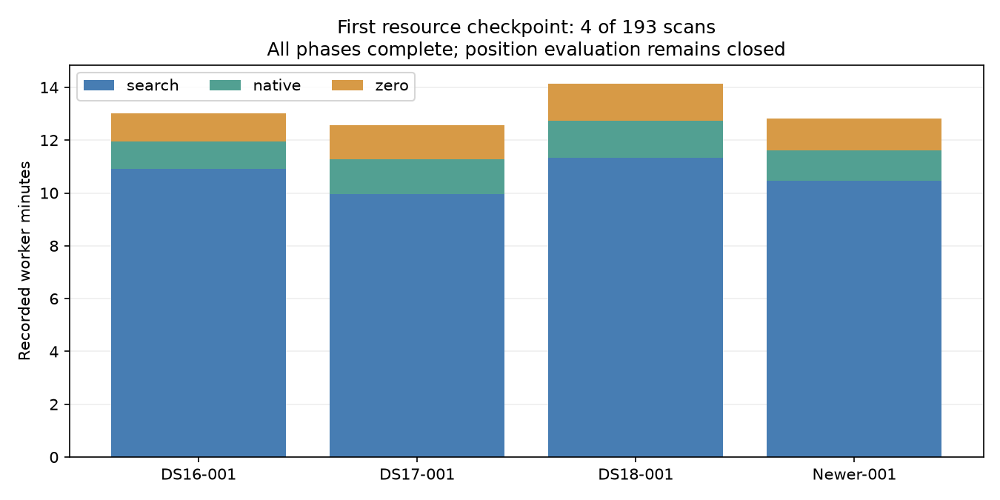

# First resource checkpoint complete

All four initial members completed search, native continuation and zero-led
continuation: **12/12 terminal phases complete**, both worker controllers exited
successfully. This is execution coverage, not a position-accuracy finding.
All193 geographic evaluation remains closed.

| Member | Search seconds | Native seconds | Zero-led seconds | Total seconds |
|---|---:|---:|---:|---:|
| DS16-001 | 654.198 | 63.243 | 63.560 | 781.000 |
| DS17-001 | 597.371 | 79.510 | 77.782 | 754.663 |
| DS18-001 | 680.518 | 83.105 | 85.055 | 848.678 |
| POST18-NEWER-20261009-001 | 628.420 | 68.216 | 72.109 | 768.746 |

Mean recorded work was 788.27 seconds/member. Linear extrapolation gives
42.26 worker-hours for193, or 21.13 hours at ideal two-worker utilization.
Four members are too few for a reliable forecast; the original twelve-member
pilot suggested 26.45 hours. These figures exclude controller overhead and
imbalance and are not embedded-performance claims. Frozen per-member allowances
remain unchanged, including their much larger soft upper envelope.

The checkpoint produced 21,894 regular files containing 522,343,619 bytes.
After both workers stopped, every path, file size, permission and SHA256 was
verified against a complete copy on local bulk storage. Source recheck,
post-cutover verification through the original repository path, retained
backup verification and exclusive-hard-link behavior all passed. Frozen
scientific source/input/runtime checks also passed. No QNAP path was touched.

The unchanged repository `results` path now points to
`/srv/bulk/leo/research/position-error-iter164-results`, with about 12.56 TB free
at the checkpoint. The small original first-checkpoint backup remains on root.
All later commands retain the original repository-facing output path.

**Decision: continue the next fixed batch of16.** This decision uses resource
and integrity checks only, not accuracy, score, region or selected-position
outcomes. All193 members remain in scope. Production B7 remains unchanged.

Evidence: [checkpoint totals](CHECKPOINT_0.json),
[relocation receipt](STORAGE_RELOCATION.json),
[complete copy manifest](STORAGE_MANIFEST.json),
[frozen evaluation plan](EVALUATION_PLAN.md).
