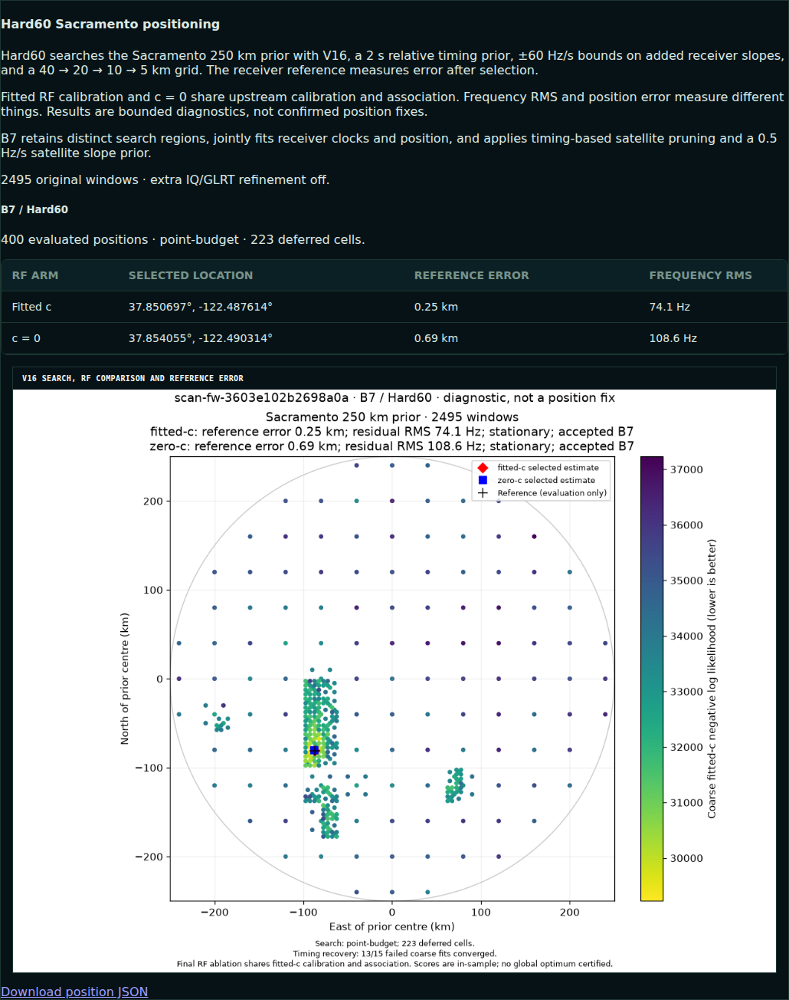

# Retained-calibration recovery rollout

This change adds the bounded, reference-free recovery tested in
[iteration 107](../2026_10_09_position_error_iter107/FULL193_COMPLETE_SNAPSHOT.md)
to the standard B7 adaptive analysis path. It applies only when an ordinary
retained search region failed calibration. The three ordinary regional passes
and their qualified candidates remain available; the same regional score
chooses a winner before the unchanged B3–B7 stages. Known receiver coordinates
and position errors are evaluation-only.

## Evidence and limits

The sealed matched comparison covered all 193 consumed DS16/DS17/DS18/newer
development recordings. The recovery trigger fired 52 times and 47 recoveries
qualified, but only four fitted-c selections changed. Fitted-c mean error went
from 1.540 to 1.255 km; the median remained 0.893 km. The `ac11` scan accounted
for about 99.4% of the aggregate fitted-c improvement, falling from 55.685 to
1.031 km. DS18's 53.401 km failure remains. The result supports recovery of a
specific failed-calibration class; it is not evidence of a broad typical-error
improvement or an independent validation set.

| Dataset | Members | B7 fitted-c mean, km | Recovery mean, km | c=0 B7 mean, km | c=0 recovery mean, km |
|---|---:|---:|---:|---:|---:|
| DS16 | 63 | 0.979 | 0.974 | 1.321 | 1.314 |
| DS17 | 51 | 0.819 | 0.819 | 1.327 | 1.327 |
| DS18 | 34 | 2.692 | 2.692 | 2.816 | 2.816 |
| Newer development | 45 | 2.271 | 1.057 | 2.908 | 1.752 |
| All | 193 | 1.540 | 1.255 | 1.956 | 1.684 |

The c=0 and fitted-c arms share calibration and association, then get matched
final-fit budgets. Frequency-fit changes are reported separately in the
[sealed comparison](../2026_10_09_position_error_iter107/FULL193_COMPLETE_SNAPSHOT.md);
a lower in-sample frequency residual alone does not establish a better position.

## Implementation

The recovery inventories calibration failures from all ordinary B7 passes and
deduplicates repeated physical starts. It verifies each saved coarse fit against
the current model, applies at most two reduced-Newton rounds and 100 objective
evaluations to an unqualified fixed-position calibration state, then runs fresh
receiver correction, bounded postfit, association and six final fits. All work
uses digest-bound checkpoints and the existing 500-second resumable worker
slices. A failed retry leaves every ordinary candidate available. The B7 policy
and source digests identify the new behavior; V3 and historical persisted
contracts are unchanged. The queue recognizes the exact previous B7
configuration digest for already published V3 products, so it does not try to
overwrite an immutable historical publication. Unpublished scans use the new
policy. A read-only census of the 81 existing V3 manifests found only the
allowlisted predecessor digest
`sha256:dc67650e940b002fce58d74ba654d87df008611d839438e2d71248a5a2694893`.

## Validation and deployment

Component, B7, CLI, contract, storage and API tests: **31 passed** on the
development Python 3.13 environment using the identical-source native orbit
extension, and **31 passed** on the active worker's pinned Python 3.14 release.
Ruff lint, formatting and `git diff --check` pass. The immutable
`/opt/leo-b7/a620e14f3-retained-r1` stage contains 678 verified source files.
The [real-scan parity replay](parity.json) recomputed the frozen `ac11`
recovery through the staged production modules without loading its reference
position: all six matched `c=0` and fitted-`c` final fits had **zero** objective
and parameter-vector difference from the sealed research result.

The [activation receipt](activation.json) records a successful rollout at
2026-10-10 17:22:29 UTC. All 19 adaptive analysis workers and the queue select
the staged overlay, and the queue timer is active. The acquisition and WebUI
services were not changed. The new configuration digest is
`sha256:d7726729fd10b9a04e818dee0e1273a5cc3e8ee800fb247c44fee52470ed01fe`.
The separately running fast-scan adapter also invokes the standard regional
analysis through a fixed interpreter wrapper. Its wrapper still selected the
previous B7 overlay at the first activation. The guarded
[fast-adapter activation](fast-adapter-activation.json) atomically selected the
new overlay at 2026-10-10 17:26:20 UTC. A check as the `leo` service user loaded
the new module and exact configuration digest. An already running fast-scan
child keeps the source it started with; the wrapper update did not interrupt
it. The [next standard-analysis child](fast-adapter-child.json), launched by
the existing fast daemon, had the new overlay in its live process environment.
The first [post-activation V3 publication](live/verification.json),
`scan-fw-3603e102b2698a0a`, carries the new digest and both converged RF
arms. Its retained-calibration inventory found zero failed ordinary candidates,
so it tests the normal path through the new release, not a live recovery
trigger. In the actual WebUI, the 1080×960 PNG decoded with its advertised
SHA256, all 16 longest-track reviews rendered, and there were no page errors
or alerts. The fitted-`c` and `c=0` reference errors were 0.253 and 0.692 km,
respectively; these reference values were displayed for evaluation only.

The first *capture begun after* activation,
`scan-fw-e3c830c542f47467`, sealed at 17:29:46 UTC, was imported despite an
unrelated older archive failing its pinned-source check. The automatic queue
enqueued `e3c` at 17:34:52 UTC. Its analysis worker selected the new overlay
and resumed after a bounded 560-second slice. Its V3 publication is still
pending at this checkpoint; the browser-rendered V3 above is a separate
post-activation publication.
