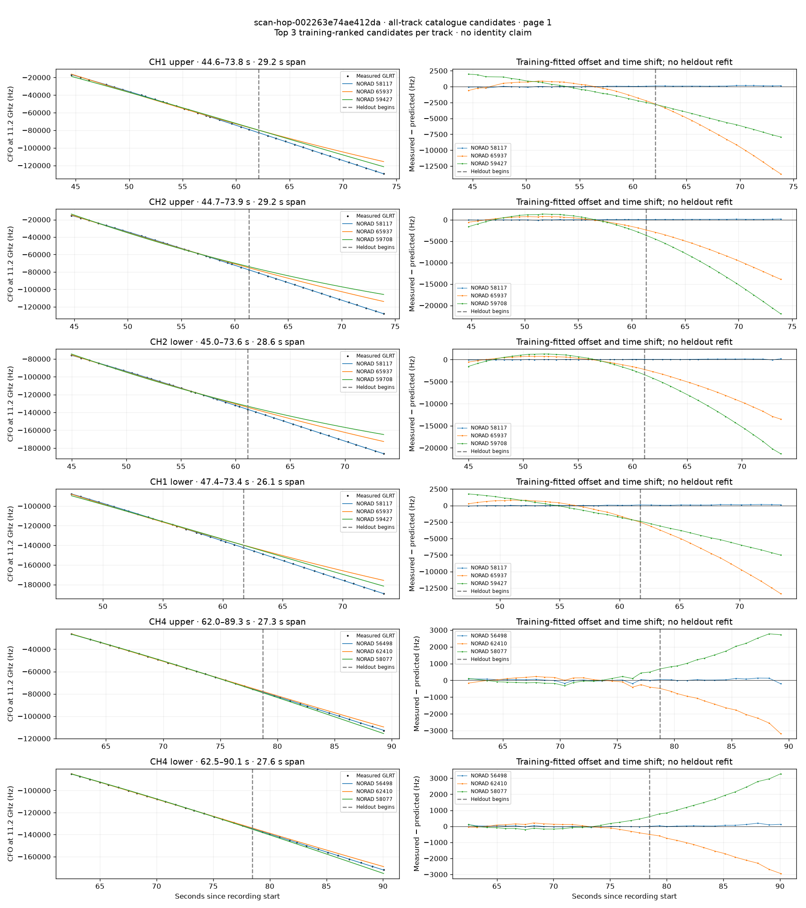
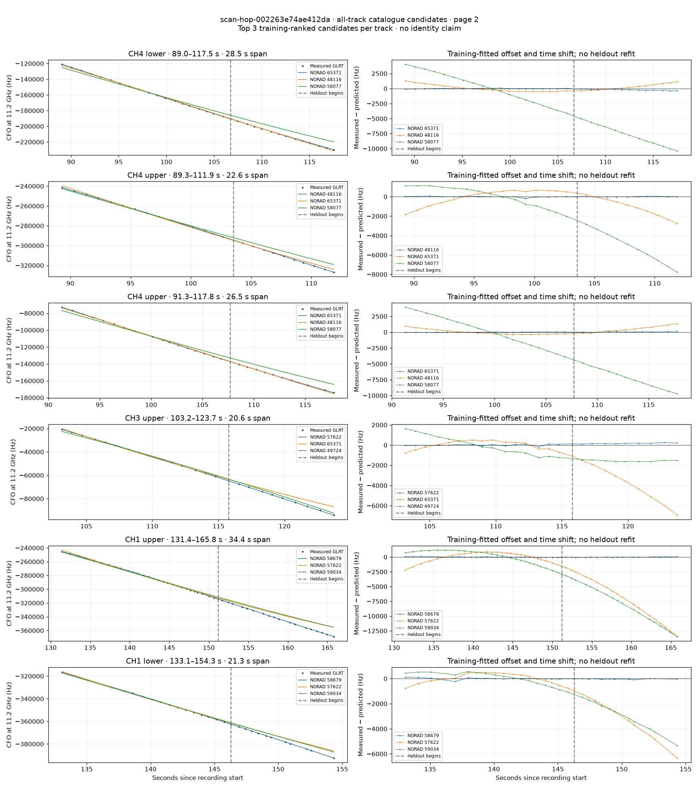
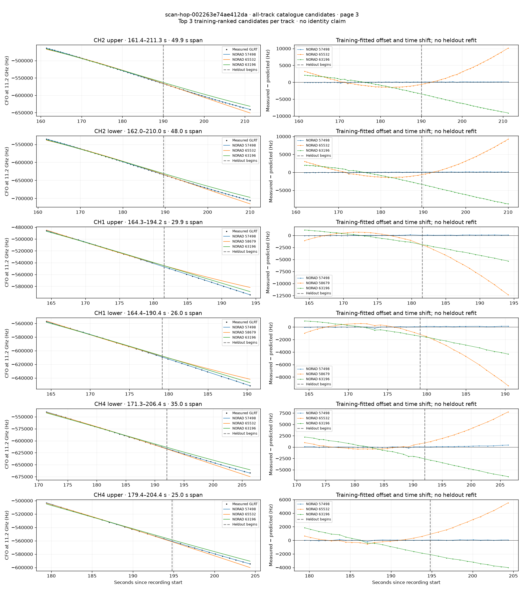
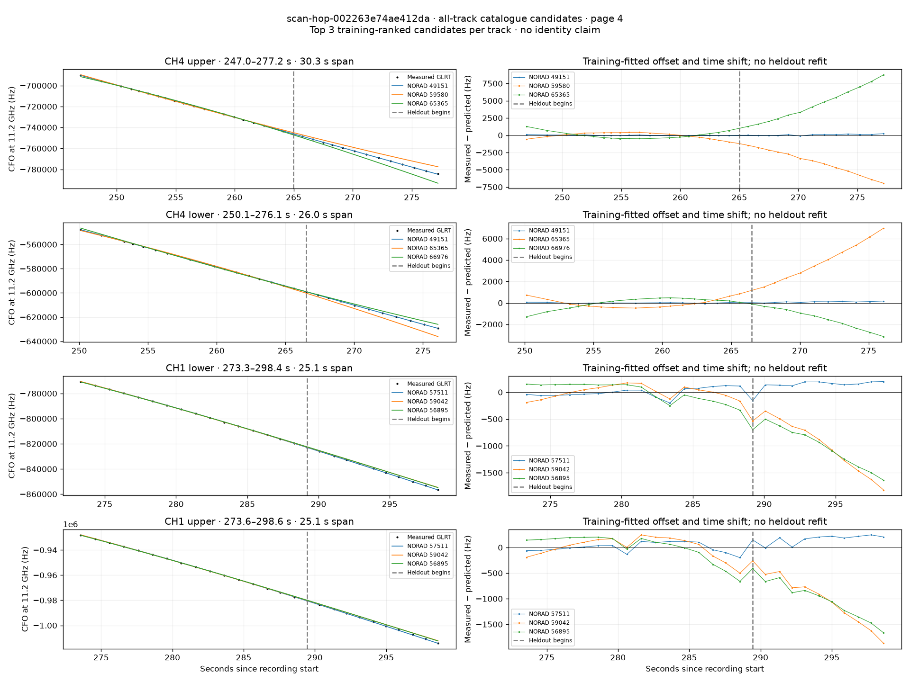

# All track overlays: scan-hop-002263e74ae412da

Recorded **2026-09-14T18:40:12.765665Z**, RX0, 10 MS/s. All **22 eligible tracks** are shown in chronological order.

[Recording assessment](scan-hop-002263e74ae412da.md) · [Candidate RMS and gains](scan-hop-002263e74ae412da-candidates.md)

Each row matches the requested view: measured GLRT CFO and the top three training-ranked TLE curves on the left, residuals on the right. Offset and time shift are fitted only on the first 60%; the last 40% is held out. These are candidate diagnostics, not satellite identifications.

## Page 1

## Page 2

## Page 3

## Page 4

