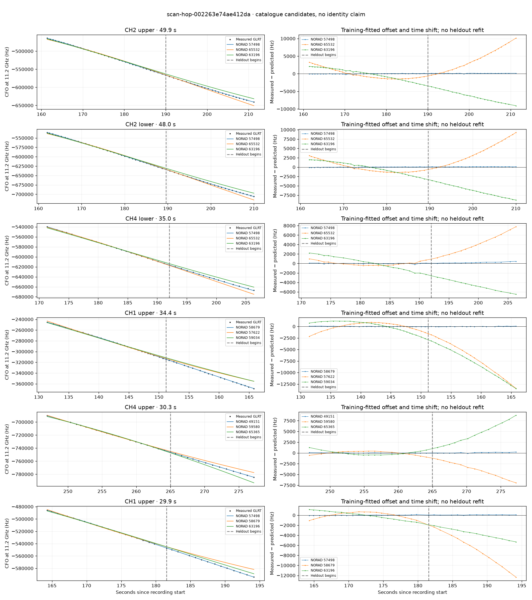

# scan-hop-002263e74ae412da

Recorded **2026-09-14T18:40:12.765665Z**, RX0, 10 MS/s.

**Candidates pass descriptive checks; no identification.** Candidates: 57498 (6 tracklets), 58117 (4 tracklets), 56498 (2 tracklets).

[Satellite RMS comparisons and top-1 gains](scan-hop-002263e74ae412da-candidates.md).

Counts are correlated lane tracklets, not independent detections or satellite counts. A recording can contain multiple transmitters; these are not one-label-per-file assignments.

Solid curves include a per-track constant carrier offset fitted on the first 60% of observations. The final 40% is held out. A close curve is not identity evidence by itself.

Catalogue: `sha256:f027c02cbe99846bc1b1e0b5a10d35c7fe22c60b64c3ddd0a6bf0efe667659cd`. Orbital-only exclusions: STARLINK-1770 (NORAD 46383; SGP4 []), STARLINK-34343 DEB (NORAD 69730; SGP4 [6]), STARLINK-37793 (NORAD 100286; SGP4 [6]).

| Lane | Recording seconds | Top 3 training NORADs | Train / heldout RMS (Hz) | Leader heldout rank | Assessment |
|---|---:|---|---:|---:|---|
| CH1 upper | 44.6–73.8 | 58117, 65937, 59427 | 63.8 / 126.7 | 1 | Passes descriptive checks; candidate only |
| CH2 upper | 44.7–73.9 | 58117, 65937, 59708 | 44.9 / 117.0 | 1 | Passes descriptive checks; candidate only |
| CH2 lower | 45.0–73.6 | 58117, 65937, 59708 | 39.3 / 106.7 | 1 | Passes descriptive checks; candidate only |
| CH1 lower | 47.4–73.4 | 58117, 65937, 59427 | 34.6 / 110.8 | 1 | Passes descriptive checks; candidate only |
| CH4 upper | 62.0–89.3 | 56498, 62410, 58077 | 72.8 / 88.5 | 1 | Passes descriptive checks; candidate only |
| CH4 lower | 89.0–117.5 | 65371, 48116, 58077 | 39.7 / 237.3 | 1 | Passes descriptive checks; candidate only |
| CH4 upper | 91.3–117.8 | 65371, 48116, 58077 | 31.7 / 72.0 | 1 | Passes descriptive checks; candidate only |
| CH3 upper | 103.2–123.7 | 57622, 65371, 49724 | 74.9 / 172.3 | 1 | -500s control fits as well or better; 500s control fits as well or better |
| CH1 upper | 131.4–165.8 | 58679, 57622, 59034 | 38.5 / 39.8 | 1 | Passes descriptive checks; candidate only |
| CH1 lower | 133.1–154.3 | 58679, 57622, 59034 | 70.7 / 43.4 | 1 | -500s control fits as well or better |
| CH2 upper | 161.4–211.3 | 57498, 65532, 63196 | 72.6 / 104.8 | 1 | Passes descriptive checks; candidate only |
| CH2 lower | 162.0–210.0 | 57498, 65532, 63196 | 63.0 / 108.0 | 1 | Passes descriptive checks; candidate only |
| CH1 lower | 164.4–190.4 | 57498, 58679, 63196 | 53.2 / 97.5 | 1 | Passes descriptive checks; candidate only |
| CH4 lower | 171.3–206.4 | 57498, 65532, 63196 | 66.8 / 227.7 | 1 | Passes descriptive checks; candidate only |
| CH4 upper | 179.4–204.4 | 57498, 65532, 63196 | 64.6 / 51.3 | 1 | Passes descriptive checks; candidate only |
| CH4 upper | 247.0–277.2 | 49151, 59580, 65365 | 34.0 / 106.8 | 1 | Passes descriptive checks; candidate only |
| CH4 lower | 250.1–276.1 | 49151, 65365, 66976 | 33.4 / 99.7 | 1 | Passes descriptive checks; candidate only |
| CH1 lower | 273.3–298.4 | 57511, 59042, 56895 | 84.4 / 163.8 | 1 | Passes descriptive checks; candidate only |
| CH1 upper | 273.6–298.6 | 57511, 59042, 56895 | 94.5 / 181.3 | 1 | -500s control fits as well or better |
| CH4 lower | 62.5–90.1 | 56498, 62410, 58077 | 39.2 / 78.9 | 1 | Passes descriptive checks; candidate only |
| CH1 upper | 164.3–194.2 | 57498, 58679, 63196 | 49.5 / 79.5 | 1 | Passes descriptive checks; candidate only |
| CH4 upper | 89.3–111.9 | 48116, 65371, 58077 | 57.8 / 24.7 | 1 | Passes descriptive checks; candidate only |

[Full candidate, control and measured-CFO evidence](scan-hop-002263e74ae412da.json.gz).
