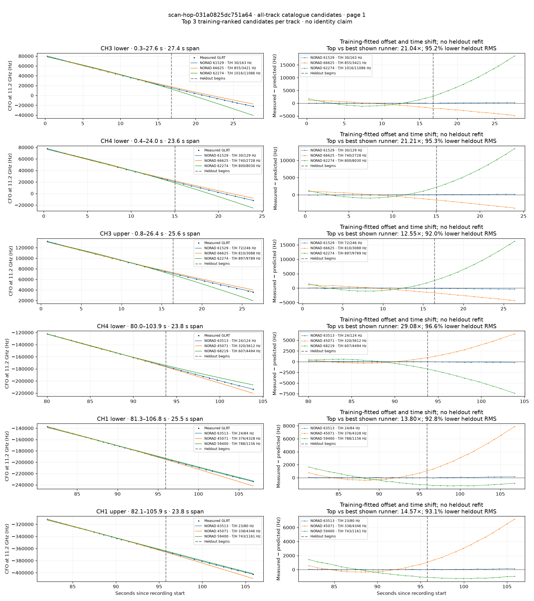
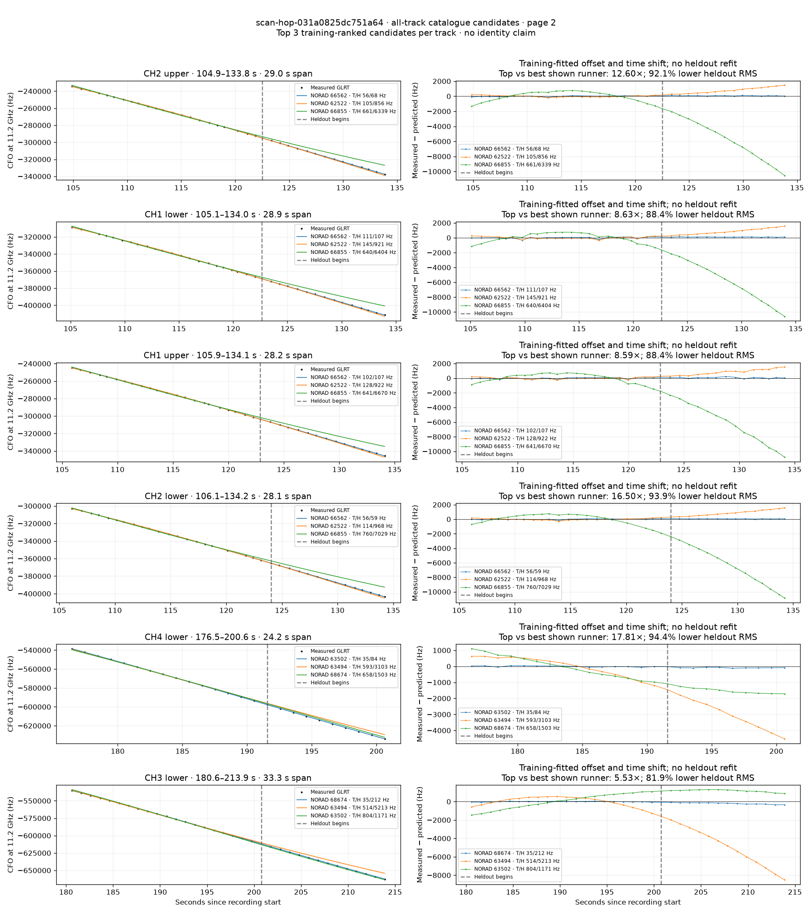
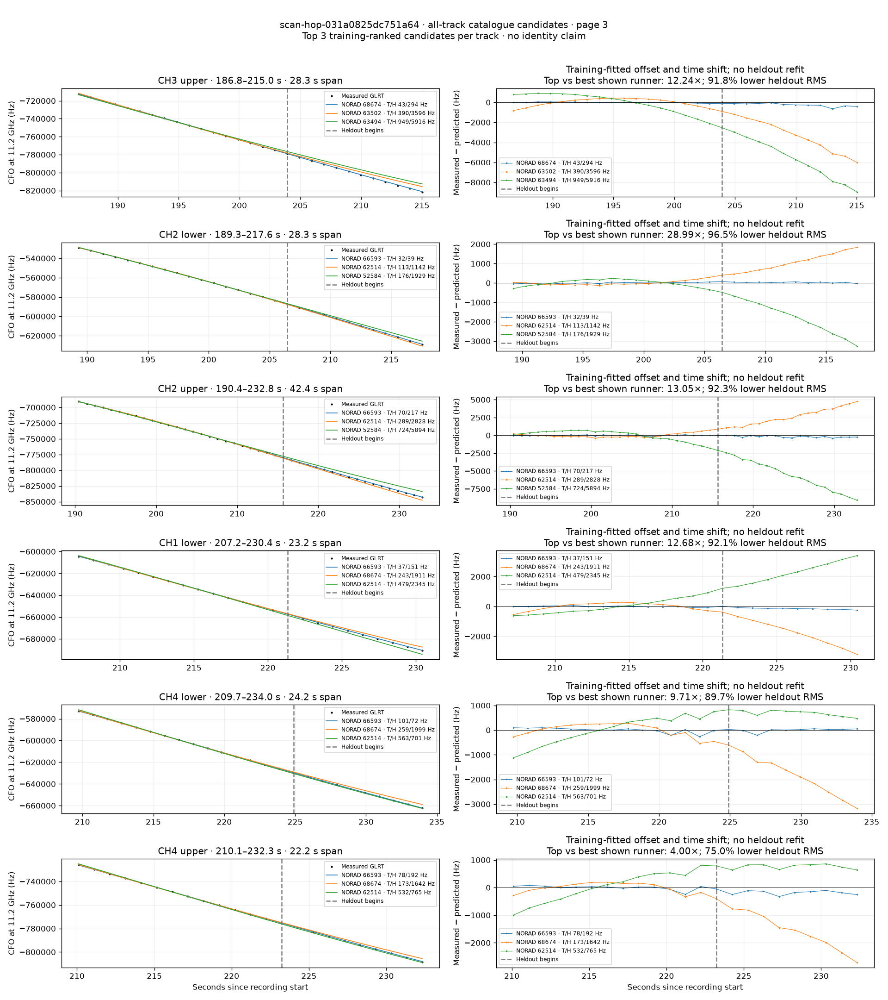
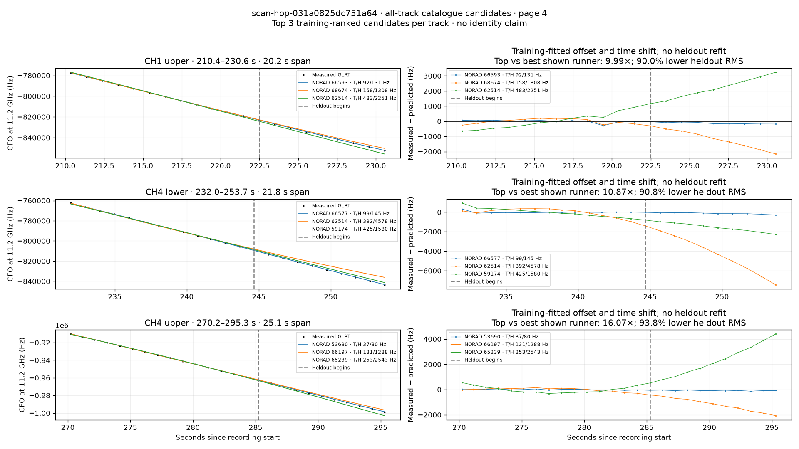

# All track overlays: scan-hop-031a0825dc751a64

Recorded **2026-09-14T16:50:12.617542Z**, RX0, 10 MS/s. All **21 eligible tracks** are shown in chronological order.

[Recording assessment](scan-hop-031a0825dc751a64.md) · [Candidate RMS and gains](scan-hop-031a0825dc751a64-candidates.md)

Each row matches the requested view: measured GLRT CFO and the top three training-ranked TLE curves on the left, residuals on the right. Offset and time shift are fitted only on the first 60%; the last 40% is held out. These are candidate diagnostics, not satellite identifications.

RMS cells below are `training / heldout` in Hz. Runner-up 1 and 2 are training ranks two and three. The gain compares the top TLE with whichever of those two has lower heldout RMS.

| Track | Top TLE, train / heldout RMS | Runner-up 1, train / heldout RMS | Runner-up 2, train / heldout RMS | Top vs best shown runner, heldout |
|---|---:|---:|---:|---:|
| CH3 lower, 0.3–27.6 s | STARLINK-32351 / 61529: 29.8 / 162.6 Hz | STARLINK-35929 / 66625: 855.0 / 3420.9 Hz | STARLINK-11504 / 62274: 1016.4 / 11085.9 Hz | 21.04× / 95.2% lower |
| CH4 lower, 0.4–24.0 s | STARLINK-32351 / 61529: 30.3 / 128.6 Hz | STARLINK-35929 / 66625: 740.2 / 2728.2 Hz | STARLINK-11504 / 62274: 799.6 / 8029.8 Hz | 21.21× / 95.3% lower |
| CH3 upper, 0.8–26.4 s | STARLINK-32351 / 61529: 72.2 / 246.0 Hz | STARLINK-35929 / 66625: 809.7 / 3088.1 Hz | STARLINK-11504 / 62274: 897.0 / 9789.2 Hz | 12.55× / 92.0% lower |
| CH4 lower, 80.0–103.9 s | STARLINK-33750 / 63513: 24.3 / 124.2 Hz | STARLINK-1167 / 45071: 319.8 / 3612.1 Hz | STARLINK-37106 / 68219: 607.1 / 4493.6 Hz | 29.08× / 96.6% lower |
| CH1 lower, 81.3–106.8 s | STARLINK-33750 / 63513: 24.0 / 83.8 Hz | STARLINK-1167 / 45071: 376.1 / 4328.5 Hz | STARLINK-31545 / 59400: 787.6 / 1156.5 Hz | 13.80× / 92.8% lower |
| CH1 upper, 82.1–105.9 s | STARLINK-33750 / 63513: 23.3 / 79.7 Hz | STARLINK-1167 / 45071: 337.8 / 4346.4 Hz | STARLINK-31545 / 59400: 743.2 / 1161.1 Hz | 14.57× / 93.1% lower |
| CH2 upper, 104.9–133.8 s | STARLINK-35579 / 66562: 55.9 / 67.9 Hz | STARLINK-11516 / 62522: 104.5 / 856.1 Hz | STARLINK-36090 / 66855: 660.9 / 6339.3 Hz | 12.60× / 92.1% lower |
| CH1 lower, 105.1–134.0 s | STARLINK-35579 / 66562: 111.0 / 106.7 Hz | STARLINK-11516 / 62522: 144.8 / 920.8 Hz | STARLINK-36090 / 66855: 639.7 / 6403.9 Hz | 8.63× / 88.4% lower |
| CH1 upper, 105.9–134.1 s | STARLINK-35579 / 66562: 101.7 / 107.4 Hz | STARLINK-11516 / 62522: 127.8 / 922.1 Hz | STARLINK-36090 / 66855: 641.1 / 6669.6 Hz | 8.59× / 88.4% lower |
| CH2 lower, 106.1–134.2 s | STARLINK-35579 / 66562: 55.8 / 58.7 Hz | STARLINK-11516 / 62522: 114.4 / 968.1 Hz | STARLINK-36090 / 66855: 760.0 / 7029.5 Hz | 16.50× / 93.9% lower |
| CH4 lower, 176.5–200.6 s | STARLINK-33818 / 63502: 34.9 / 84.4 Hz | STARLINK-33819 / 63494: 592.5 / 3103.1 Hz | STARLINK-36672 / 68674: 657.8 / 1503.1 Hz | 17.81× / 94.4% lower |
| CH3 lower, 180.6–213.9 s | STARLINK-36672 / 68674: 35.0 / 211.9 Hz | STARLINK-33819 / 63494: 514.5 / 5212.5 Hz | STARLINK-33818 / 63502: 804.1 / 1171.2 Hz | 5.53× / 81.9% lower |
| CH3 upper, 186.8–215.0 s | STARLINK-36672 / 68674: 42.7 / 293.7 Hz | STARLINK-33818 / 63502: 390.1 / 3595.5 Hz | STARLINK-33819 / 63494: 949.4 / 5916.3 Hz | 12.24× / 91.8% lower |
| CH2 lower, 189.3–217.6 s | STARLINK-36031 / 66593: 31.9 / 39.4 Hz | STARLINK-11514 / 62514: 113.1 / 1142.5 Hz | STARLINK-3922 / 52584: 176.3 / 1928.5 Hz | 28.99× / 96.5% lower |
| CH2 upper, 190.4–232.8 s | STARLINK-36031 / 66593: 69.9 / 216.7 Hz | STARLINK-11514 / 62514: 288.6 / 2827.8 Hz | STARLINK-3922 / 52584: 724.4 / 5893.6 Hz | 13.05× / 92.3% lower |
| CH1 lower, 207.2–230.4 s | STARLINK-36031 / 66593: 36.8 / 150.7 Hz | STARLINK-36672 / 68674: 242.8 / 1911.0 Hz | STARLINK-11514 / 62514: 478.6 / 2345.3 Hz | 12.68× / 92.1% lower |
| CH4 lower, 209.7–234.0 s | STARLINK-36031 / 66593: 101.2 / 72.2 Hz | STARLINK-36672 / 68674: 259.3 / 1999.1 Hz | STARLINK-11514 / 62514: 563.0 / 701.2 Hz | 9.71× / 89.7% lower |
| CH4 upper, 210.1–232.3 s | STARLINK-36031 / 66593: 78.5 / 191.6 Hz | STARLINK-36672 / 68674: 172.7 / 1641.8 Hz | STARLINK-11514 / 62514: 532.4 / 765.5 Hz | 4.00× / 75.0% lower |
| CH1 upper, 210.4–230.6 s | STARLINK-36031 / 66593: 91.8 / 130.9 Hz | STARLINK-36672 / 68674: 158.0 / 1307.5 Hz | STARLINK-11514 / 62514: 483.5 / 2250.7 Hz | 9.99× / 90.0% lower |
| CH4 lower, 232.0–253.7 s | STARLINK-35815 / 66577: 98.9 / 145.3 Hz | STARLINK-11514 / 62514: 392.3 / 4577.7 Hz | STARLINK-31283 / 59174: 425.4 / 1580.2 Hz | 10.87× / 90.8% lower |
| CH4 upper, 270.2–295.3 s | STARLINK-4570 / 53690: 37.0 / 80.1 Hz | STARLINK-35259 / 66197: 130.6 / 1288.2 Hz | STARLINK-34964 / 65239: 253.2 / 2543.0 Hz | 16.07× / 93.8% lower |

## Page 1

## Page 2

## Page 3

## Page 4

