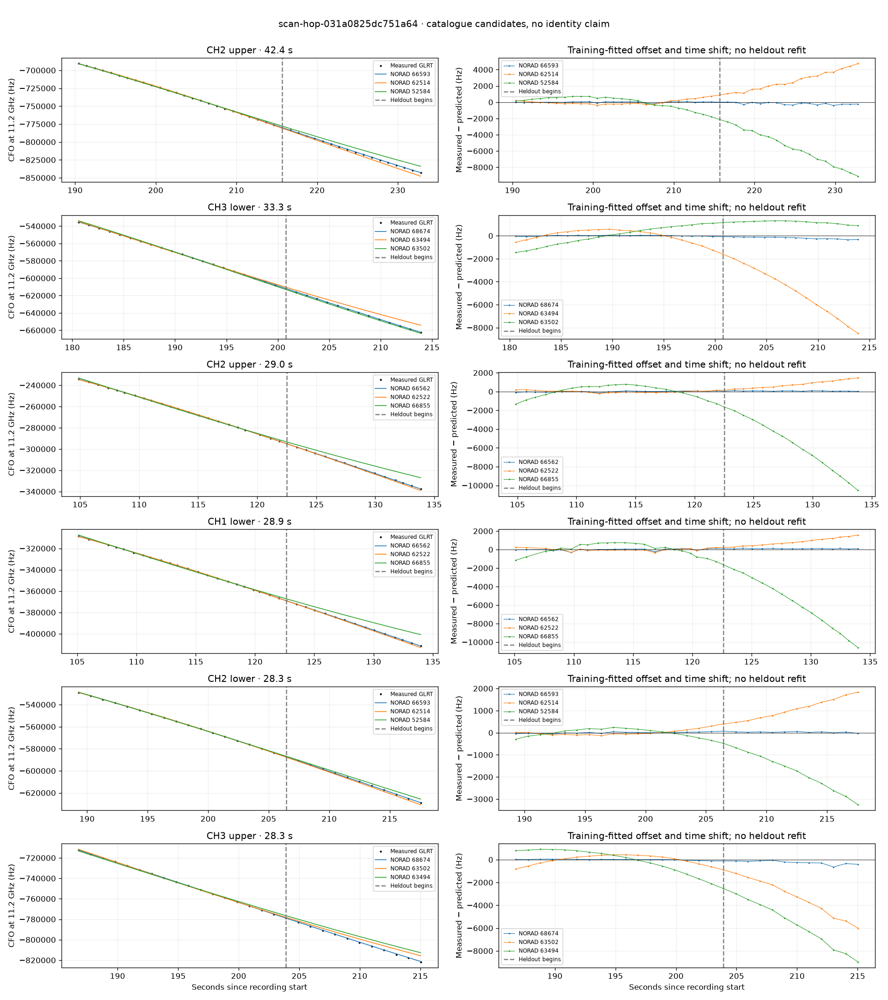

# scan-hop-031a0825dc751a64

Recorded **2026-09-14T16:50:12.617542Z**, RX0, 10 MS/s.

**Candidates pass descriptive checks; no identification.** Candidates: 66593 (6 tracklets), 61529 (3 tracklets), 63513 (3 tracklets).

[Satellite RMS comparisons and top-1 gains](scan-hop-031a0825dc751a64-candidates.md).

Counts are correlated lane tracklets, not independent detections or satellite counts. A recording can contain multiple transmitters; these are not one-label-per-file assignments.

Solid curves include a per-track constant carrier offset fitted on the first 60% of observations. The final 40% is held out. A close curve is not identity evidence by itself.

Catalogue: `sha256:f623da8623d574a387a40f84f1b4e813d76f1f993d2759f7aa9a8c002a1c272e`. Orbital-only exclusions: STARLINK-1770 (NORAD 46383; SGP4 []), STARLINK-34343 DEB (NORAD 69730; SGP4 [6]), STARLINK-37793 (NORAD 100286; SGP4 [6]).

| Lane | Recording seconds | Top 3 training NORADs | Train / heldout RMS (Hz) | Leader heldout rank | Assessment |
|---|---:|---|---:|---:|---|
| CH3 lower | 0.3–27.6 | 61529, 66625, 62274 | 29.8 / 162.6 | 1 | Passes descriptive checks; candidate only |
| CH4 lower | 0.4–24.0 | 61529, 66625, 62274 | 30.3 / 128.6 | 1 | Passes descriptive checks; candidate only |
| CH3 upper | 0.8–26.4 | 61529, 66625, 62274 | 72.2 / 246.0 | 1 | Passes descriptive checks; candidate only |
| CH4 lower | 80.0–103.9 | 63513, 45071, 68219 | 24.3 / 124.2 | 1 | Passes descriptive checks; candidate only |
| CH2 upper | 104.9–133.8 | 66562, 62522, 66855 | 55.9 / 67.9 | 1 | Passes descriptive checks; candidate only |
| CH1 lower | 105.1–134.0 | 66562, 62522, 66855 | 111.0 / 106.7 | 1 | 500s control fits as well or better |
| CH1 upper | 105.9–134.1 | 66562, 62522, 66855 | 101.7 / 107.4 | 1 | Passes descriptive checks; candidate only |
| CH2 lower | 106.1–134.2 | 66562, 62522, 66855 | 55.8 / 58.7 | 1 | Passes descriptive checks; candidate only |
| CH4 lower | 176.5–200.6 | 63502, 63494, 68674 | 34.9 / 84.4 | 1 | Passes descriptive checks; candidate only |
| CH3 lower | 180.6–213.9 | 68674, 63494, 63502 | 35.0 / 211.9 | 1 | Passes descriptive checks; candidate only |
| CH3 upper | 186.8–215.0 | 68674, 63502, 63494 | 42.7 / 293.7 | 1 | radio drift fits as well or better |
| CH2 lower | 189.3–217.6 | 66593, 62514, 52584 | 31.9 / 39.4 | 1 | Passes descriptive checks; candidate only |
| CH2 upper | 190.4–232.8 | 66593, 62514, 52584 | 69.9 / 216.7 | 1 | Passes descriptive checks; candidate only |
| CH1 lower | 207.2–230.4 | 66593, 68674, 62514 | 36.8 / 150.7 | 1 | Passes descriptive checks; candidate only |
| CH4 lower | 209.7–234.0 | 66593, 68674, 62514 | 101.2 / 72.2 | 1 | Passes descriptive checks; candidate only |
| CH4 upper | 210.1–232.3 | 66593, 68674, 62514 | 78.5 / 191.6 | 1 | Passes descriptive checks; candidate only |
| CH1 upper | 210.4–230.6 | 66593, 68674, 62514 | 91.8 / 130.9 | 1 | Passes descriptive checks; candidate only |
| CH4 upper | 270.2–295.3 | 53690, 66197, 65239 | 37.0 / 80.1 | 1 | Passes descriptive checks; candidate only |
| CH4 lower | 232.0–253.7 | 66577, 62514, 59174 | 98.9 / 145.3 | 1 | radio drift fits as well or better; 500s control fits as well or better |
| CH1 upper | 82.1–105.9 | 63513, 45071, 59400 | 23.3 / 79.7 | 1 | Passes descriptive checks; candidate only |
| CH1 lower | 81.3–106.8 | 63513, 45071, 59400 | 24.0 / 83.8 | 1 | Passes descriptive checks; candidate only |

[Full candidate, control and measured-CFO evidence](scan-hop-031a0825dc751a64.json.gz).
