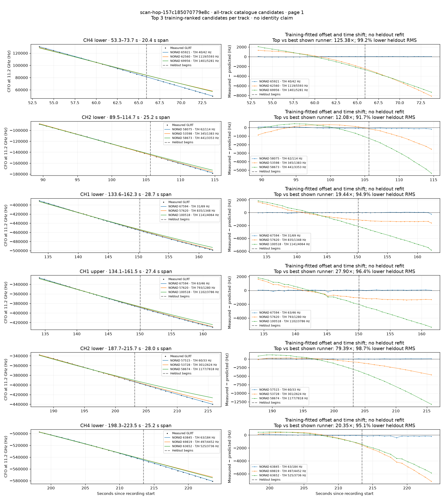
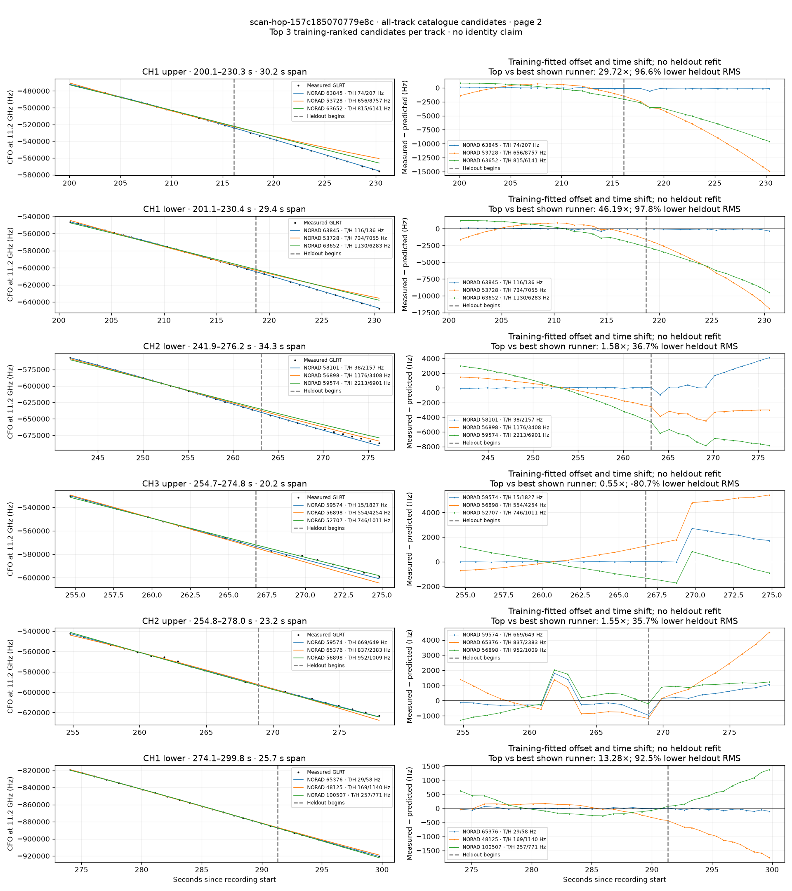
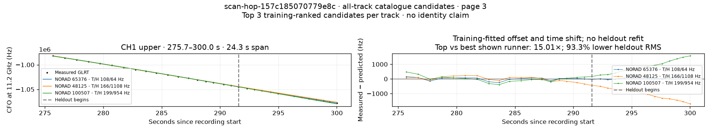

# All track overlays: scan-hop-157c185070779e8c

Recorded **2026-09-14T18:30:12.754513Z**, RX0, 10 MS/s. All **13 eligible tracks** are shown in chronological order.

[Recording assessment](scan-hop-157c185070779e8c.md) · [Candidate RMS and gains](scan-hop-157c185070779e8c-candidates.md)

Each row matches the requested view: measured GLRT CFO and the top three training-ranked TLE curves on the left, residuals on the right. Offset and time shift are fitted only on the first 60%; the last 40% is held out. These are candidate diagnostics, not satellite identifications.

RMS cells below are `training / heldout` in Hz. Runner-up 1 and 2 are training ranks two and three. The gain compares the top TLE with whichever of those two has lower heldout RMS.

| Track | Top TLE, train / heldout RMS | Runner-up 1, train / heldout RMS | Runner-up 2, train / heldout RMS | Top vs best shown runner, heldout |
|---|---:|---:|---:|---:|
| CH4 lower, 53.3–73.7 s | STARLINK-35530 / 65921: 40.1 / 42.1 Hz | STARLINK-11519 / 62560: 1118.9 / 5592.9 Hz | STARLINK-37824 / 69956: 1401.4 / 5281.1 Hz | 125.38× / 99.2% lower |
| CH2 lower, 89.5–114.7 s | STARLINK-30604 / 58075: 61.7 / 114.5 Hz | STARLINK-4676 / 53598: 344.7 / 1383.1 Hz | STARLINK-31131 / 58673: 440.8 / 3353.0 Hz | 12.08× / 91.7% lower |
| CH1 lower, 133.6–162.3 s | STARLINK-36638 / 67594: 31.2 / 69.3 Hz | STARLINK-30141 / 57620: 834.6 / 1347.5 Hz | STARLINK-38323 / 100518: 1141.5 / 4064.3 Hz | 19.44× / 94.9% lower |
| CH1 upper, 134.1–161.5 s | STARLINK-36638 / 67594: 62.6 / 45.9 Hz | STARLINK-30141 / 57620: 792.6 / 1279.8 Hz | STARLINK-38323 / 100518: 1101.7 / 3785.5 Hz | 27.90× / 96.4% lower |
| CH2 lower, 187.7–215.7 s | STARLINK-30081 / 57515: 59.5 / 33.0 Hz | STARLINK-4640 / 53728: 301.3 / 2623.9 Hz | STARLINK-31124 / 58674: 1176.9 / 7818.3 Hz | 79.39× / 98.7% lower |
| CH4 lower, 198.3–223.5 s | STARLINK-34011 / 63845: 63.1 / 183.6 Hz | STARLINK-37520 / 69819: 497.5 / 4452.3 Hz | STARLINK-33663 / 63652: 525.0 / 3736.3 Hz | 20.35× / 95.1% lower |
| CH1 upper, 200.1–230.3 s | STARLINK-34011 / 63845: 73.8 / 206.6 Hz | STARLINK-4640 / 53728: 655.9 / 8757.0 Hz | STARLINK-33663 / 63652: 815.3 / 6140.8 Hz | 29.72× / 96.6% lower |
| CH1 lower, 201.1–230.4 s | STARLINK-34011 / 63845: 116.0 / 136.0 Hz | STARLINK-4640 / 53728: 734.4 / 7055.0 Hz | STARLINK-33663 / 63652: 1130.0 / 6283.4 Hz | 46.19× / 97.8% lower |
| CH2 lower, 241.9–276.2 s | STARLINK-30605 / 58101: 38.2 / 2156.5 Hz | STARLINK-6205 / 56898: 1176.4 / 3408.3 Hz | STARLINK-31751 / 59574: 2212.9 / 6901.1 Hz | 1.58× / 36.7% lower |
| CH3 upper, 254.7–274.8 s | STARLINK-31751 / 59574: 14.6 / 1826.7 Hz | STARLINK-6205 / 56898: 554.1 / 4254.5 Hz | STARLINK-4007 / 52707: 746.3 / 1011.0 Hz | 0.55× / -80.7% lower |
| CH2 upper, 254.8–278.0 s | STARLINK-31751 / 59574: 669.2 / 648.7 Hz | STARLINK-34249 / 65376: 837.4 / 2383.1 Hz | STARLINK-6205 / 56898: 952.0 / 1008.5 Hz | 1.55× / 35.7% lower |
| CH1 lower, 274.1–299.8 s | STARLINK-34249 / 65376: 28.6 / 58.1 Hz | STARLINK-2466 / 48125: 169.5 / 1139.7 Hz | STARLINK-38277 / 100507: 257.1 / 771.4 Hz | 13.28× / 92.5% lower |
| CH1 upper, 275.7–300.0 s | STARLINK-34249 / 65376: 107.7 / 63.6 Hz | STARLINK-2466 / 48125: 166.3 / 1108.3 Hz | STARLINK-38277 / 100507: 199.4 / 954.3 Hz | 15.01× / 93.3% lower |

## Page 1

## Page 2

## Page 3

