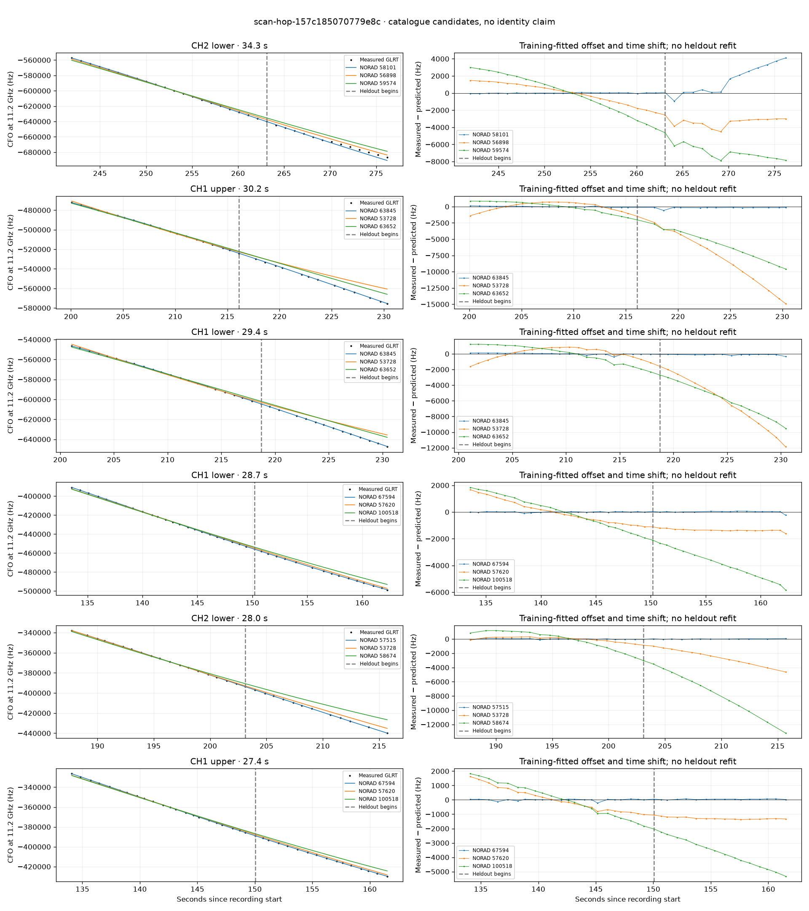

# scan-hop-157c185070779e8c

Recorded **2026-09-14T18:30:12.754513Z**, RX0, 10 MS/s.

**Candidates pass descriptive checks; no identification.** Candidates: 63845 (3 tracklets), 67594 (2 tracklets), 65376 (2 tracklets).

[Satellite RMS comparisons and top-1 gains](scan-hop-157c185070779e8c-candidates.md).

Counts are correlated lane tracklets, not independent detections or satellite counts. A recording can contain multiple transmitters; these are not one-label-per-file assignments.

Solid curves include a per-track constant carrier offset fitted on the first 60% of observations. The final 40% is held out. A close curve is not identity evidence by itself.

Catalogue: `sha256:f027c02cbe99846bc1b1e0b5a10d35c7fe22c60b64c3ddd0a6bf0efe667659cd`. Orbital-only exclusions: STARLINK-1770 (NORAD 46383; SGP4 []), STARLINK-34343 DEB (NORAD 69730; SGP4 [6]), STARLINK-37793 (NORAD 100286; SGP4 [6]).

| Lane | Recording seconds | Top 3 training NORADs | Train / heldout RMS (Hz) | Leader heldout rank | Assessment |
|---|---:|---|---:|---:|---|
| CH4 lower | 53.3–73.7 | 65921, 62560, 69956 | 40.1 / 42.1 | 1 | Passes descriptive checks; candidate only |
| CH2 lower | 89.5–114.7 | 58075, 53598, 58673 | 61.7 / 114.5 | 1 | Passes descriptive checks; candidate only |
| CH1 lower | 133.6–162.3 | 67594, 57620, 100518 | 31.2 / 69.3 | 1 | Passes descriptive checks; candidate only |
| CH1 upper | 134.1–161.5 | 67594, 57620, 100518 | 62.6 / 45.9 | 1 | Passes descriptive checks; candidate only |
| CH2 lower | 187.7–215.7 | 57515, 53728, 58674 | 59.5 / 33.0 | 1 | Passes descriptive checks; candidate only |
| CH4 lower | 198.3–223.5 | 63845, 69819, 63652 | 63.1 / 183.6 | 1 | Passes descriptive checks; candidate only |
| CH1 upper | 200.1–230.3 | 63845, 53728, 63652 | 73.8 / 206.6 | 1 | Passes descriptive checks; candidate only |
| CH1 lower | 201.1–230.4 | 63845, 53728, 63652 | 116.0 / 136.0 | 1 | Passes descriptive checks; candidate only |
| CH2 lower | 241.9–276.2 | 58101, 56898, 59574 | 38.2 / 2156.5 | 1 | radio drift fits as well or better |
| CH3 upper | 254.7–274.8 | 59574, 56898, 52707 | 14.6 / 1826.7 | 3 | leader changes on heldout; 500s control fits as well or better |
| CH2 upper | 254.8–278.0 | 59574, 65376, 56898 | 669.2 / 648.7 | 1 | time-shift boundary |
| CH1 lower | 274.1–299.8 | 65376, 48125, 100507 | 28.6 / 58.1 | 1 | Passes descriptive checks; candidate only |
| CH1 upper | 275.7–300.0 | 65376, 48125, 100507 | 107.7 / 63.6 | 1 | Passes descriptive checks; candidate only |

[Full candidate, control and measured-CFO evidence](scan-hop-157c185070779e8c.json.gz).
