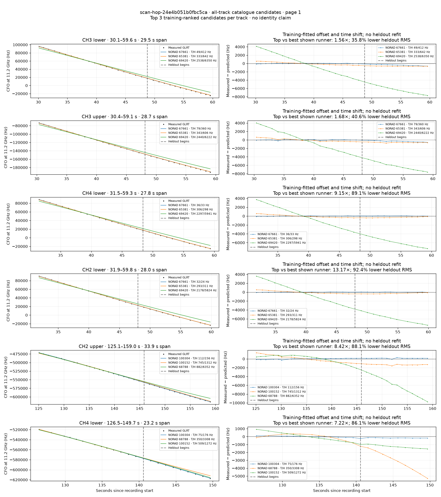
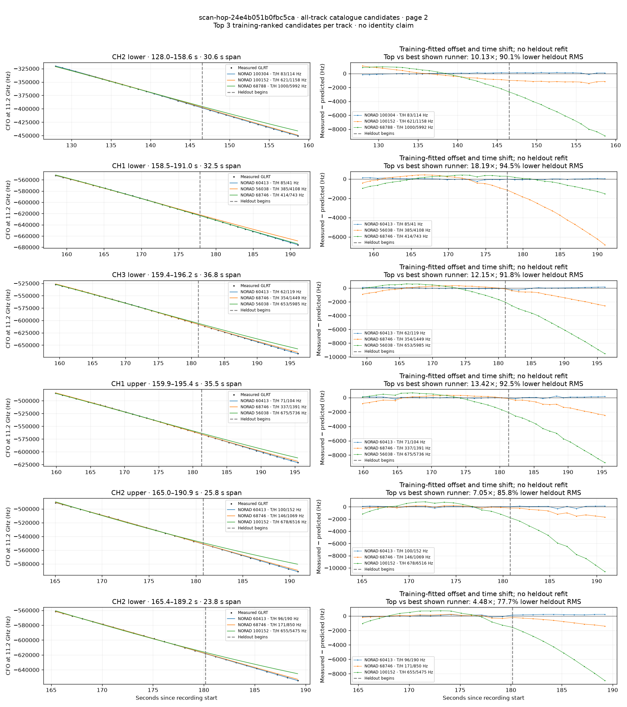
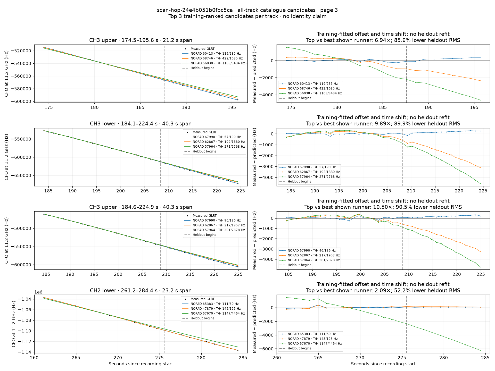

# All track overlays: scan-hop-24e4b051b0fbc5ca

Recorded **2026-09-14T16:20:12.023849Z**, RX0, 10 MS/s. All **16 eligible tracks** are shown in chronological order.

[Recording assessment](scan-hop-24e4b051b0fbc5ca.md) · [Candidate RMS and gains](scan-hop-24e4b051b0fbc5ca-candidates.md)

Each row matches the requested view: measured GLRT CFO and the top three training-ranked TLE curves on the left, residuals on the right. Offset and time shift are fitted only on the first 60%; the last 40% is held out. These are candidate diagnostics, not satellite identifications.

RMS cells below are `training / heldout` in Hz. Runner-up 1 and 2 are training ranks two and three. The gain compares the top TLE with whichever of those two has lower heldout RMS.

| Track | Top TLE, train / heldout RMS | Runner-up 1, train / heldout RMS | Runner-up 2, train / heldout RMS | Top vs best shown runner, heldout |
|---|---:|---:|---:|---:|
| CH3 lower, 30.1–59.6 s | STARLINK-36674 / 67661: 49.4 / 412.2 Hz | STARLINK-35028 / 65381: 332.8 / 642.4 Hz | STARLINK-37537 / 69420: 2538.0 / 6349.6 Hz | 1.56× / 35.8% lower |
| CH3 upper, 30.4–59.1 s | STARLINK-36674 / 67661: 79.0 / 360.0 Hz | STARLINK-35028 / 65381: 343.1 / 605.7 Hz | STARLINK-37537 / 69420: 2439.8 / 6222.2 Hz | 1.68× / 40.6% lower |
| CH4 lower, 31.5–59.3 s | STARLINK-36674 / 67661: 35.6 / 32.6 Hz | STARLINK-35028 / 65381: 306.3 / 298.2 Hz | STARLINK-37537 / 69420: 2297.0 / 5941.4 Hz | 9.15× / 89.1% lower |
| CH2 lower, 31.9–59.8 s | STARLINK-36674 / 67661: 31.9 / 23.6 Hz | STARLINK-35028 / 65381: 293.2 / 310.6 Hz | STARLINK-37537 / 69420: 2178.2 / 5823.9 Hz | 13.17× / 92.4% lower |
| CH2 upper, 125.1–159.0 s | STARLINK-38260 / 100304: 111.8 / 155.9 Hz | STARLINK-38111 / 100152: 745.5 / 1312.0 Hz | STARLINK-37403 / 68788: 881.8 / 6351.9 Hz | 8.42× / 88.1% lower |
| CH4 lower, 126.5–149.7 s | STARLINK-38260 / 100304: 74.6 / 176.2 Hz | STARLINK-37403 / 68788: 350.0 / 3307.5 Hz | STARLINK-38111 / 100152: 508.8 / 1272.2 Hz | 7.22× / 86.1% lower |
| CH2 lower, 128.0–158.6 s | STARLINK-38260 / 100304: 82.5 / 114.4 Hz | STARLINK-38111 / 100152: 620.7 / 1158.3 Hz | STARLINK-37403 / 68788: 1000.1 / 5991.5 Hz | 10.13× / 90.1% lower |
| CH1 lower, 158.5–191.0 s | STARLINK-32178 / 60413: 84.9 / 40.8 Hz | STARLINK-5793 / 56038: 384.7 / 4107.6 Hz | STARLINK-37347 / 68746: 414.2 / 742.7 Hz | 18.19× / 94.5% lower |
| CH3 lower, 159.4–196.2 s | STARLINK-32178 / 60413: 62.5 / 119.2 Hz | STARLINK-37347 / 68746: 353.8 / 1448.8 Hz | STARLINK-5793 / 56038: 652.9 / 5985.4 Hz | 12.15× / 91.8% lower |
| CH1 upper, 159.9–195.4 s | STARLINK-32178 / 60413: 70.7 / 103.7 Hz | STARLINK-37347 / 68746: 336.8 / 1391.5 Hz | STARLINK-5793 / 56038: 674.8 / 5736.3 Hz | 13.42× / 92.5% lower |
| CH2 upper, 165.0–190.9 s | STARLINK-32178 / 60413: 100.1 / 151.7 Hz | STARLINK-37347 / 68746: 145.5 / 1069.1 Hz | STARLINK-38111 / 100152: 677.9 / 6516.0 Hz | 7.05× / 85.8% lower |
| CH2 lower, 165.4–189.2 s | STARLINK-32178 / 60413: 96.3 / 189.8 Hz | STARLINK-37347 / 68746: 171.0 / 849.5 Hz | STARLINK-38111 / 100152: 655.0 / 5474.7 Hz | 4.48× / 77.7% lower |
| CH3 upper, 174.5–195.6 s | STARLINK-32178 / 60413: 119.1 / 235.4 Hz | STARLINK-37347 / 68746: 421.7 / 1634.7 Hz | STARLINK-5793 / 56038: 1103.3 / 3433.9 Hz | 6.94× / 85.6% lower |
| CH3 lower, 184.1–224.4 s | STARLINK-36951 / 67990: 56.8 / 190.0 Hz | STARLINK-32846 / 62867: 192.3 / 1879.6 Hz | STARLINK-30396 / 57964: 270.6 / 2768.0 Hz | 9.89× / 89.9% lower |
| CH3 upper, 184.6–224.9 s | STARLINK-36951 / 67990: 95.5 / 186.3 Hz | STARLINK-32846 / 62867: 217.0 / 1956.9 Hz | STARLINK-30396 / 57964: 301.2 / 2877.6 Hz | 10.50× / 90.5% lower |
| CH2 lower, 261.2–284.4 s | STARLINK-35054 / 65383: 110.9 / 59.8 Hz | STARLINK-2336 / 47879: 145.3 / 125.0 Hz | STARLINK-36596 / 67670: 1147.2 / 4464.0 Hz | 2.09× / 52.2% lower |

## Page 1

## Page 2

## Page 3

