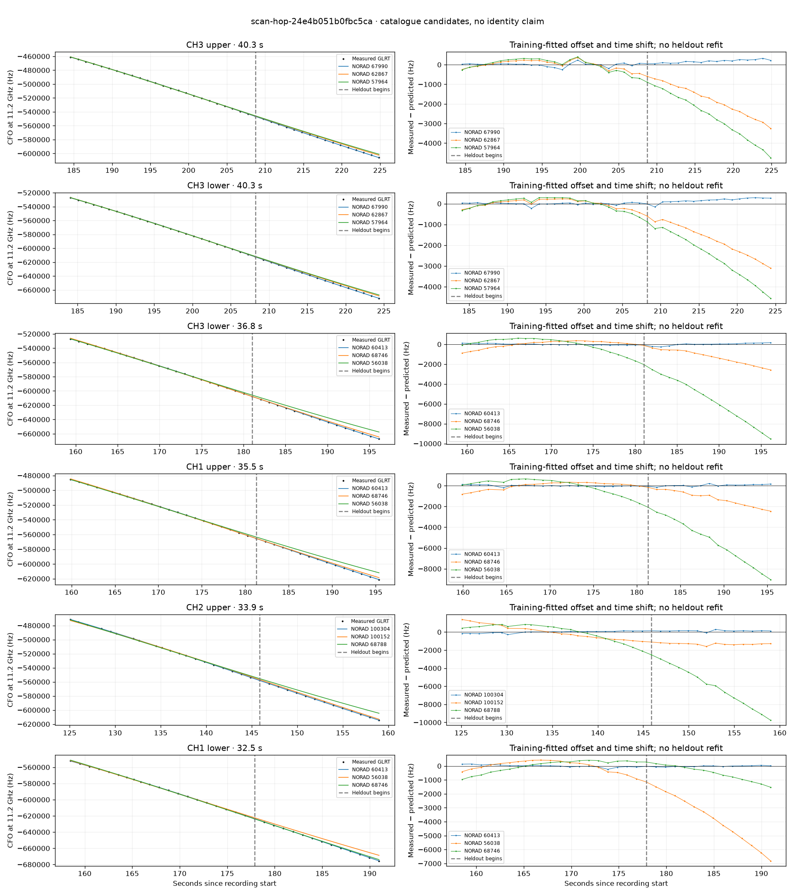

# scan-hop-24e4b051b0fbc5ca

Recorded **2026-09-14T16:20:12.023849Z**, RX0, 10 MS/s.

**Candidates pass descriptive checks; no identification.** Candidates: 60413 (6 tracklets), 67661 (4 tracklets), 100304 (3 tracklets).

**Stricter audit of one shortlisted track: ABSTAIN; leading NORAD 60413.** radio-polynomial-null-not-worse-on-heldout. [Full audit](deep-checks/scan-hop-24e4b051b0fbc5ca.json.gz).

[Satellite RMS comparisons and top-1 gains](scan-hop-24e4b051b0fbc5ca-candidates.md).

Counts are correlated lane tracklets, not independent detections or satellite counts. A recording can contain multiple transmitters; these are not one-label-per-file assignments.

Solid curves include a per-track constant carrier offset fitted on the first 60% of observations. The final 40% is held out. A close curve is not identity evidence by itself.

Catalogue: `sha256:f623da8623d574a387a40f84f1b4e813d76f1f993d2759f7aa9a8c002a1c272e`. Orbital-only exclusions: STARLINK-34343 DEB (NORAD 69730; SGP4 [6]), STARLINK-37793 (NORAD 100286; SGP4 [6]).

| Lane | Recording seconds | Top 3 training NORADs | Train / heldout RMS (Hz) | Leader heldout rank | Assessment |
|---|---:|---|---:|---:|---|
| CH3 lower | 30.1–59.6 | 67661, 65381, 69420 | 49.4 / 412.2 | 1 | Passes descriptive checks; candidate only |
| CH3 upper | 30.4–59.1 | 67661, 65381, 69420 | 79.0 / 360.0 | 1 | Passes descriptive checks; candidate only |
| CH4 lower | 31.5–59.3 | 67661, 65381, 69420 | 35.6 / 32.6 | 1 | Passes descriptive checks; candidate only |
| CH2 lower | 31.9–59.8 | 67661, 65381, 69420 | 31.9 / 23.6 | 1 | Passes descriptive checks; candidate only |
| CH2 upper | 125.1–159.0 | 100304, 100152, 68788 | 111.8 / 155.9 | 1 | Passes descriptive checks; candidate only |
| CH4 lower | 126.5–149.7 | 100304, 68788, 100152 | 74.6 / 176.2 | 1 | Passes descriptive checks; candidate only |
| CH2 lower | 128.0–158.6 | 100304, 100152, 68788 | 82.5 / 114.4 | 1 | Passes descriptive checks; candidate only |
| CH1 lower | 158.5–191.0 | 60413, 56038, 68746 | 84.9 / 40.8 | 1 | Passes descriptive checks; candidate only |
| CH1 upper | 159.9–195.4 | 60413, 68746, 56038 | 70.7 / 103.7 | 1 | Passes descriptive checks; candidate only |
| CH2 upper | 165.0–190.9 | 60413, 68746, 100152 | 100.1 / 151.7 | 1 | Passes descriptive checks; candidate only |
| CH2 lower | 165.4–189.2 | 60413, 68746, 100152 | 96.3 / 189.8 | 1 | Passes descriptive checks; candidate only |
| CH3 lower | 184.1–224.4 | 67990, 62867, 57964 | 56.8 / 190.0 | 1 | 500s control fits as well or better |
| CH3 upper | 184.6–224.9 | 67990, 62867, 57964 | 95.5 / 186.3 | 1 | 500s control fits as well or better |
| CH2 lower | 261.2–284.4 | 65383, 47879, 67670 | 110.9 / 59.8 | 1 | Passes descriptive checks; candidate only |
| CH3 upper | 174.5–195.6 | 60413, 68746, 56038 | 119.1 / 235.4 | 1 | Passes descriptive checks; candidate only |
| CH3 lower | 159.4–196.2 | 60413, 68746, 56038 | 62.5 / 119.2 | 1 | Passes descriptive checks; candidate only |

[Full candidate, control and measured-CFO evidence](scan-hop-24e4b051b0fbc5ca.json.gz).
