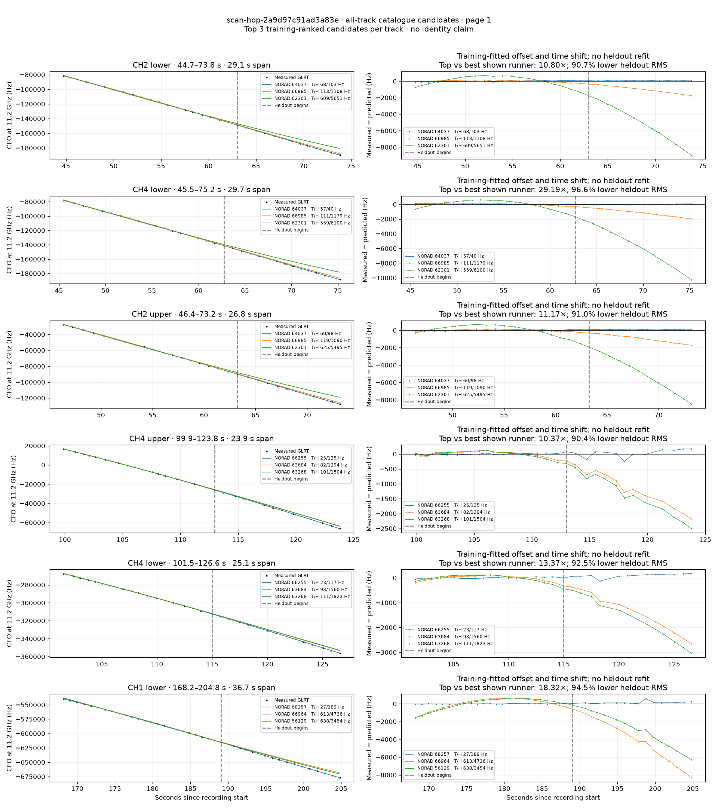
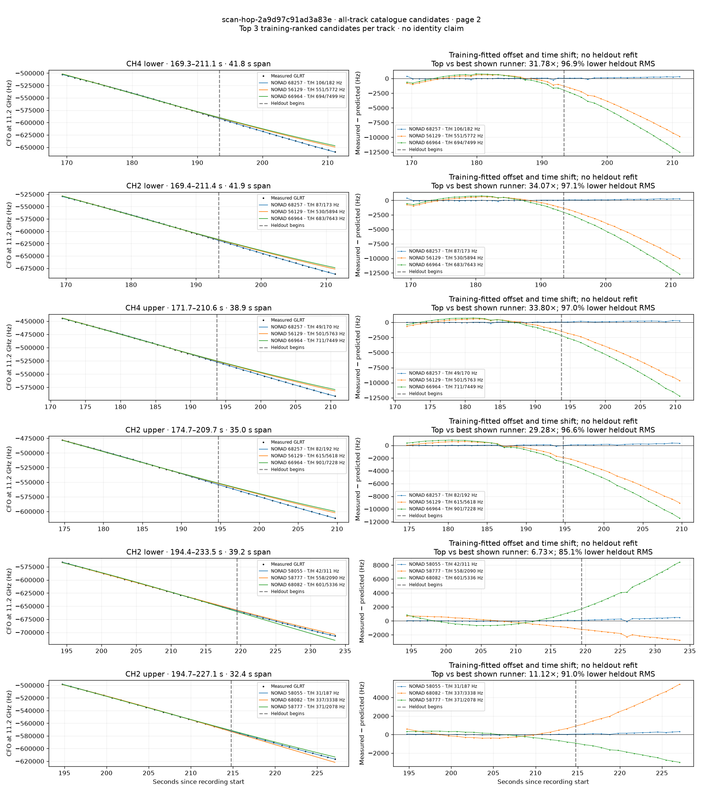

# All track overlays: scan-hop-2a9d97c91ad3a83e

Recorded **2026-09-14T19:20:12.953187Z**, RX0, 10 MS/s. All **12 eligible tracks** are shown in chronological order.

[Recording assessment](scan-hop-2a9d97c91ad3a83e.md) · [Candidate RMS and gains](scan-hop-2a9d97c91ad3a83e-candidates.md)

Each row matches the requested view: measured GLRT CFO and the top three training-ranked TLE curves on the left, residuals on the right. Offset and time shift are fitted only on the first 60%; the last 40% is held out. These are candidate diagnostics, not satellite identifications.

RMS cells below are `training / heldout` in Hz. Runner-up 1 and 2 are training ranks two and three. The gain compares the top TLE with whichever of those two has lower heldout RMS.

| Track | Top TLE, train / heldout RMS | Runner-up 1, train / heldout RMS | Runner-up 2, train / heldout RMS | Top vs best shown runner, heldout |
|---|---:|---:|---:|---:|
| CH2 lower, 44.7–73.8 s | STARLINK-34008 / 64037: 67.6 / 102.6 Hz | STARLINK-36103 / 66985: 112.9 / 1108.2 Hz | STARLINK-32648 / 62301: 609.0 / 5651.3 Hz | 10.80× / 90.7% lower |
| CH4 lower, 45.5–75.2 s | STARLINK-34008 / 64037: 56.6 / 40.4 Hz | STARLINK-36103 / 66985: 110.6 / 1179.4 Hz | STARLINK-32648 / 62301: 559.0 / 6099.8 Hz | 29.19× / 96.6% lower |
| CH2 upper, 46.4–73.2 s | STARLINK-34008 / 64037: 59.9 / 97.6 Hz | STARLINK-36103 / 66985: 118.5 / 1089.6 Hz | STARLINK-32648 / 62301: 624.9 / 5495.3 Hz | 11.17× / 91.0% lower |
| CH4 upper, 99.9–123.8 s | STARLINK-35616 / 66255: 24.6 / 124.8 Hz | STARLINK-33853 / 63684: 82.0 / 1294.0 Hz | STARLINK-11641 [DTC] / 63268: 101.3 / 1504.0 Hz | 10.37× / 90.4% lower |
| CH4 lower, 101.5–126.6 s | STARLINK-35616 / 66255: 23.4 / 116.7 Hz | STARLINK-33853 / 63684: 92.7 / 1559.7 Hz | STARLINK-11641 [DTC] / 63268: 110.7 / 1823.0 Hz | 13.37× / 92.5% lower |
| CH1 lower, 168.2–204.8 s | STARLINK-36745 / 68257: 27.3 / 188.5 Hz | STARLINK-36104 / 66964: 613.1 / 4735.6 Hz | STARLINK-6121 / 56129: 638.4 / 3454.4 Hz | 18.32× / 94.5% lower |
| CH4 lower, 169.3–211.1 s | STARLINK-36745 / 68257: 105.5 / 181.6 Hz | STARLINK-6121 / 56129: 550.9 / 5771.7 Hz | STARLINK-36104 / 66964: 693.8 / 7498.9 Hz | 31.78× / 96.9% lower |
| CH2 lower, 169.4–211.4 s | STARLINK-36745 / 68257: 87.2 / 173.0 Hz | STARLINK-6121 / 56129: 530.4 / 5894.2 Hz | STARLINK-36104 / 66964: 682.6 / 7643.4 Hz | 34.07× / 97.1% lower |
| CH4 upper, 171.7–210.6 s | STARLINK-36745 / 68257: 49.5 / 170.5 Hz | STARLINK-6121 / 56129: 500.7 / 5763.1 Hz | STARLINK-36104 / 66964: 711.2 / 7449.3 Hz | 33.80× / 97.0% lower |
| CH2 upper, 174.7–209.7 s | STARLINK-36745 / 68257: 82.5 / 191.9 Hz | STARLINK-6121 / 56129: 615.5 / 5618.2 Hz | STARLINK-36104 / 66964: 901.3 / 7228.1 Hz | 29.28× / 96.6% lower |
| CH2 lower, 194.4–233.5 s | STARLINK-30544 / 58055: 42.0 / 310.6 Hz | STARLINK-31132 / 58777: 558.3 / 2090.0 Hz | STARLINK-37054 / 68082: 601.2 / 5335.6 Hz | 6.73× / 85.1% lower |
| CH2 upper, 194.7–227.1 s | STARLINK-30544 / 58055: 31.5 / 186.9 Hz | STARLINK-37054 / 68082: 337.0 / 3338.0 Hz | STARLINK-31132 / 58777: 370.7 / 2078.1 Hz | 11.12× / 91.0% lower |

## Page 1

## Page 2

