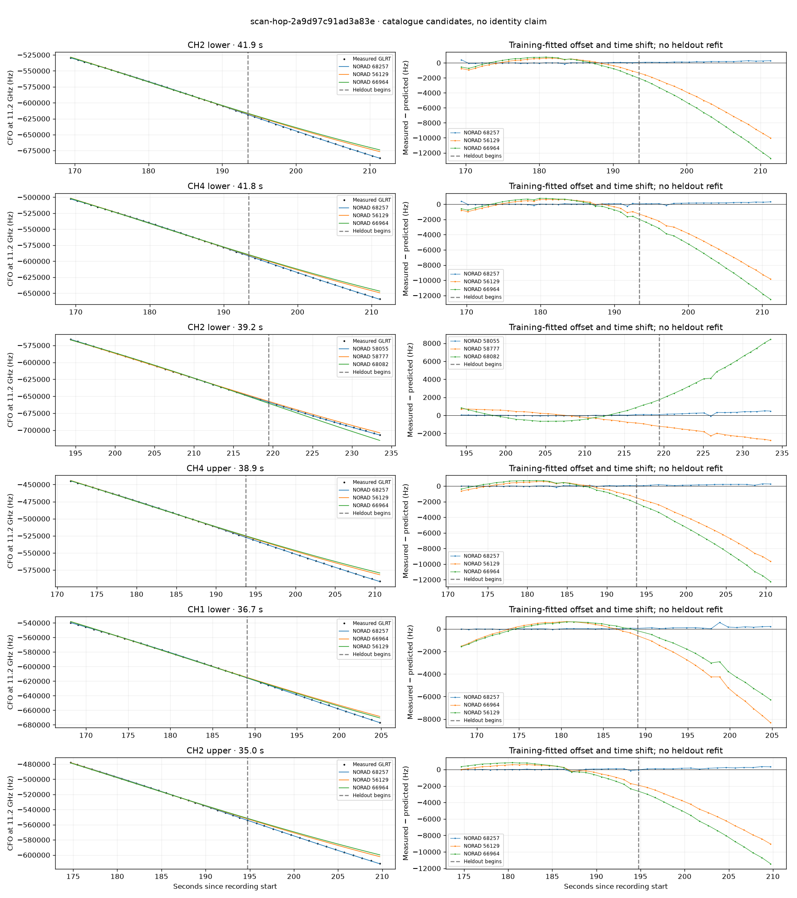

# scan-hop-2a9d97c91ad3a83e

Recorded **2026-09-14T19:20:12.953187Z**, RX0, 10 MS/s.

**Candidates pass descriptive checks; no identification.** Candidates: 68257 (5 tracklets), 64037 (3 tracklets), 66255 (2 tracklets).

[Satellite RMS comparisons and top-1 gains](scan-hop-2a9d97c91ad3a83e-candidates.md).

[Measured CFO/TLE overlays for every track](scan-hop-2a9d97c91ad3a83e-all-tracks.md).

Counts are correlated lane tracklets, not independent detections or satellite counts. A recording can contain multiple transmitters; these are not one-label-per-file assignments.

Solid curves include a per-track constant carrier offset fitted on the first 60% of observations. The final 40% is held out. A close curve is not identity evidence by itself.

Catalogue: `sha256:4b2095c8131c06da613b154fc073602a412fc2bfa0847667b2c078799384e2ac`. Orbital-only exclusions: STARLINK-1770 (NORAD 46383; SGP4 []).

| Lane | Recording seconds | Top 3 training NORADs | Train / heldout RMS (Hz) | Leader heldout rank | Assessment |
|---|---:|---|---:|---:|---|
| CH2 lower | 44.7–73.8 | 64037, 66985, 62301 | 67.6 / 102.6 | 1 | Passes descriptive checks; candidate only |
| CH4 lower | 45.5–75.2 | 64037, 66985, 62301 | 56.6 / 40.4 | 1 | Passes descriptive checks; candidate only |
| CH2 upper | 46.4–73.2 | 64037, 66985, 62301 | 59.9 / 97.6 | 1 | Passes descriptive checks; candidate only |
| CH4 upper | 99.9–123.8 | 66255, 63684, 63268 | 24.6 / 124.8 | 1 | Passes descriptive checks; candidate only |
| CH4 lower | 101.5–126.6 | 66255, 63684, 63268 | 23.4 / 116.7 | 1 | Passes descriptive checks; candidate only |
| CH1 lower | 168.2–204.8 | 68257, 66964, 56129 | 27.3 / 188.5 | 1 | Passes descriptive checks; candidate only |
| CH4 lower | 169.3–211.1 | 68257, 56129, 66964 | 105.5 / 181.6 | 1 | Passes descriptive checks; candidate only |
| CH2 lower | 169.4–211.4 | 68257, 56129, 66964 | 87.2 / 173.0 | 1 | Passes descriptive checks; candidate only |
| CH4 upper | 171.7–210.6 | 68257, 56129, 66964 | 49.5 / 170.5 | 1 | Passes descriptive checks; candidate only |
| CH2 upper | 174.7–209.7 | 68257, 56129, 66964 | 82.5 / 191.9 | 1 | Passes descriptive checks; candidate only |
| CH2 lower | 194.4–233.5 | 58055, 58777, 68082 | 42.0 / 310.6 | 1 | Passes descriptive checks; candidate only |
| CH2 upper | 194.7–227.1 | 58055, 68082, 58777 | 31.5 / 186.9 | 1 | Passes descriptive checks; candidate only |

[Full candidate, control and measured-CFO evidence](scan-hop-2a9d97c91ad3a83e.json.gz).
