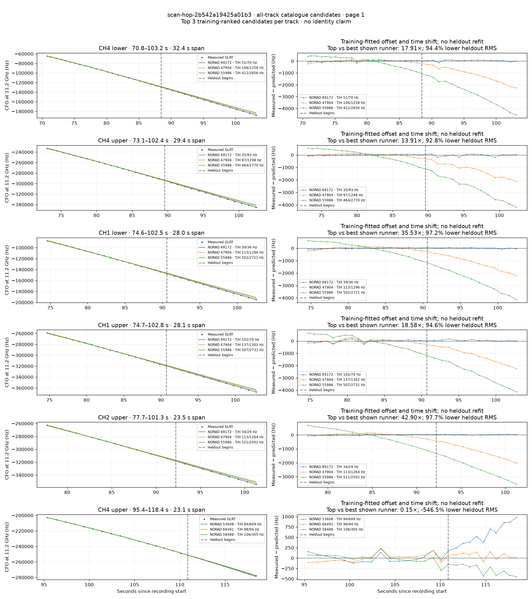
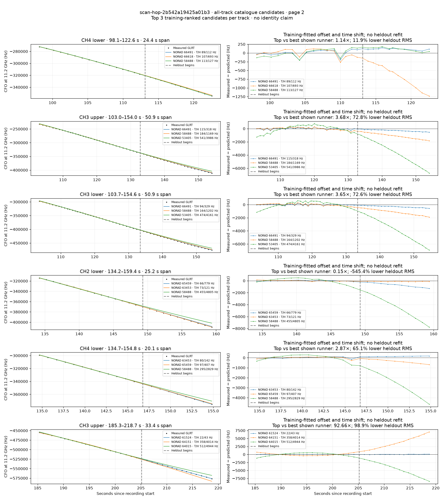
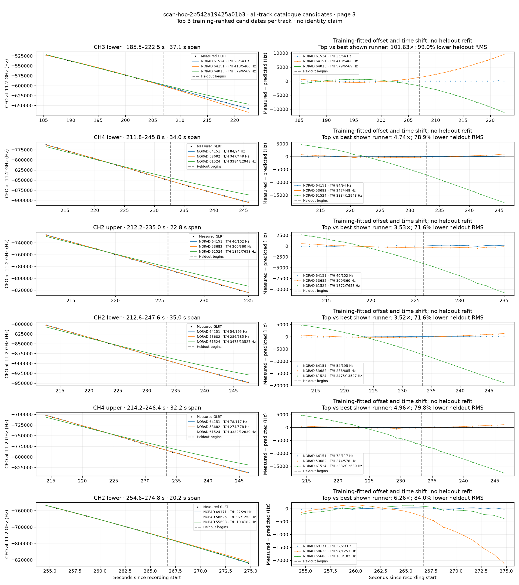
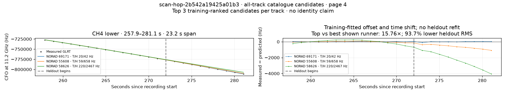

# All track overlays: scan-hop-2b542a19425a01b3

Recorded **2026-09-14T17:10:12.880432Z**, RX0, 10 MS/s. All **19 eligible tracks** are shown in chronological order.

[Recording assessment](scan-hop-2b542a19425a01b3.md) · [Candidate RMS and gains](scan-hop-2b542a19425a01b3-candidates.md)

Each row matches the requested view: measured GLRT CFO and the top three training-ranked TLE curves on the left, residuals on the right. Offset and time shift are fitted only on the first 60%; the last 40% is held out. These are candidate diagnostics, not satellite identifications.

RMS cells below are `training / heldout` in Hz. Runner-up 1 and 2 are training ranks two and three. The gain compares the top TLE with whichever of those two has lower heldout RMS.

| Track | Top TLE, train / heldout RMS | Runner-up 1, train / heldout RMS | Runner-up 2, train / heldout RMS | Top vs best shown runner, heldout |
|---|---:|---:|---:|---:|
| CH4 lower, 70.8–103.2 s | STARLINK-37472 / 69172: 50.7 / 70.2 Hz | STARLINK-2364 / 47904: 106.2 / 1257.7 Hz | STARLINK-5905 / 55986: 412.3 / 2856.4 Hz | 17.91× / 94.4% lower |
| CH4 upper, 73.1–102.4 s | STARLINK-37472 / 69172: 34.5 / 93.3 Hz | STARLINK-2364 / 47904: 96.8 / 1298.3 Hz | STARLINK-5905 / 55986: 464.1 / 2770.2 Hz | 13.91× / 92.8% lower |
| CH1 lower, 74.6–102.5 s | STARLINK-37472 / 69172: 39.1 / 36.5 Hz | STARLINK-2364 / 47904: 112.5 / 1296.1 Hz | STARLINK-5905 / 55986: 501.7 / 2721.5 Hz | 35.53× / 97.2% lower |
| CH1 upper, 74.7–102.8 s | STARLINK-37472 / 69172: 101.8 / 70.1 Hz | STARLINK-2364 / 47904: 137.2 / 1302.2 Hz | STARLINK-5905 / 55986: 507.3 / 2731.0 Hz | 18.58× / 94.6% lower |
| CH2 upper, 77.7–101.3 s | STARLINK-37472 / 69172: 34.2 / 29.5 Hz | STARLINK-2364 / 47904: 113.5 / 1264.2 Hz | STARLINK-5905 / 55986: 521.4 / 2502.2 Hz | 42.90× / 97.7% lower |
| CH4 upper, 95.4–118.4 s | STARLINK-4647 / 53608: 94.1 / 608.7 Hz | STARLINK-35663 / 66491: 97.9 / 94.1 Hz | STARLINK-31000 / 58488: 106.0 / 305.1 Hz | 0.15× / -546.5% lower |
| CH4 lower, 98.1–122.6 s | STARLINK-35663 / 66491: 89.3 / 112.2 Hz | STARLINK-35970 / 66618: 106.5 / 693.5 Hz | STARLINK-31000 / 58488: 112.7 / 127.4 Hz | 1.14× / 11.9% lower |
| CH3 upper, 103.0–154.0 s | STARLINK-35663 / 66491: 115.1 / 318.0 Hz | STARLINK-31000 / 58488: 184.2 / 1169.3 Hz | STARLINK-4510 / 53405: 541.1 / 3985.7 Hz | 3.68× / 72.8% lower |
| CH3 lower, 103.7–154.6 s | STARLINK-35663 / 66491: 94.0 / 329.4 Hz | STARLINK-31000 / 58488: 164.4 / 1202.4 Hz | STARLINK-4510 / 53405: 473.5 / 4160.5 Hz | 3.65× / 72.6% lower |
| CH2 lower, 134.2–159.4 s | STARLINK-34867 / 65459: 66.3 / 778.8 Hz | STARLINK-33784 / 63453: 73.0 / 120.7 Hz | STARLINK-31000 / 58488: 455.1 / 4805.0 Hz | 0.15× / -545.4% lower |
| CH4 lower, 134.7–154.8 s | STARLINK-33784 / 63453: 79.9 / 142.0 Hz | STARLINK-34867 / 65459: 97.3 / 407.2 Hz | STARLINK-31000 / 58488: 294.6 / 2828.7 Hz | 2.87× / 65.1% lower |
| CH3 upper, 185.3–218.7 s | STARLINK-32296 / 61524: 21.5 / 43.3 Hz | STARLINK-34338 / 64151: 358.2 / 4014.3 Hz | STARLINK-34093 / 64015: 511.9 / 4943.9 Hz | 92.66× / 98.9% lower |
| CH3 lower, 185.5–222.5 s | STARLINK-32296 / 61524: 26.1 / 53.8 Hz | STARLINK-34338 / 64151: 417.6 / 5465.8 Hz | STARLINK-34093 / 64015: 578.5 / 6569.4 Hz | 101.63× / 99.0% lower |
| CH4 lower, 211.8–245.8 s | STARLINK-34338 / 64151: 83.9 / 94.5 Hz | STARLINK-4438 / 53682: 347.2 / 447.7 Hz | STARLINK-32296 / 61524: 3384.2 / 12948.1 Hz | 4.74× / 78.9% lower |
| CH2 upper, 212.2–235.0 s | STARLINK-34338 / 64151: 39.7 / 102.2 Hz | STARLINK-4438 / 53682: 299.9 / 360.2 Hz | STARLINK-32296 / 61524: 1872.5 / 7652.7 Hz | 3.53× / 71.6% lower |
| CH2 lower, 212.6–247.6 s | STARLINK-34338 / 64151: 54.5 / 194.7 Hz | STARLINK-4438 / 53682: 286.2 / 684.8 Hz | STARLINK-32296 / 61524: 3475.1 / 13526.8 Hz | 3.52× / 71.6% lower |
| CH4 upper, 214.2–246.4 s | STARLINK-34338 / 64151: 78.5 / 116.5 Hz | STARLINK-4438 / 53682: 274.1 / 577.9 Hz | STARLINK-32296 / 61524: 3331.9 / 12629.6 Hz | 4.96× / 79.8% lower |
| CH2 lower, 254.6–274.8 s | STARLINK-37392 / 69171: 21.5 / 29.1 Hz | STARLINK-31086 / 58626: 96.7 / 1253.5 Hz | STARLINK-5726 / 55608: 103.4 / 182.2 Hz | 6.26× / 84.0% lower |
| CH4 lower, 257.9–281.1 s | STARLINK-37392 / 69171: 20.0 / 41.7 Hz | STARLINK-5726 / 55608: 58.6 / 657.6 Hz | STARLINK-31086 / 58626: 220.1 / 2467.2 Hz | 15.76× / 93.7% lower |

## Page 1

## Page 2

## Page 3

## Page 4

