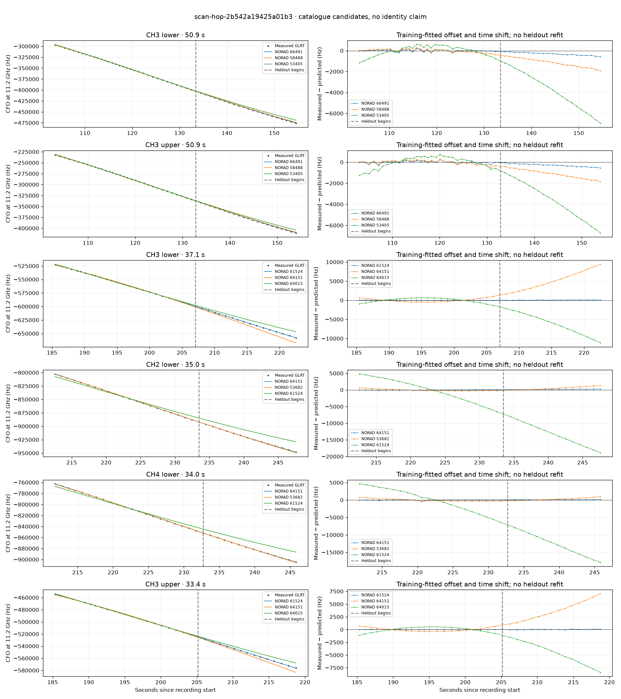

# scan-hop-2b542a19425a01b3

Recorded **2026-09-14T17:10:12.880432Z**, RX0, 10 MS/s.

**Candidates pass descriptive checks; no identification.** Candidates: 69172 (5 tracklets), 64151 (4 tracklets), 61524 (2 tracklets).

Counts are correlated lane tracklets, not independent detections or satellite counts. A recording can contain multiple transmitters; these are not one-label-per-file assignments.

Solid curves include a per-track constant carrier offset fitted on the first 60% of observations. The final 40% is held out. A close curve is not identity evidence by itself.

Catalogue: `sha256:f623da8623d574a387a40f84f1b4e813d76f1f993d2759f7aa9a8c002a1c272e`. Orbital-only exclusions: STARLINK-1770 (NORAD 46383; SGP4 []), STARLINK-34343 DEB (NORAD 69730; SGP4 [6]), STARLINK-37793 (NORAD 100286; SGP4 [6]).

| Lane | Recording seconds | Top 3 training NORADs | Train / heldout RMS (Hz) | Leader heldout rank | Assessment |
|---|---:|---|---:|---:|---|
| CH4 lower | 70.8–103.2 | 69172, 47904, 55986 | 50.7 / 70.2 | 1 | Passes descriptive checks; candidate only |
| CH4 upper | 73.1–102.4 | 69172, 47904, 55986 | 34.5 / 93.3 | 1 | Passes descriptive checks; candidate only |
| CH1 lower | 74.6–102.5 | 69172, 47904, 55986 | 39.1 / 36.5 | 1 | Passes descriptive checks; candidate only |
| CH1 upper | 74.7–102.8 | 69172, 47904, 55986 | 101.8 / 70.1 | 1 | Passes descriptive checks; candidate only |
| CH2 upper | 77.7–101.3 | 69172, 47904, 55986 | 34.2 / 29.5 | 1 | Passes descriptive checks; candidate only |
| CH3 upper | 103.0–154.0 | 66491, 58488, 53405 | 115.1 / 318.0 | 1 | -500s control fits as well or better |
| CH3 lower | 103.7–154.6 | 66491, 58488, 53405 | 94.0 / 329.4 | 1 | -500s control fits as well or better |
| CH2 lower | 134.2–159.4 | 65459, 63453, 58488 | 66.3 / 778.8 | 2 | leader changes on heldout |
| CH4 lower | 134.7–154.8 | 63453, 65459, 58488 | 79.9 / 142.0 | 1 | Passes descriptive checks; candidate only |
| CH3 upper | 185.3–218.7 | 61524, 64151, 64015 | 21.5 / 43.3 | 1 | Passes descriptive checks; candidate only |
| CH3 lower | 185.5–222.5 | 61524, 64151, 64015 | 26.1 / 53.8 | 1 | Passes descriptive checks; candidate only |
| CH4 lower | 211.8–245.8 | 64151, 53682, 61524 | 83.9 / 94.5 | 1 | Passes descriptive checks; candidate only |
| CH2 upper | 212.2–235.0 | 64151, 53682, 61524 | 39.7 / 102.2 | 1 | Passes descriptive checks; candidate only |
| CH2 lower | 212.6–247.6 | 64151, 53682, 61524 | 54.5 / 194.7 | 1 | Passes descriptive checks; candidate only |
| CH4 upper | 214.2–246.4 | 64151, 53682, 61524 | 78.5 / 116.5 | 1 | Passes descriptive checks; candidate only |
| CH2 lower | 254.6–274.8 | 69171, 58626, 55608 | 21.5 / 29.1 | 1 | Passes descriptive checks; candidate only |
| CH4 lower | 257.9–281.1 | 69171, 55608, 58626 | 20.0 / 41.7 | 1 | Passes descriptive checks; candidate only |
| CH4 upper | 95.4–118.4 | 53608, 66491, 58488 | 94.1 / 608.7 | 4 | leader changes on heldout; time-shift boundary; radio drift fits as well or better; -500s control fits as well or better; 500s control fits as well or better |
| CH4 lower | 98.1–122.6 | 66491, 66618, 58488 | 89.3 / 112.2 | 1 | -500s control fits as well or better |

[Full candidate, control and measured-CFO evidence](scan-hop-2b542a19425a01b3.json.gz).
