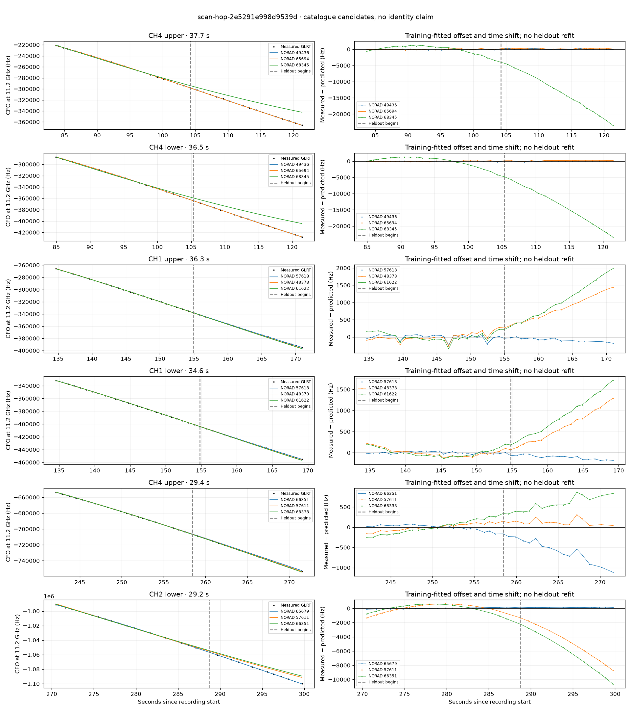

# scan-hop-2e5291e998d9539d

Recorded **2026-09-14T23:10:12.694332Z**, RX0, 10 MS/s.

**Candidates pass descriptive checks; no identification.** Candidates: 65679 (3 tracklets).

[Satellite RMS comparisons and top-1 gains](scan-hop-2e5291e998d9539d-candidates.md).

Counts are correlated lane tracklets, not independent detections or satellite counts. A recording can contain multiple transmitters; these are not one-label-per-file assignments.

Solid curves include a per-track constant carrier offset fitted on the first 60% of observations. The final 40% is held out. A close curve is not identity evidence by itself.

Catalogue: `sha256:d0d899a2d1da7811b03849396c03507e74e2de38d046edc9e068d12f2700ab20`. Orbital-only exclusions: STARLINK-34343 DEB (NORAD 69730; SGP4 [6]), STARLINK-37793 (NORAD 100286; SGP4 [1]).

| Lane | Recording seconds | Top 3 training NORADs | Train / heldout RMS (Hz) | Leader heldout rank | Assessment |
|---|---:|---|---:|---:|---|
| CH1 lower | 21.7–44.0 | 62742, 57638, 69263 | 28.5 / 205.7 | 2 | leader changes on heldout |
| CH4 upper | 83.7–121.3 | 49436, 65694, 68345 | 109.4 / 135.9 | 1 | time-shift boundary |
| CH4 lower | 84.9–121.5 | 49436, 65694, 68345 | 75.2 / 105.8 | 1 | time-shift boundary |
| CH1 lower | 134.6–169.2 | 57618, 48378, 61622 | 24.9 / 117.9 | 1 | 500s control fits as well or better |
| CH1 upper | 134.7–170.9 | 57618, 48378, 61622 | 77.0 / 97.9 | 1 | 500s control fits as well or better |
| CH4 lower | 241.5–269.4 | 66351, 57611, 68338 | 55.7 / 580.1 | 3 | leader changes on heldout; -500s control fits as well or better; 500s control fits as well or better |
| CH4 upper | 242.1–271.5 | 66351, 57611, 68338 | 62.7 / 614.9 | 3 | leader changes on heldout; -500s control fits as well or better; 500s control fits as well or better |
| CH2 lower | 270.5–299.7 | 65679, 57611, 66351 | 76.9 / 134.0 | 1 | Passes descriptive checks; candidate only |
| CH4 lower | 274.4–299.4 | 65679, 57611, 68338 | 69.6 / 92.8 | 1 | Passes descriptive checks; candidate only |
| CH4 upper | 276.9–299.6 | 65679, 63203, 57611 | 56.4 / 56.3 | 1 | Passes descriptive checks; candidate only |

[Full candidate, control and measured-CFO evidence](scan-hop-2e5291e998d9539d.json.gz).
