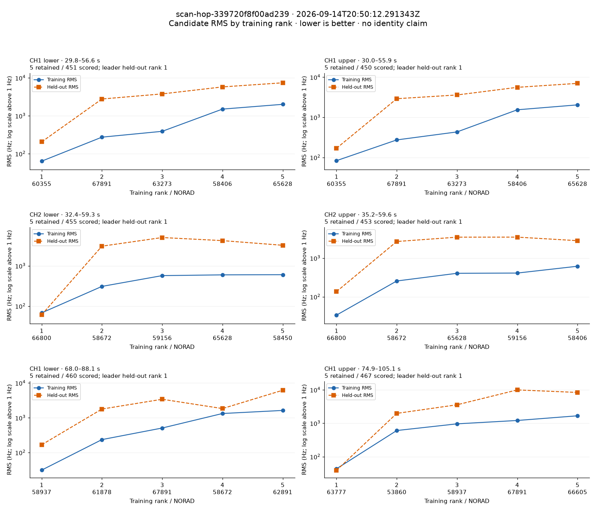
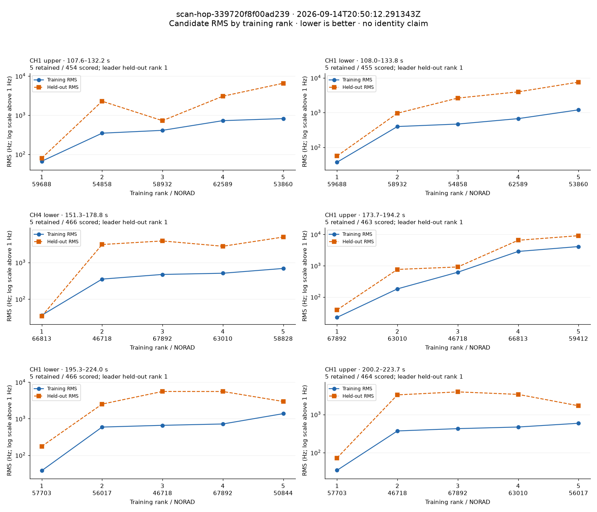
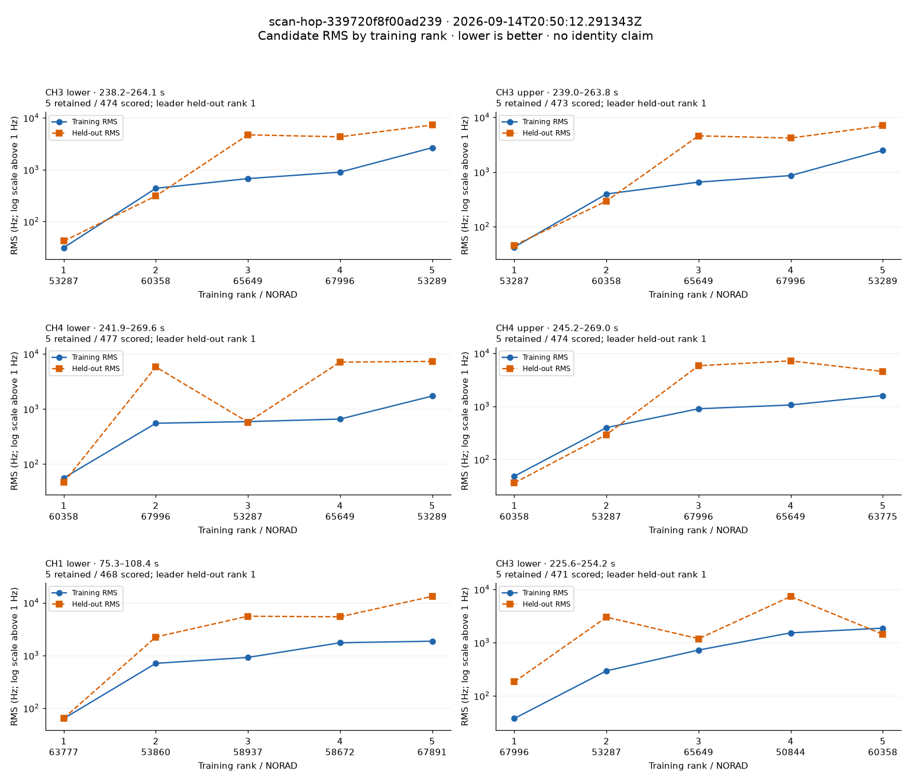
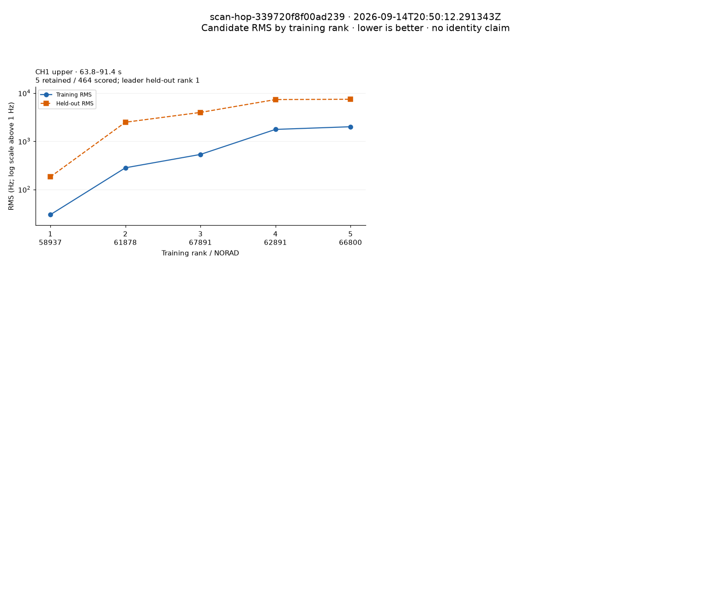

# Ranked candidate RMS: scan-hop-339720f8f00ad239

[Full satellite names, RMS tables and gains](scan-hop-339720f8f00ad239-candidates.md).

Each panel is one track, with at most ten training-ranked satellite candidates. This archive retained five per ranking, so five are shown. Both curves use the same satellites in training order; held-out RMS is not resorted. The leader's held-out rank is measured against the full scored population. Axes are logarithmic above 1 Hz and linear near zero; panel scales vary. A low RMS alone does not establish satellite identity.

