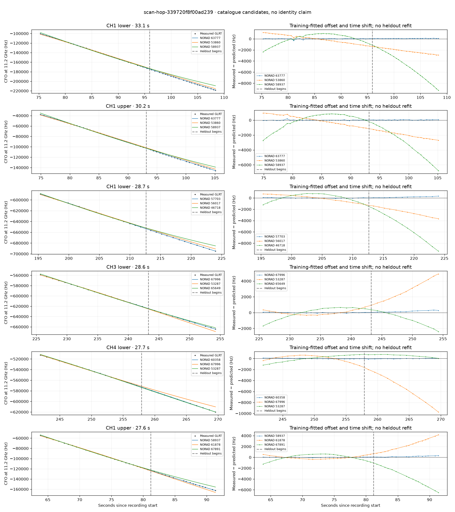

# scan-hop-339720f8f00ad239

Recorded **2026-09-14T20:50:12.291343Z**, RX0, 10 MS/s.

**Candidates pass descriptive checks; no identification.** Candidates: 60355 (2 tracklets), 66800 (2 tracklets), 58937 (2 tracklets).

Counts are correlated lane tracklets, not independent detections or satellite counts. A recording can contain multiple transmitters; these are not one-label-per-file assignments.

Solid curves include a per-track constant carrier offset fitted on the first 60% of observations. The final 40% is held out. A close curve is not identity evidence by itself.

Catalogue: `sha256:889e7736a313d5543eb60d5bad6841ef1ba92f93f691d8af8bb2a30aafee825e`. Orbital-only exclusions: STARLINK-34343 DEB (NORAD 69730; SGP4 [6]), STARLINK-37793 (NORAD 100286; SGP4 [1]).

| Lane | Recording seconds | Top 3 training NORADs | Train / heldout RMS (Hz) | Leader heldout rank | Assessment |
|---|---:|---|---:|---:|---|
| CH1 lower | 29.8–56.6 | 60355, 67891, 63273 | 63.5 / 204.9 | 1 | Passes descriptive checks; candidate only |
| CH1 upper | 30.0–55.9 | 60355, 67891, 63273 | 83.0 / 168.9 | 1 | Passes descriptive checks; candidate only |
| CH2 lower | 32.4–59.3 | 66800, 58672, 59156 | 68.0 / 61.0 | 1 | Passes descriptive checks; candidate only |
| CH2 upper | 35.2–59.6 | 66800, 58672, 65628 | 33.5 / 135.8 | 1 | Passes descriptive checks; candidate only |
| CH1 lower | 68.0–88.1 | 58937, 61878, 67891 | 31.2 / 167.4 | 1 | Passes descriptive checks; candidate only |
| CH1 upper | 74.9–105.1 | 63777, 53860, 58937 | 43.5 / 38.9 | 1 | Passes descriptive checks; candidate only |
| CH1 upper | 107.6–132.2 | 59688, 54858, 58932 | 66.6 / 79.7 | 1 | -500s control fits as well or better |
| CH1 lower | 108.0–133.8 | 59688, 58932, 54858 | 37.1 / 56.0 | 1 | Passes descriptive checks; candidate only |
| CH4 lower | 151.3–178.8 | 66813, 46718, 67892 | 36.3 / 34.3 | 1 | Passes descriptive checks; candidate only |
| CH1 upper | 173.7–194.2 | 67892, 63010, 46718 | 22.2 / 38.5 | 1 | Passes descriptive checks; candidate only |
| CH1 lower | 195.3–224.0 | 57703, 56017, 46718 | 37.7 / 174.7 | 1 | Passes descriptive checks; candidate only |
| CH1 upper | 200.2–223.7 | 57703, 46718, 67892 | 34.5 / 72.6 | 1 | Passes descriptive checks; candidate only |
| CH3 lower | 238.2–264.1 | 53287, 60358, 65649 | 31.3 / 41.9 | 1 | Passes descriptive checks; candidate only |
| CH3 upper | 239.0–263.8 | 53287, 60358, 65649 | 42.3 / 45.3 | 1 | Passes descriptive checks; candidate only |
| CH4 lower | 241.9–269.6 | 60358, 67996, 53287 | 55.8 / 46.3 | 1 | Passes descriptive checks; candidate only |
| CH4 upper | 245.2–269.0 | 60358, 53287, 67996 | 48.4 / 36.1 | 1 | Passes descriptive checks; candidate only |
| CH1 lower | 75.3–108.4 | 63777, 53860, 58937 | 63.5 / 64.4 | 1 | Passes descriptive checks; candidate only |
| CH3 lower | 225.6–254.2 | 67996, 53287, 65649 | 37.6 / 183.5 | 1 | Passes descriptive checks; candidate only |
| CH1 upper | 63.8–91.4 | 58937, 61878, 67891 | 29.9 / 182.3 | 1 | Passes descriptive checks; candidate only |

[Full candidate, control and measured-CFO evidence](scan-hop-339720f8f00ad239.json.gz).
