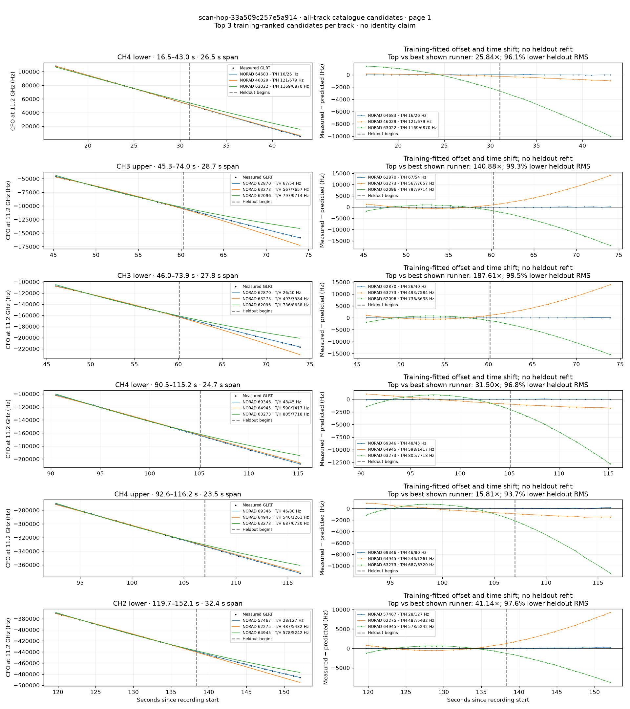
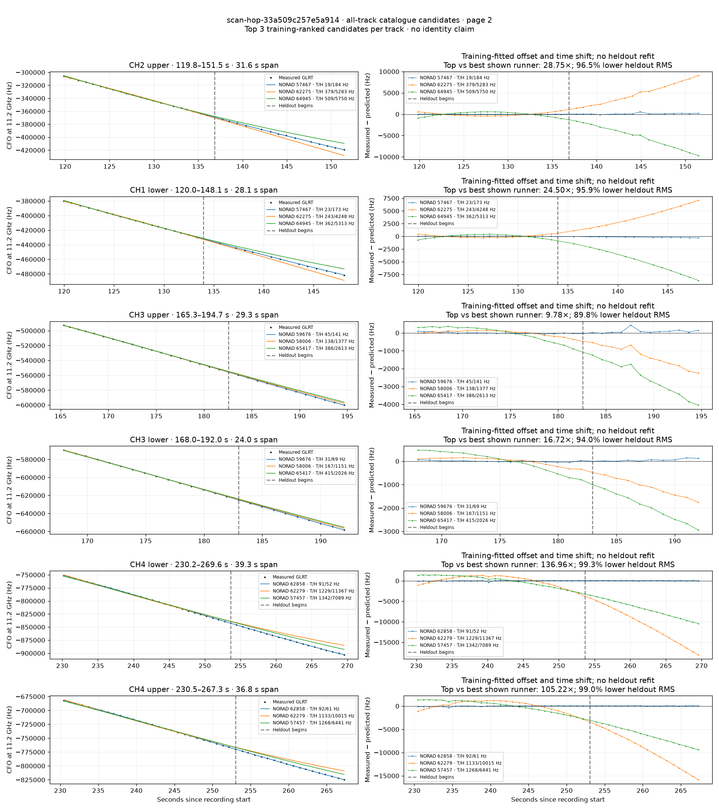
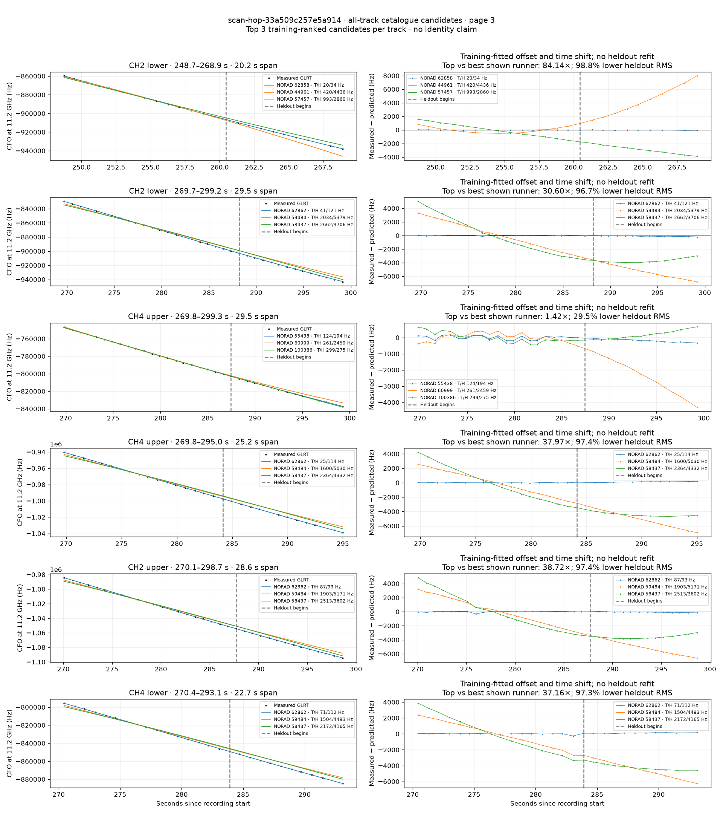
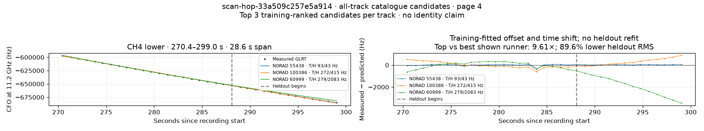

# All track overlays: scan-hop-33a509c257e5a914

Recorded **2026-09-14T16:00:12.385886Z**, RX0, 10 MS/s. All **19 eligible tracks** are shown in chronological order.

[Recording assessment](scan-hop-33a509c257e5a914.md) · [Candidate RMS and gains](scan-hop-33a509c257e5a914-candidates.md)

Each row matches the requested view: measured GLRT CFO and the top three training-ranked TLE curves on the left, residuals on the right. Offset and time shift are fitted only on the first 60%; the last 40% is held out. These are candidate diagnostics, not satellite identifications.

RMS cells below are `training / heldout` in Hz. Runner-up 1 and 2 are training ranks two and three. The gain compares the top TLE with whichever of those two has lower heldout RMS.

| Track | Top TLE, train / heldout RMS | Runner-up 1, train / heldout RMS | Runner-up 2, train / heldout RMS | Top vs best shown runner, heldout |
|---|---:|---:|---:|---:|
| CH4 lower, 16.5–43.0 s | STARLINK-34550 / 64683: 16.4 / 26.3 Hz | STARLINK-1526 / 46029: 121.3 / 679.4 Hz | STARLINK-32944 / 63022: 1169.2 / 6869.8 Hz | 25.84× / 96.1% lower |
| CH3 upper, 45.3–74.0 s | STARLINK-32861 / 62870: 66.7 / 54.3 Hz | STARLINK-11621 / 63273: 567.0 / 7656.6 Hz | STARLINK-11303 / 62096: 797.0 / 9714.3 Hz | 140.88× / 99.3% lower |
| CH3 lower, 46.0–73.9 s | STARLINK-32861 / 62870: 26.4 / 40.4 Hz | STARLINK-11621 / 63273: 492.8 / 7583.6 Hz | STARLINK-11303 / 62096: 736.0 / 8637.6 Hz | 187.61× / 99.5% lower |
| CH4 lower, 90.5–115.2 s | STARLINK-37773 / 69346: 47.7 / 45.0 Hz | STARLINK-34758 / 64945: 598.5 / 1416.9 Hz | STARLINK-11621 / 63273: 805.3 / 7718.1 Hz | 31.50× / 96.8% lower |
| CH4 upper, 92.6–116.2 s | STARLINK-37773 / 69346: 46.0 / 79.8 Hz | STARLINK-34758 / 64945: 546.1 / 1261.0 Hz | STARLINK-11621 / 63273: 686.9 / 6719.8 Hz | 15.81× / 93.7% lower |
| CH2 lower, 119.7–152.1 s | STARLINK-30092 / 57467: 28.2 / 127.4 Hz | STARLINK-11495 / 62275: 487.4 / 5431.6 Hz | STARLINK-34758 / 64945: 578.5 / 5241.6 Hz | 41.14× / 97.6% lower |
| CH2 upper, 119.8–151.5 s | STARLINK-30092 / 57467: 18.8 / 183.7 Hz | STARLINK-11495 / 62275: 379.1 / 5282.7 Hz | STARLINK-34758 / 64945: 509.3 / 5750.4 Hz | 28.75× / 96.5% lower |
| CH1 lower, 120.0–148.1 s | STARLINK-30092 / 57467: 22.6 / 173.4 Hz | STARLINK-11495 / 62275: 242.6 / 4248.4 Hz | STARLINK-34758 / 64945: 362.1 / 5313.5 Hz | 24.50× / 95.9% lower |
| CH3 upper, 165.3–194.7 s | STARLINK-31884 / 59676: 45.0 / 140.8 Hz | STARLINK-30526 / 58006: 137.9 / 1376.6 Hz | STARLINK-34255 / 65417: 386.3 / 2612.9 Hz | 9.78× / 89.8% lower |
| CH3 lower, 168.0–192.0 s | STARLINK-31884 / 59676: 31.3 / 68.9 Hz | STARLINK-30526 / 58006: 166.8 / 1151.3 Hz | STARLINK-34255 / 65417: 415.1 / 2026.5 Hz | 16.72× / 94.0% lower |
| CH4 lower, 230.2–269.6 s | STARLINK-32866 / 62858: 90.6 / 51.8 Hz | STARLINK-11499 / 62279: 1228.9 / 11367.1 Hz | STARLINK-30165 / 57457: 1342.3 / 7089.1 Hz | 136.96× / 99.3% lower |
| CH4 upper, 230.5–267.3 s | STARLINK-32866 / 62858: 92.2 / 61.2 Hz | STARLINK-11499 / 62279: 1132.7 / 10014.5 Hz | STARLINK-30165 / 57457: 1268.4 / 6441.0 Hz | 105.22× / 99.0% lower |
| CH2 lower, 248.7–268.9 s | STARLINK-32866 / 62858: 19.8 / 34.0 Hz | STARLINK-1080 / 44961: 420.0 / 4436.3 Hz | STARLINK-30165 / 57457: 992.6 / 2859.6 Hz | 84.14× / 98.8% lower |
| CH2 lower, 269.7–299.2 s | STARLINK-32864 / 62862: 40.9 / 121.1 Hz | STARLINK-31753 / 59484: 2034.2 / 5379.4 Hz | STARLINK-30869 / 58437: 2661.6 / 3705.7 Hz | 30.60× / 96.7% lower |
| CH4 upper, 269.8–299.3 s | STARLINK-5074 / 55438: 124.0 / 193.9 Hz | STARLINK-11270 / 60999: 261.1 / 2458.7 Hz | STARLINK-38308 / 100386: 299.0 / 275.1 Hz | 1.42× / 29.5% lower |
| CH4 upper, 269.8–295.0 s | STARLINK-32864 / 62862: 25.3 / 114.1 Hz | STARLINK-31753 / 59484: 1599.7 / 5030.3 Hz | STARLINK-30869 / 58437: 2364.0 / 4331.8 Hz | 37.97× / 97.4% lower |
| CH2 upper, 270.1–298.7 s | STARLINK-32864 / 62862: 86.5 / 93.0 Hz | STARLINK-31753 / 59484: 1903.2 / 5171.4 Hz | STARLINK-30869 / 58437: 2513.0 / 3601.6 Hz | 38.72× / 97.4% lower |
| CH4 lower, 270.4–293.1 s | STARLINK-32864 / 62862: 70.6 / 112.1 Hz | STARLINK-31753 / 59484: 1503.7 / 4493.2 Hz | STARLINK-30869 / 58437: 2172.0 / 4164.5 Hz | 37.16× / 97.3% lower |
| CH4 lower, 270.4–299.0 s | STARLINK-5074 / 55438: 93.1 / 43.1 Hz | STARLINK-38308 / 100386: 272.5 / 414.7 Hz | STARLINK-11270 / 60999: 279.2 / 2082.6 Hz | 9.61× / 89.6% lower |

## Page 1

## Page 2

## Page 3

## Page 4

