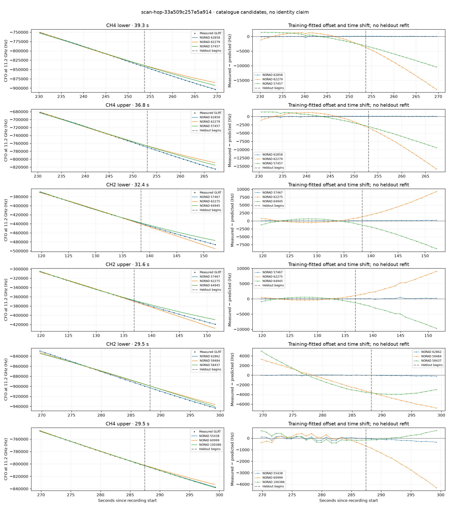

# scan-hop-33a509c257e5a914

Recorded **2026-09-14T16:00:12.385886Z**, RX0, 10 MS/s.

**Candidates pass descriptive checks; no identification.** Candidates: 62862 (4 tracklets), 57467 (3 tracklets), 62858 (3 tracklets).

[Satellite RMS comparisons and top-1 gains](scan-hop-33a509c257e5a914-candidates.md).

[Measured CFO/TLE overlays for every track](scan-hop-33a509c257e5a914-all-tracks.md).

Counts are correlated lane tracklets, not independent detections or satellite counts. A recording can contain multiple transmitters; these are not one-label-per-file assignments.

Solid curves include a per-track constant carrier offset fitted on the first 60% of observations. The final 40% is held out. A close curve is not identity evidence by itself.

Catalogue: `sha256:f623da8623d574a387a40f84f1b4e813d76f1f993d2759f7aa9a8c002a1c272e`. Orbital-only exclusions: STARLINK-34343 DEB (NORAD 69730; SGP4 [6]), STARLINK-37793 (NORAD 100286; SGP4 [6]).

| Lane | Recording seconds | Top 3 training NORADs | Train / heldout RMS (Hz) | Leader heldout rank | Assessment |
|---|---:|---|---:|---:|---|
| CH4 lower | 16.5–43.0 | 64683, 46029, 63022 | 16.4 / 26.3 | 1 | Passes descriptive checks; candidate only |
| CH3 upper | 45.3–74.0 | 62870, 63273, 62096 | 66.7 / 54.3 | 1 | Passes descriptive checks; candidate only |
| CH3 lower | 46.0–73.9 | 62870, 63273, 62096 | 26.4 / 40.4 | 1 | Passes descriptive checks; candidate only |
| CH4 lower | 90.5–115.2 | 69346, 64945, 63273 | 47.7 / 45.0 | 1 | Passes descriptive checks; candidate only |
| CH4 upper | 92.6–116.2 | 69346, 64945, 63273 | 46.0 / 79.8 | 1 | Passes descriptive checks; candidate only |
| CH2 lower | 119.7–152.1 | 57467, 62275, 64945 | 28.2 / 127.4 | 1 | Passes descriptive checks; candidate only |
| CH2 upper | 119.8–151.5 | 57467, 62275, 64945 | 18.8 / 183.7 | 1 | Passes descriptive checks; candidate only |
| CH1 lower | 120.0–148.1 | 57467, 62275, 64945 | 22.6 / 173.4 | 1 | Passes descriptive checks; candidate only |
| CH3 upper | 165.3–194.7 | 59676, 58006, 65417 | 45.0 / 140.8 | 1 | Passes descriptive checks; candidate only |
| CH3 lower | 168.0–192.0 | 59676, 58006, 65417 | 31.3 / 68.9 | 1 | Passes descriptive checks; candidate only |
| CH4 lower | 230.2–269.6 | 62858, 62279, 57457 | 90.6 / 51.8 | 1 | Passes descriptive checks; candidate only |
| CH4 upper | 230.5–267.3 | 62858, 62279, 57457 | 92.2 / 61.2 | 1 | Passes descriptive checks; candidate only |
| CH2 lower | 248.7–268.9 | 62858, 44961, 57457 | 19.8 / 34.0 | 1 | Passes descriptive checks; candidate only |
| CH2 lower | 269.7–299.2 | 62862, 59484, 58437 | 40.9 / 121.1 | 1 | Passes descriptive checks; candidate only |
| CH4 upper | 269.8–299.3 | 55438, 60999, 100386 | 124.0 / 193.9 | 1 | Passes descriptive checks; candidate only |
| CH2 upper | 270.1–298.7 | 62862, 59484, 58437 | 86.5 / 93.0 | 1 | Passes descriptive checks; candidate only |
| CH4 lower | 270.4–299.0 | 55438, 100386, 60999 | 93.1 / 43.1 | 1 | Passes descriptive checks; candidate only |
| CH4 lower | 270.4–293.1 | 62862, 59484, 58437 | 70.6 / 112.1 | 1 | Passes descriptive checks; candidate only |
| CH4 upper | 269.8–295.0 | 62862, 59484, 58437 | 25.3 / 114.1 | 1 | Passes descriptive checks; candidate only |

[Full candidate, control and measured-CFO evidence](scan-hop-33a509c257e5a914.json.gz).
