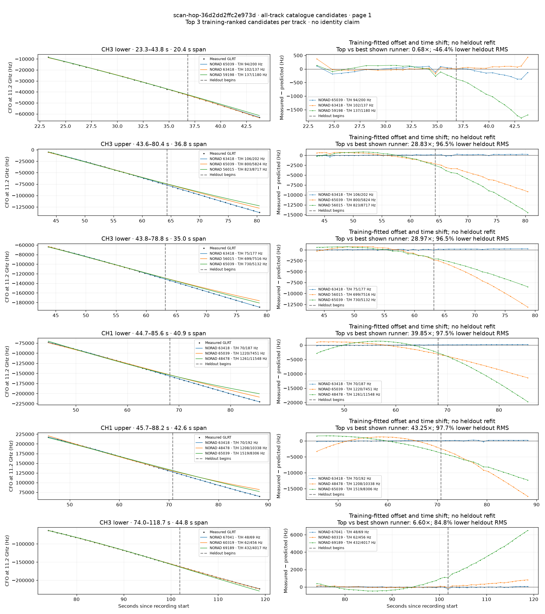
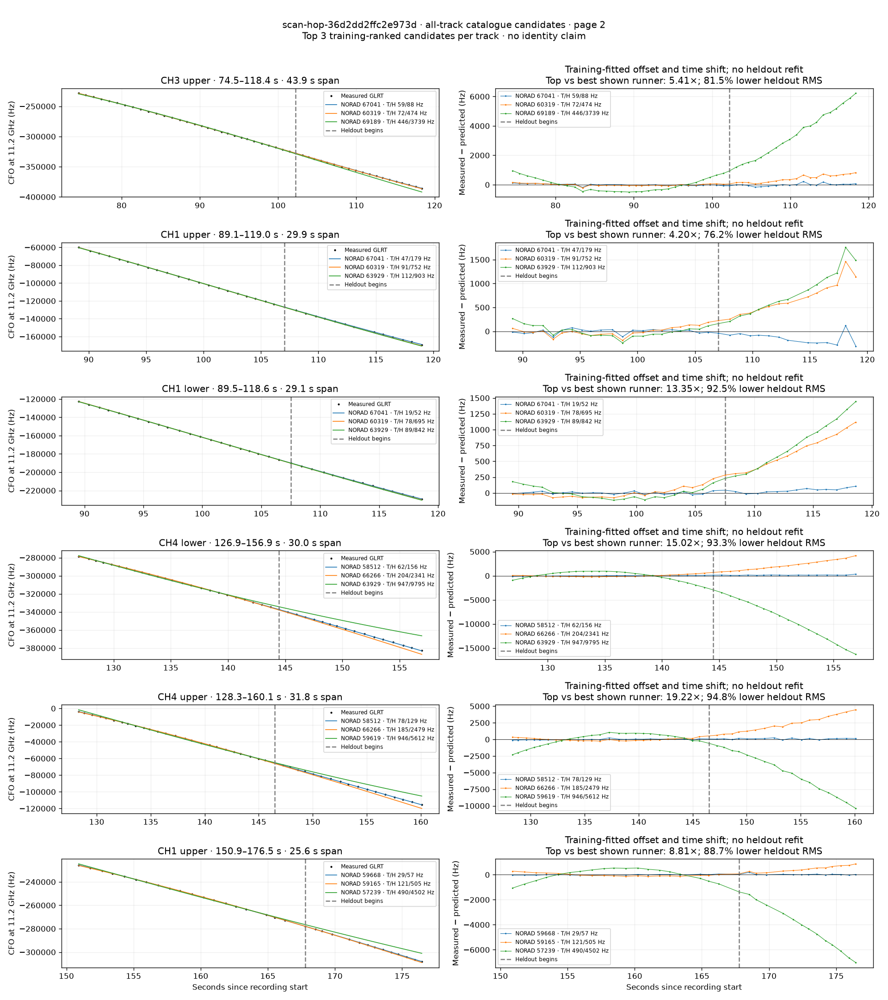
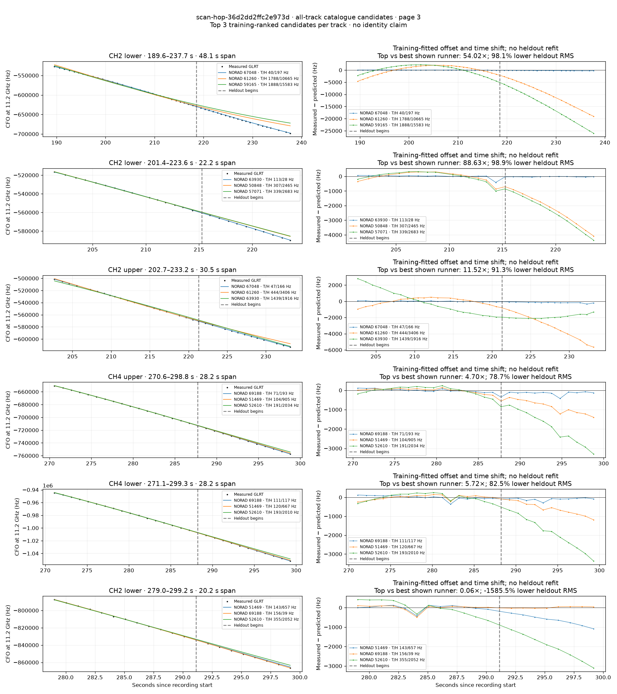

# All track overlays: scan-hop-36d2dd2ffc2e973d

Recorded **2026-09-14T20:10:12.907428Z**, RX0, 10 MS/s. All **18 eligible tracks** are shown in chronological order.

[Recording assessment](scan-hop-36d2dd2ffc2e973d.md) · [Candidate RMS and gains](scan-hop-36d2dd2ffc2e973d-candidates.md)

Each row matches the requested view: measured GLRT CFO and the top three training-ranked TLE curves on the left, residuals on the right. Offset and time shift are fitted only on the first 60%; the last 40% is held out. These are candidate diagnostics, not satellite identifications.

RMS cells below are `training / heldout` in Hz. Runner-up 1 and 2 are training ranks two and three. The gain compares the top TLE with whichever of those two has lower heldout RMS.

| Track | Top TLE, train / heldout RMS | Runner-up 1, train / heldout RMS | Runner-up 2, train / heldout RMS | Top vs best shown runner, heldout |
|---|---:|---:|---:|---:|
| CH3 lower, 23.3–43.8 s | STARLINK-34721 / 65039: 93.5 / 200.2 Hz | STARLINK-33703 / 63418: 101.7 / 136.8 Hz | STARLINK-31590 / 59198: 136.7 / 1179.5 Hz | 0.68× / -46.4% lower |
| CH3 upper, 43.6–80.4 s | STARLINK-33703 / 63418: 105.7 / 202.0 Hz | STARLINK-34721 / 65039: 800.2 / 5824.5 Hz | STARLINK-5939 / 56015: 822.6 / 8716.8 Hz | 28.83× / 96.5% lower |
| CH3 lower, 43.8–78.8 s | STARLINK-33703 / 63418: 74.9 / 177.2 Hz | STARLINK-5939 / 56015: 698.8 / 7515.8 Hz | STARLINK-34721 / 65039: 730.1 / 5132.0 Hz | 28.97× / 96.5% lower |
| CH1 lower, 44.7–85.6 s | STARLINK-33703 / 63418: 70.3 / 187.0 Hz | STARLINK-34721 / 65039: 1219.5 / 7450.8 Hz | STARLINK-2728 / 48478: 1261.2 / 11548.3 Hz | 39.85× / 97.5% lower |
| CH1 upper, 45.7–88.2 s | STARLINK-33703 / 63418: 70.2 / 192.0 Hz | STARLINK-2728 / 48478: 1208.0 / 10338.3 Hz | STARLINK-34721 / 65039: 1518.5 / 8305.8 Hz | 43.25× / 97.7% lower |
| CH3 lower, 74.0–118.7 s | STARLINK-35765 / 67041: 47.7 / 69.1 Hz | STARLINK-32182 / 60319: 61.6 / 456.4 Hz | STARLINK-37440 / 69189: 431.7 / 4017.2 Hz | 6.60× / 84.8% lower |
| CH3 upper, 74.5–118.4 s | STARLINK-35765 / 67041: 58.5 / 87.6 Hz | STARLINK-32182 / 60319: 72.0 / 474.4 Hz | STARLINK-37440 / 69189: 445.6 / 3738.8 Hz | 5.41× / 81.5% lower |
| CH1 upper, 89.1–119.0 s | STARLINK-35765 / 67041: 47.3 / 179.0 Hz | STARLINK-32182 / 60319: 90.7 / 752.0 Hz | STARLINK-33989 / 63929: 111.8 / 902.9 Hz | 4.20× / 76.2% lower |
| CH1 lower, 89.5–118.6 s | STARLINK-35765 / 67041: 19.2 / 52.1 Hz | STARLINK-32182 / 60319: 77.5 / 695.4 Hz | STARLINK-33989 / 63929: 88.6 / 842.5 Hz | 13.35× / 92.5% lower |
| CH4 lower, 126.9–156.9 s | STARLINK-30982 / 58512: 62.4 / 155.9 Hz | STARLINK-35056 / 66266: 204.2 / 2341.3 Hz | STARLINK-33989 / 63929: 946.8 / 9795.1 Hz | 15.02× / 93.3% lower |
| CH4 upper, 128.3–160.1 s | STARLINK-30982 / 58512: 78.3 / 129.0 Hz | STARLINK-35056 / 66266: 184.6 / 2479.4 Hz | STARLINK-31777 / 59619: 945.8 / 5612.5 Hz | 19.22× / 94.8% lower |
| CH1 upper, 150.9–176.5 s | STARLINK-31866 / 59668: 29.2 / 57.3 Hz | STARLINK-31325 / 59165: 121.2 / 505.2 Hz | STARLINK-6330 / 57239: 490.1 / 4501.8 Hz | 8.81× / 88.7% lower |
| CH2 lower, 189.6–237.7 s | STARLINK-35905 / 67048: 40.5 / 197.4 Hz | STARLINK-32474 / 61260: 1788.2 / 10665.2 Hz | STARLINK-31325 / 59165: 1888.2 / 15582.8 Hz | 54.02× / 98.1% lower |
| CH2 lower, 201.4–223.6 s | STARLINK-33980 / 63930: 112.7 / 27.8 Hz | STARLINK-3315 / 50848: 306.7 / 2464.6 Hz | STARLINK-5834 / 57071: 339.4 / 2682.7 Hz | 88.63× / 98.9% lower |
| CH2 upper, 202.7–233.2 s | STARLINK-35905 / 67048: 46.7 / 166.3 Hz | STARLINK-32474 / 61260: 443.6 / 3405.8 Hz | STARLINK-33980 / 63930: 1439.2 / 1915.8 Hz | 11.52× / 91.3% lower |
| CH4 upper, 270.6–298.8 s | STARLINK-37359 / 69188: 71.5 / 192.7 Hz | STARLINK-3182 / 51469: 104.0 / 905.1 Hz | STARLINK-3998 / 52610: 190.7 / 2033.9 Hz | 4.70× / 78.7% lower |
| CH4 lower, 271.1–299.3 s | STARLINK-37359 / 69188: 110.7 / 116.6 Hz | STARLINK-3182 / 51469: 119.7 / 666.7 Hz | STARLINK-3998 / 52610: 193.3 / 2010.1 Hz | 5.72× / 82.5% lower |
| CH2 lower, 279.0–299.2 s | STARLINK-3182 / 51469: 142.9 / 656.5 Hz | STARLINK-37359 / 69188: 156.2 / 38.9 Hz | STARLINK-3998 / 52610: 355.5 / 2052.4 Hz | 0.06× / -1585.5% lower |

## Page 1

## Page 2

## Page 3

