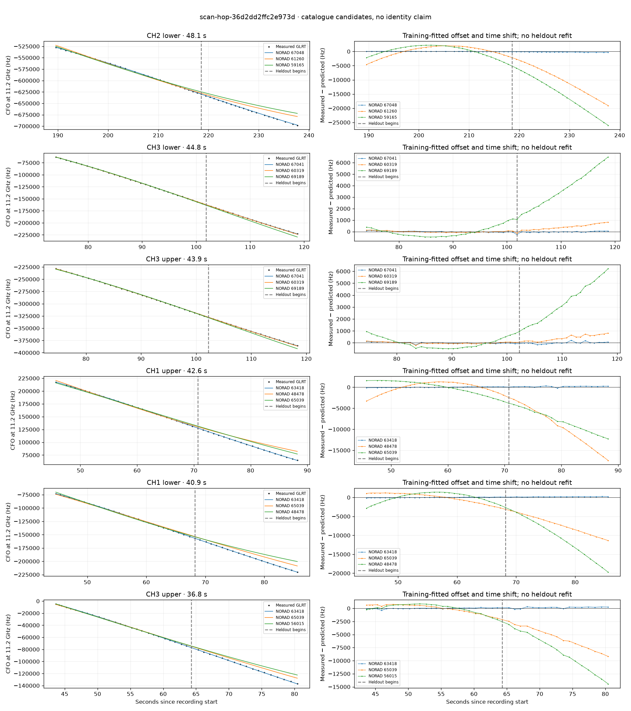

# scan-hop-36d2dd2ffc2e973d

Recorded **2026-09-14T20:10:12.907428Z**, RX0, 10 MS/s.

**Candidates pass descriptive checks; no identification.** Candidates: 67041 (3 tracklets), 58512 (2 tracklets), 69188 (2 tracklets).

Counts are correlated lane tracklets, not independent detections or satellite counts. A recording can contain multiple transmitters; these are not one-label-per-file assignments.

Solid curves include a per-track constant carrier offset fitted on the first 60% of observations. The final 40% is held out. A close curve is not identity evidence by itself.

Catalogue: `sha256:4b2095c8131c06da613b154fc073602a412fc2bfa0847667b2c078799384e2ac`. Orbital-only exclusions: STARLINK-1770 (NORAD 46383; SGP4 []).

| Lane | Recording seconds | Top 3 training NORADs | Train / heldout RMS (Hz) | Leader heldout rank | Assessment |
|---|---:|---|---:|---:|---|
| CH3 lower | 23.3–43.8 | 65039, 63418, 59198 | 93.5 / 200.2 | 2 | leader changes on heldout; -500s control fits as well or better |
| CH3 upper | 43.6–80.4 | 63418, 65039, 56015 | 105.7 / 202.0 | 1 | -500s control fits as well or better |
| CH1 lower | 44.7–85.6 | 63418, 65039, 48478 | 70.3 / 187.0 | 1 | -500s control fits as well or better |
| CH1 upper | 45.7–88.2 | 63418, 48478, 65039 | 70.2 / 192.0 | 1 | -500s control fits as well or better |
| CH3 lower | 74.0–118.7 | 67041, 60319, 69189 | 47.7 / 69.1 | 1 | Passes descriptive checks; candidate only |
| CH1 upper | 89.1–119.0 | 67041, 60319, 63929 | 47.3 / 179.0 | 1 | 500s control fits as well or better |
| CH1 lower | 89.5–118.6 | 67041, 60319, 63929 | 19.2 / 52.1 | 1 | Passes descriptive checks; candidate only |
| CH4 lower | 126.9–156.9 | 58512, 66266, 63929 | 62.4 / 155.9 | 1 | Passes descriptive checks; candidate only |
| CH4 upper | 128.3–160.1 | 58512, 66266, 59619 | 78.3 / 129.0 | 1 | Passes descriptive checks; candidate only |
| CH1 upper | 150.9–176.5 | 59668, 59165, 57239 | 29.2 / 57.3 | 1 | Passes descriptive checks; candidate only |
| CH2 lower | 189.6–237.7 | 67048, 61260, 59165 | 40.5 / 197.4 | 1 | 500s control fits as well or better |
| CH2 upper | 202.7–233.2 | 67048, 61260, 63930 | 46.7 / 166.3 | 1 | 500s control fits as well or better |
| CH4 upper | 270.6–298.8 | 69188, 51469, 52610 | 71.5 / 192.7 | 1 | Passes descriptive checks; candidate only |
| CH4 lower | 271.1–299.3 | 69188, 51469, 52610 | 110.7 / 116.6 | 1 | Passes descriptive checks; candidate only |
| CH2 lower | 279.0–299.2 | 51469, 69188, 52610 | 142.9 / 656.5 | 2 | leader changes on heldout; radio drift fits as well or better |
| CH3 upper | 74.5–118.4 | 67041, 60319, 69189 | 58.5 / 87.6 | 1 | Passes descriptive checks; candidate only |
| CH3 lower | 43.8–78.8 | 63418, 56015, 65039 | 74.9 / 177.2 | 1 | -500s control fits as well or better |
| CH2 lower | 201.4–223.6 | 63930, 50848, 57071 | 112.7 / 27.8 | 1 | Passes descriptive checks; candidate only |

[Full candidate, control and measured-CFO evidence](scan-hop-36d2dd2ffc2e973d.json.gz).
