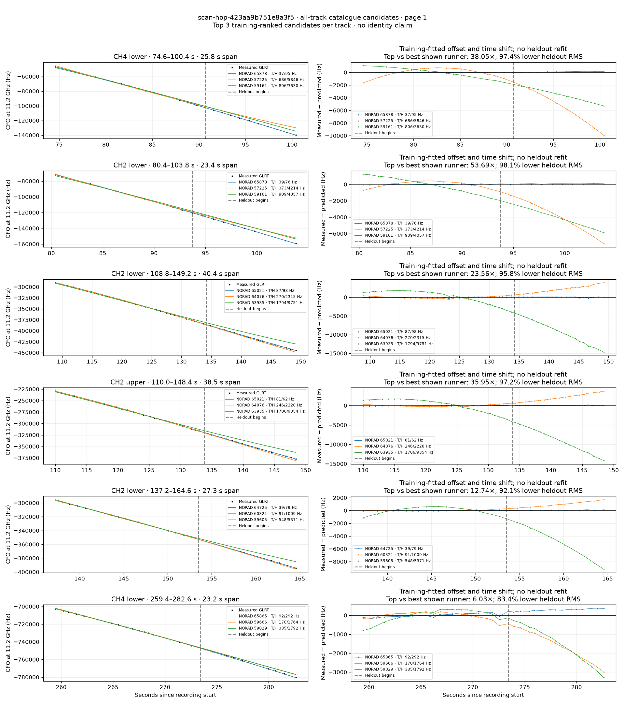
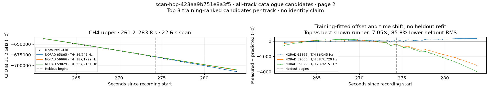

# All track overlays: scan-hop-423aa9b751e8a3f5

Recorded **2026-09-14T19:50:12.646148Z**, RX0, 10 MS/s. All **7 eligible tracks** are shown in chronological order.

[Recording assessment](scan-hop-423aa9b751e8a3f5.md) · [Candidate RMS and gains](scan-hop-423aa9b751e8a3f5-candidates.md)

Each row matches the requested view: measured GLRT CFO and the top three training-ranked TLE curves on the left, residuals on the right. Offset and time shift are fitted only on the first 60%; the last 40% is held out. These are candidate diagnostics, not satellite identifications.

RMS cells below are `training / heldout` in Hz. Runner-up 1 and 2 are training ranks two and three. The gain compares the top TLE with whichever of those two has lower heldout RMS.

| Track | Top TLE, train / heldout RMS | Runner-up 1, train / heldout RMS | Runner-up 2, train / heldout RMS | Top vs best shown runner, heldout |
|---|---:|---:|---:|---:|
| CH4 lower, 74.6–100.4 s | STARLINK-35453 / 65878: 36.8 / 95.4 Hz | STARLINK-6294 / 57225: 686.4 / 5846.5 Hz | STARLINK-31256 / 59161: 805.7 / 3629.6 Hz | 38.05× / 97.4% lower |
| CH2 lower, 80.4–103.8 s | STARLINK-35453 / 65878: 38.8 / 75.6 Hz | STARLINK-6294 / 57225: 372.5 / 4213.8 Hz | STARLINK-31256 / 59161: 908.8 / 4056.6 Hz | 53.69× / 98.1% lower |
| CH2 lower, 108.8–149.2 s | STARLINK-34778 / 65021: 86.9 / 98.3 Hz | STARLINK-11715 [DTC] / 64076: 269.8 / 2315.0 Hz | STARLINK-34005 / 63935: 1794.4 / 9751.2 Hz | 23.56× / 95.8% lower |
| CH2 upper, 110.0–148.4 s | STARLINK-34778 / 65021: 80.6 / 61.8 Hz | STARLINK-11715 [DTC] / 64076: 245.9 / 2220.4 Hz | STARLINK-34005 / 63935: 1706.0 / 9354.3 Hz | 35.95× / 97.2% lower |
| CH2 lower, 137.2–164.6 s | STARLINK-34562 / 64725: 39.0 / 79.2 Hz | STARLINK-32198 / 60321: 91.4 / 1009.0 Hz | STARLINK-31767 / 59605: 547.5 / 5370.6 Hz | 12.74× / 92.1% lower |
| CH4 lower, 259.4–282.6 s | STARLINK-35475 / 65865: 92.1 / 292.3 Hz | STARLINK-31902 / 59666: 170.0 / 1763.6 Hz | STARLINK-31224 / 59029: 334.7 / 1791.8 Hz | 6.03× / 83.4% lower |
| CH4 upper, 261.2–283.8 s | STARLINK-35475 / 65865: 85.7 / 245.3 Hz | STARLINK-31902 / 59666: 187.1 / 1729.2 Hz | STARLINK-31224 / 59029: 237.4 / 2151.0 Hz | 7.05× / 85.8% lower |

## Page 1

## Page 2

